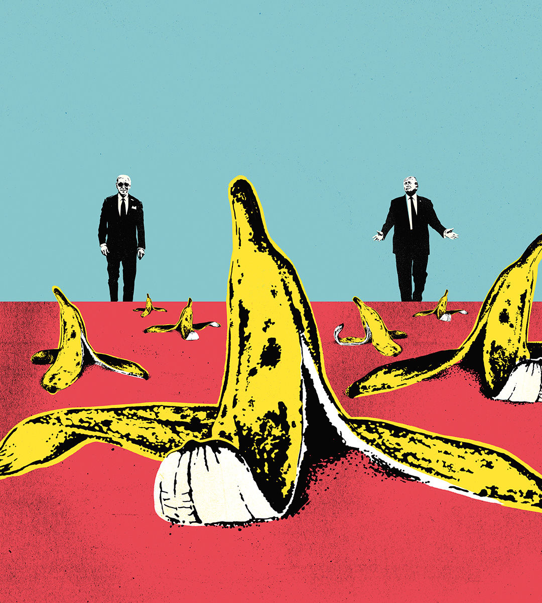

###### And they’re off

# Three big risks that might tip America’s presidential election 

##### Third parties, the Trump trials and the candidates’ age introduce a high degree of uncertainty 

 

> Mar 7th 2024 

And so it is confirmed. After Super Tuesday, it seems clear that the presidential election of 2024 will be a rematch—the first time a former president has challenged a sitting one since 1912. The  are exceptionally well-known, yet about 12% of voters have yet to choose between them. Those swing voters may decide what is shaping up to be a tight race. In the six elections before the year 2000, the average margin of victory in the popular vote was nine points. In the six since 2000 it has been three points. Even that understates how close presidential elections are these days. Just six states will be competitive in November. Last time round 160m Americans voted, but Joe Biden won Wisconsin, the tipping-point state, by 20,000 votes, or 0.013% of the total votes cast. When elections are this close, small differences in the inputs can have world-changing effects.

Because of this, any one of a dozen things could tip the election to  or . There are the issues: the economy, the border, abortion. There are the turnout and persuasion operations, the donors and the volunteers. But in this election there are also three other big areas of uncertainty.

The first is the . Many Americans find both main parties a bit weird. In theory, breaking their duopoly would be wonderful. In practice, a glance at the existing third-party candidates is a cure for that line of thinking. This year’s crop includes Jill Stein, an environmentalist whose singular contribution to America may have been to ease Mr Trump’s victory in 2016 and his withdrawal from the Paris climate agreement. It includes Cornel West, a left-wing professor who thinks there is not much difference between Mr Biden and Mr Trump. And then there is Robert Kennedy junior.

The two big parties jealously guard their duopoly. Since 2000, when Ralph Nader took enough votes in Florida to tip that state for George W. Bush, the parties have tightened the rules around who can get on the ballot for a presidential election. Ms Stein and Mr West are unlikely to qualify in every state (though they could still hurt Mr Biden). Mr Kennedy is different. In polls that include third parties he gets 12% of the vote. That suggests he ought to get enough signatures to put him on the ballot in most states. And if those polls translated into vote share in November, it would be by far the highest third-party score since Ross Perot in 1992.

It is hard to be precise about whom Mr Kennedy would draw more votes from. The surname suggests he would attract more Democrats, yet Republicans like him more. His environmentalism and vaccine-scepticism mix issues of left and right. His cheerleaders are Silicon Valley bros who think disruption is an intrinsic good. All of which means that a scenario in which Mr Kennedy helps Mr Trump to victory is disturbingly possible.

A second big uncertainty that is peculiar to this election concerns Mr Trump’s trials. This week the Supreme Court sent a clear signal, in its 9-0 ruling against the state of Colorado, that it would rather keep out of this election. Mr Trump will therefore be on the ballot everywhere. Over the past couple of years there has been speculation that he might be imprisoned before the election or that, if re-elected, he might even have to govern from a cell. That will not happen. Most of the trials he faces will not be concluded, with appeals, by November 5th. The one case most likely to be decided in time is the most trivial: Mr Trump’s trial for paying Stormy Daniels, a porn star, to keep schtum in 2016 and disguising this as legal expenses.

That is not the same as saying the trials are irrelevant. In our /YouGov polls, a third of Republican voters say being “a criminal” is not a desirable trait in a candidate. Negative partisanship—the conviction that whatever your own side does, the other lot are worse—means that a huge majority of those who voted for Mr Trump before will do so again. But once the trial over his role in the riot of January 6th 2021 begins, there will be regular reminders of how his first term ended, just as undecided voters are weighing whether to give him another one. Yes, most Republican voters will find a way to rationalise the charges against Mr Trump. But the trials are still a drag on him.

The third area of uncertainty is the candidates’ age. Mr Biden and Mr Trump will be the oldest and second-oldest nominees on record, making the odds of what is politely called a “health event” higher than usual. On the Republican side, Mr Trump has no . He is installing his campaign manager as the party’s chief operating officer and his daughter-in-law as its co-chair. That is a brittle kind of strength. He so dominates the party that there would be chaos if he were incapacitated.

There is, by contrast, a debate among Democrats about whether Mr Biden is capable of winning a campaign because of his age. His poll numbers remain oddly low given the strength of the economy. The White House’s answer is that the polls are wrong and that the president’s fortunes will turn round when more voters start paying attention. Maybe. But 85% of Americans and 70% of Democrats think he is too old to serve another term. That is unlikely to change.

Slip road

If he is still behind in swing-state polls before the party’s nominee is crowned at the convention in August, the main argument for Mr Biden—that he is the best defence against a second Trump term—will be hard to sustain. Replacing him then would be risky and could be chaotic. Mr Biden would have to stand aside voluntarily, which seems unlikely. Kamala Harris, the vice-president and likely successor, could be an even weaker candidate.

One way around that problem would be for Democrats to hold a talent contest at the convention. The risk is that the candidates would be dragged to the left to please an audience of activists. An alternative would be for party grandees to settle on a young governor such as Gretchen Whitmer in Michigan, or a charismatic speaker like Senator Raphael Warnock of Georgia. They would then have two months to campaign, in a blizzard of media attention, while Mr Trump is on trial over January 6th.

It may seem inevitable that the election of 2024 will be between Mr Biden and Mr Trump. But given the oddities specific to this contest, there is more uncertainty than you might think. ■


