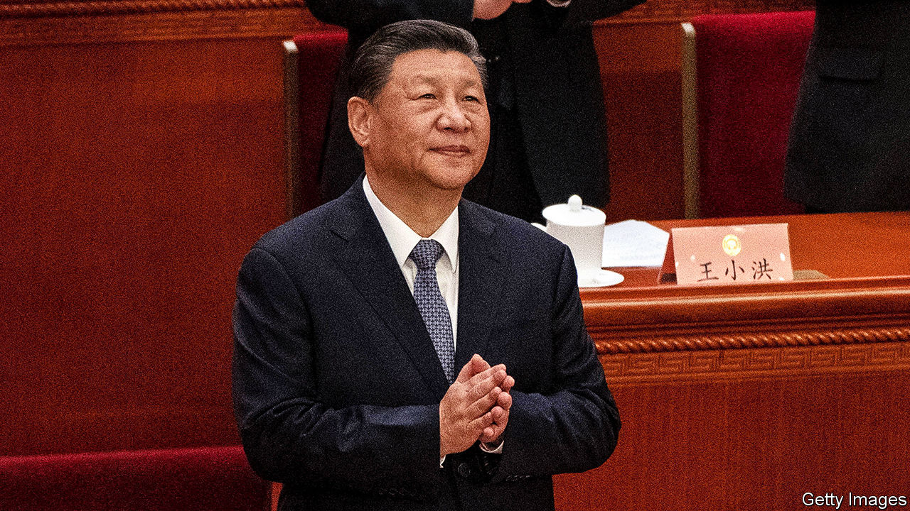

###### China’s National People’s Congress

# Xi Jinping’s hunger for power is hurting China’s economy 

##### A new economic plan won’t end deflation, even as he sidelines his prime minister 

 

> Mar 6th 2024 

As China’s political system becomes ever more closed, set-piece public events offer one of the few remaining windows into decision-making. The most important such annual gathering, of the , is under way in Beijing. The top leaders and thousands of delegates will attend for a week. So far the signals are not reassuring. They suggest that China lacks a robust plan to deal with its economic slump and that some of its targets are fanciful. Power is being concentrated even further in the hands of President Xi Jinping. 

Start with the economics. In a speech to the assembly China’s prime minister, Li Qiang, unveiled a gdp  in 2024. He also laid out a long-term blueprint under the slogan “new productive forces”. This emphasises shifting from a bloated property sector, debt-financed investment and basic manufacturing to high-productivity industries, such as green energy, artificial intelligence and digital services. China’s rulers believe they have been appropriately tough about the , disciplined at responding to the slowdown, and have a coherent vision.

But look closer and the picture falls apart. The target exceeds the average of economists’ growth forecasts, of 4.6%. To hit it, China needs more stimulus. Yet the fiscal-deficit target of 3% for 2024, which will be augmented by long-term bond issuance and other off-budget funds, is too small. Mr Li also set a de facto ceiling for inflation of 3%, in line with past practice. But unlike before, China now faces a deflationary crisis: consumer prices fell by 0.8% year on year in January. China used to set targets and beat them. Now its targets are semi-detached from reality.

To reinvigorate its economy China needs to harness the private sector. Private investments are half of the national total but fell by 0.4% in 2023, largely because of the property slump. But given its unstable regulation and official paranoia, the government has no good way to repair confidence among gloomy entrepreneurs. Multinational investment is at a 30-year low. Investors are so disillusioned that the valuation discount on Chinese shares compared with American ones has reached 54%.

Amid this malaise the political choreography suggests Mr Xi is ever less willing to share power even with his hand-picked subordinates. In his speech Mr Li mentioned his boss more often than previous premiers did. And breaking a convention dating back to the 1980s, Mr Li will not be allowed to conduct a press conference at the congress. That had been the only opportunity for ordinary people to hear such a senior politician respond to questions. Now even this small nod to transparency has gone. Meanwhile, technocrats are marginalised and unflattering data suppressed. The less convincing China’s economic strategy becomes, the more Mr Xi tightens control. 

Although the meeting is a domestic affair, it can affect China’s relations with America. With the race for the White House so uncertain, China’s rulers are trying not to stir up controversy. Mr Li’s speech mentioned the “peaceful development” of relations with Taiwan and downplayed exports as an engine of growth, presumably to avoid provoking protectionists abroad. 

Yet there were plentiful clues that China’s regime sees itself in a long-term cold war. Defence spending will rise by 7% this year, above most forecasts for nominal gdp. Central-government spending on science is soaring. As the meeting began China signed a new defence agreement with the Maldives, raising tensions in the Indian Ocean. Chinese politics is more opaque than ever, but the real message is unmistakable: the economy is misfiring, power is concentrating and Mr Xi is focusing unwaveringly on the contest with America. ■

