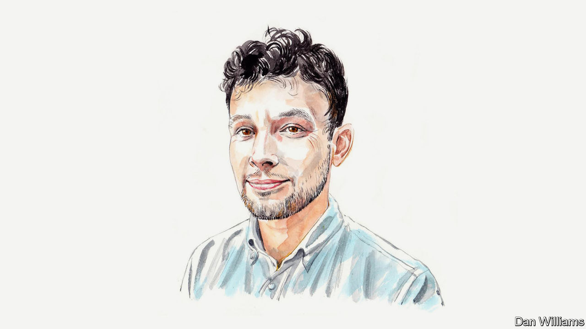
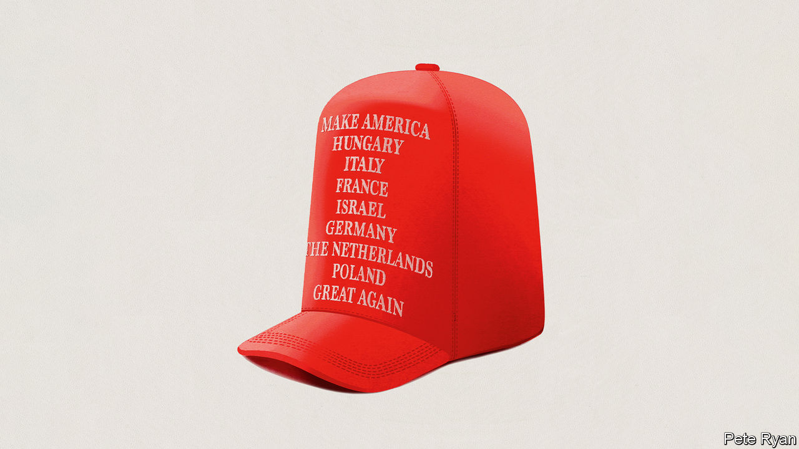
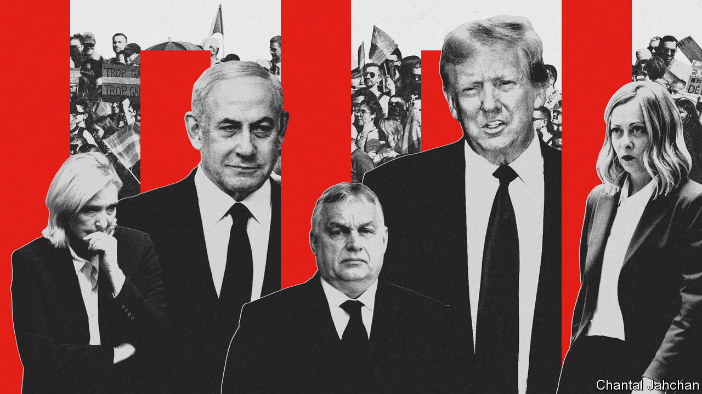
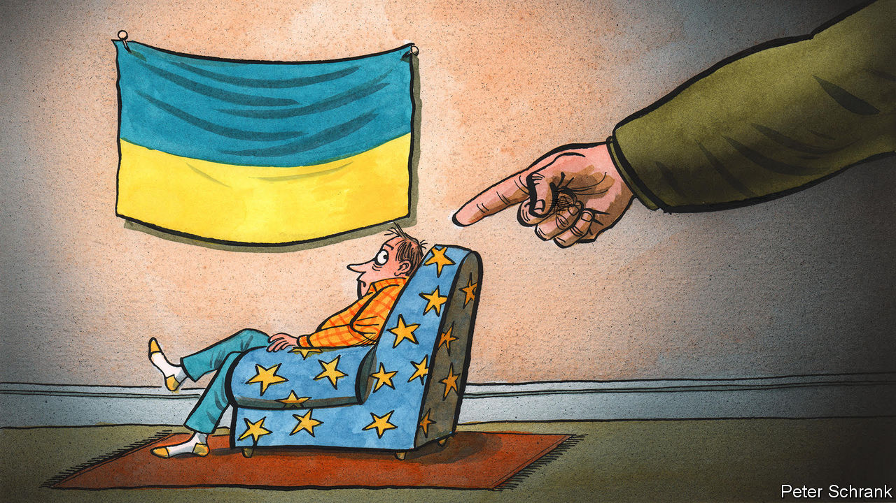
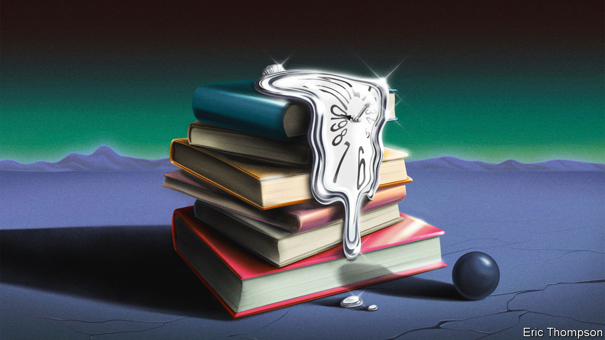
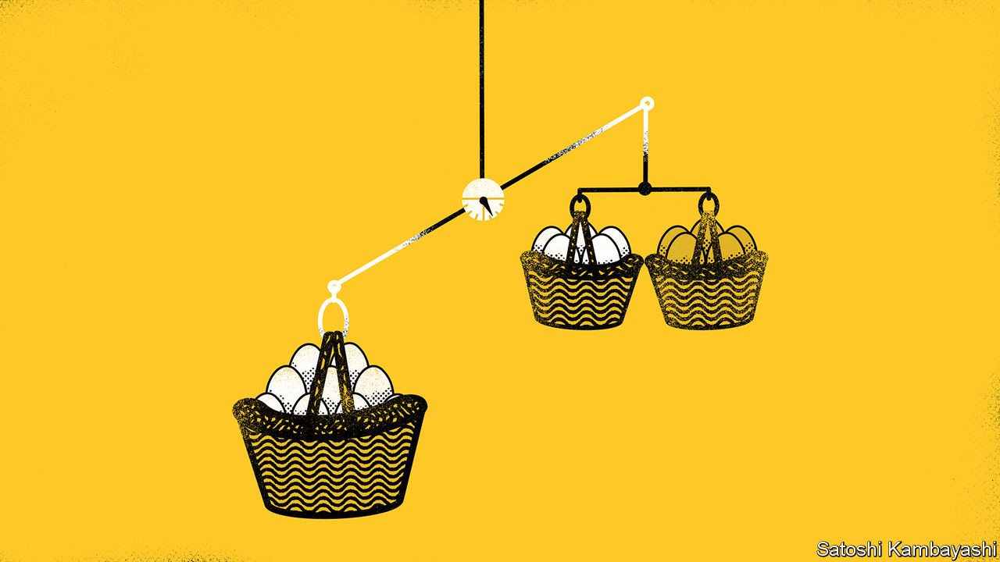

###### On artificial intelligence, the Holocaust, national conservatives, Ukraine, history, investment advice

# Letters to the editor 

##### A selection of correspondence 

 

> Mar 7th 2024 


Who owns AI?

Ben Sobel’s diatribe against “anti-human” copyright law because it poses a “profound threat” to generative artificial intelligence missed some critical steps (, February 16th). One of the main reasons the holders of copyright want protection of their work is so that they can continue to exercise their moral rights, including the right to attribution and to stop their work from being used in a derogatory way. This is of critical importance in the world of deep fakery. 

However, those companies that are developing AI-powered tools in the fields of law, medicine and research have to be as sure as possible about the authoritative provenance of the works they are using in training. Copyright is a great tool for this purpose, because it provides a chain of evidence leading directly back to the author-publisher. From here a judgment can be made as to whether the work is true (did the judge really make that statement?) or false (did a large language model hallucinate a medical research finding?). 

If copyright is taken out of the AI equation this heredity is difficult if not impossible to determine and the world will be a less fair and more dangerous place as a result.

Richard Mollet


 


Anthropomorphising is a problem as society debates AI. The term “hallucination” is used for when the AI is “just plain wrong”. You say this is better described as having the “qualities of a great bullshitter” (“”, March 2nd). But such a person has, at heart, an intent, such as to evade criminal prosecution or to win an election (or both). Large language models do not have intent, but as you pointed out, merely produce the most probable next word for a certain input.

Our intent as users of AI may be to use a reliable tool, marketed as a useful assistant or alternative to reading Wikipedia. The AI boosters’ intent is to sell a product or support ever larger valuations of their companies. Who’s the real bullshitter there?

Seth Hays

Editor

Asia AI Policy Monitor


War and genocide

Paul Moss wondered whether the Holocaust should be viewed outside the context of war, as many of its atrocities took place away from the battlefield (, February 24th). Without war, the Holocaust couldn’t have happened the way it did. The Nazis saw the second world war itself as an opportunity to purify the Aryan race and to make a living space for its people (). The conflict provided opportunities for experiments in brutality. With conquest these methods were exported to murder millions of people depicted as racial enemies using the language and cover of war. The murder of the mentally ill began in October 1939 but was backdated to September 1939 to give it the appearance of a wartime measure. 

For the Nazis, the war against the Allies was also a war against the Jews. To separate the war from the genocide leaves out key parts of each. Only with Germany’s defeat did it end.

Alexander McPherson


 


Populists v conservatives

You proposed distinguishing “national conservatives” from “old-style conservatives” (“”, February 17th). You say these so-called “national conservatives” are fine with big government, hostile to elites, and think their country has been the victim of exploitation by a shadowy cabal of international organisations, bankers and elites. That’s not conservative. That’s reactionary. Donald Trump is not a conservative. The Americans who vote for Mr Trump are not conservatives. They are populist reactionaries. 

This political position is not new and has a long tradition in American politics (Huey Long, for example). It is not stable, because the belief that everything is rigged against “the people” eventually undermines faith in democracy and promotes the view that progress is only possible through some supreme leader. So populist reaction collapses very quickly into a form of authoritarianism known as fascism. We don’t need a new political category to describe this. Moreover, the “old-style” conservatives were also nationalists, they just took a wider view of the national interest. 

Matthew Draper


Umberto Eco’s article, “Ur-Fascism”, published in the  in 1995, identified 14 characteristics of fascist movements. All the national-conservative parties in the various countries you mentioned tick most of those boxes. The tolerance of contradictions, the faux traditionalism, the plot obsession, the macho posturing, the appeal to a frustrated middle class, the covert (and sometimes not so covert) racism, the anti-intellectualism, and the rejection of democracy and enlightenment values. Listening to the speeches made by their leaders with Eco’s list in hand is a depressing game of bingo.

Paul Johnson


 


Powwows are very important and distinctly indigenous cultural events. They may be organised in different ways according to local traditions, but none that I’ve attended resembles a meeting of European conservative politicians. Powwows are much more fun and spiritually uplifting than that. I plead with your writers and editors not to use this word outside its proper context and, when describing mob gatherings of the Trumps and Orbans of the world, to come up with a word that’s less generous-spirited and joyful than an actual powwow (“”, February 17th). 


PATRICIA ELLIOTT 

Professor of journalism 

First Nations University of Canada


 


A Ukrainian abroad

wrote about Ukraine’s refugees (February 24th). I am one of them, residing in Switzerland rather than the EU. My situation is atypical. I was already in Switzerland as a tourist visiting family when the war began. I quickly secured a job at the same international firm I worked for in Ukraine, never seeking social assistance and covering all my expenses independently. Much like other expats in Zurich, I live in a good flat, travel, pay taxes and contribute to social security. However, my employer prefers to keep me on the Ukrainian programme permit for simplicity. 

The prospect of these programmes coming to an end concerns me deeply. I don’t want to return to a home with constant Russian threats, a society experiencing profound trauma, a struggling economy and limited corporate job opportunities. It raises the question of what European governments will do with individuals like me once they close the Ukrainian scheme.

Anna Kuzmenko

Zoriginally from 

 


As time goes by

I thoroughly enjoyed the piece on when events become history (“”, February 10th). I find myself, born in England in 1943, increasingly thinking that my own past is now history. Many young people might add “ancient” to that. It’s not that I object or find it alarming. It is just a strange sensation to know that I was there when this, that or the other thing happened. It is said that old age is not for sissies, but nobody tells you how curiously fascinating it can be. 

Geoff Giffin


 


Investment advice disclaimer

What is my preferred measure of when to shift into safer investments (, February 24th)? An index incorporating the number of published articles declaring that “this time is different” and the number of relatives offering stock tips based on their day-trading activities.

Grant Lewis

 

