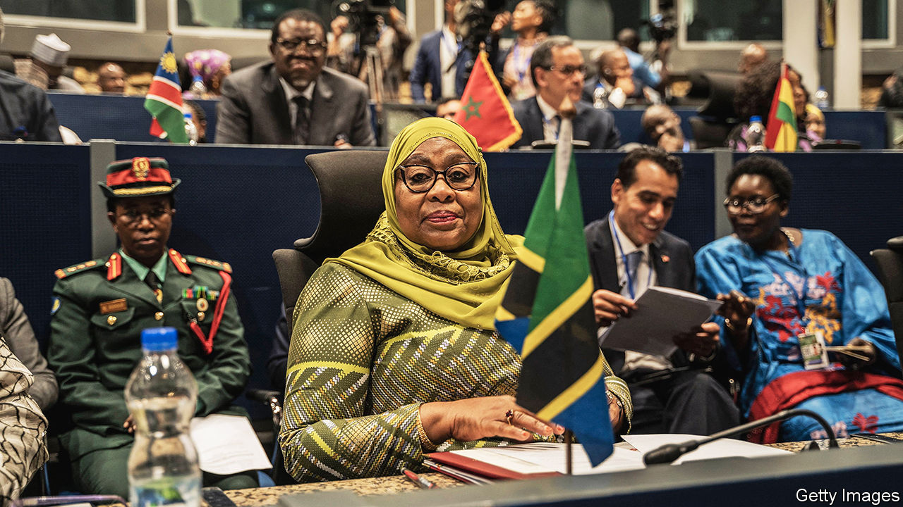

###### Riding the CCM seesaw

# A lost opportunity to reform Tanzania 

##### The country needs a constitutional overhaul. The ruling party stands in the way 

 

> Mar 7th 2024 

TANZANIA’S PRESIDENT is undoubtedly an improvement on her ghastly predecessor. John Magufuli was an abrasive, covid-denying nativist who crushed dissent, chilled investment and frittered away money on vanity projects. Samia Suluhu Hassan, by contrast, is a conciliatory internationalist who has wooed foreign investors and who prefers negotiating with her opponents to locking them up. Yet three years into her presidency, as words fail to translate into action and reforms stall, nostalgia for the Magufuli era is growing.

As a hijab-wearing Muslim woman from the politically marginalised archipelago of Zanzibar, Mrs Samia has had plenty of prejudices to overcome. Before becoming president she was an inconsequential figure within the ruling CCM party, which has governed Tanzania since independence from Britain in 1961. She was the choice of neither her party nor her predecessor, whom she served as vice-president, a position that owed more to tokenism than anything else. When Mr Magufuli died in March 2021, she assumed the presidency by virtue of the constitution.

An accidental, unelected president, lacking a political base and disadvantaged by her sex, faith and birthplace, Mrs Samia was therefore always going to struggle to manoeuvre. The question, therefore, is not whether she is a cautious reformer but whether she is a genuine one. To this, the answer is far from clear.

Certainly, Tanzania is less sinister and less mad since she took over. Mr Magufuli advocated the Eucharist as the best way to fend off covid-19, an approach that failed to prevent many who caught it (probably including himself) from meeting their maker. Mrs Samia preferred vaccines to communion wafers. Likewise, government critics do not have to talk in hushed tones or look over their shoulders quite so much. The president lifted a ban on opposition rallies last year and allowed a protest to take place in Dar es Salaam, Tanzania’s biggest city. Press censorship has eased.

The poisoned atmosphere of her predecessor’s era has also dissipated. Mr Magufuli liked to rile up his supporters by blaming “” (literally “male goats”, meaning foreign imperialists) for unleashing covid, holding back Tanzanian industrialisation and plundering the country’s natural resources. Facing arbitrary government demands, investors fled. Mrs Samia is trying to get them back. Now it is easier to do business and tax audits have grown less quixotic, says Anna Rabin, who runs a firm advising Western companies. The president also sidelined many of Mr Magufuli’s most toxic lieutenants, notably Paul Makonda, who had called on Tanzanians to round up gays and was accused by America of oppressing the opposition.

Yet Mrs Samia has shied away from meaningful political reforms. Though she has lifted bans on news outlets, legislation passed under Mr Magufuli to constrain the media and NGOs remains in place. Few efforts have been made to bring to account those responsible for the worst abuses of the Magufuli years, most notably the attempted assassination of Tundu Lissu, a prominent opposition leader. “I have not had a single call from the police, I have not been interviewed by the police and, as far as I know, not a single person has ever been interviewed,” Mr Lissu says.

Worryingly, there are signs that in recent months Mrs Samia has taken an “authoritarian turn”, says Deus Valentine of the Centre for Strategic Litigation, a pro-democracy movement. Having ditched Mr Magufuli’s stooges, she has busied herself bringing them back into the fold. In October she appointed Mr Makonda to the powerful post of ideology and publicity secretary for the CCM. Reformers within the party appear to have been sidelined.

The restoration of the dinosaurs has been accompanied by a cooling on promises of constitutional and electoral reforms. Mrs Samia had been discussing these with the opposition and pro-democracy groups, but then said that a constitutional review would not take place until 2027, after the general election next year. 

Tanzania’s constitution, written to support the repressive mechanisms of a one-party state, desperately needs an overhaul. The current laws blur the lines between the ruling party and the state and imbue the president with coercive and unnecessary powers. Mrs Samia has used these less frequently than some of her predecessors did, although she has occasionally yielded to temptation. Freeman Mbowe, the leader of Chadema, the main opposition party, was held in prison for seven months until prosecutors dropped terrorism charges against him in 2022. Had the constitution guaranteed prosecutorial and judicial independence, Mr Mbowe might never have seen the inside of a cell.

There is plenty of debate as to why Mrs Samia changed tack. Some say she was never a genuine reformer and had merely been toying with the opposition to buy time. It is more likely, however, that she was forced to do so to shore up support among the electorate and within her party. 

Mr Makonda comes from the Sukuma tribe, Tanzania’s biggest, and could win her votes in a community where her sex is potentially a drawback. Electoral mathematics aside, Mr Magufuli was popular because he made serious efforts to curb petty corruption. Ordinary Tanzanians and foreign investors grumble that police officers and civil servants, who were restrained during his rule, are fleecing them with greater vigour than ever. Bringing the hardliners back might show that Mrs Samia is getting serious about graft.

If the president has anxieties about her electoral position, these must be even greater in regard to her party, where rivals are constantly circling. There are at least eight bigwigs with presidential ambitions who would welcome the chance to trip her up, analysts say. Some of the most charismatic come from the party’s reformist wing. Meanwhile, some Magufuli hardliners are said to have teamed up with opposition parties last year to stir protests over a controversial port deal she signed with the Emirati company DP World. 

For the CCM’s hardliners, constitutional change is a threat to the party’s 63-year grip on power. Whatever her personal views, Mrs Samia needs to pacify them to secure her own position. As party and president scramble to preserve themselves, the window for further reforms seems to be closing. The president has had three years to make a difference. The return on investment has been disappointingly paltry. ■

