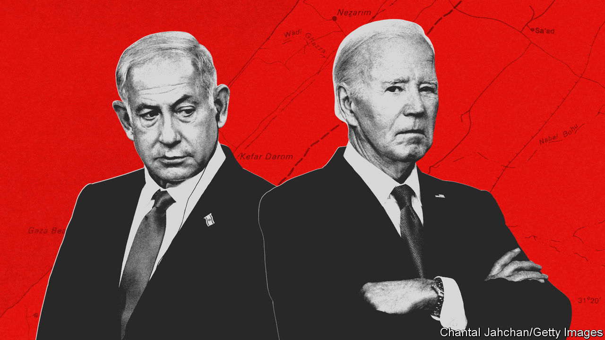

###### Bibi blues

# Joe Biden is exasperated by Israel but will not stop its war 

##### Facing mounting pressure at home and abroad, the president bets on a hostage deal 

 

> Mar 5th 2024 

SIXTY-SIX BUNDLES of food drifting on parachutes onto the beach of Gaza on March 2nd made for an incongruous sight after five months of war: as Israel dropped American-made bombs on Gaza, America’s air force dropped ready meals. The aid operation, conducted jointly with Jordan and repeated on March 5th, symbolised not the power of America, but its frustration at its limited ability to influence Israel’s fight against Hamas.

President Joe Biden has sharpened his tone towards Israel of late, saying he would accept “no excuses” for delays in increasing humanitarian supplies to Gaza. He faces growing pressure, at home and abroad, over the appalling toll of the war, not least the mass displacement of Gaza’s population, the deaths of thousands of civilians, and widespread hunger and disease. 


Mr Biden is making plain his displeasure with Israel’s prime minister, Binyamin “Bibi” Netanyahu, in other ways, too. On March 4th and 5th his administration welcomed Benny Gantz, a centrist member of Israel’s war cabinet, as if he were an alternative prime minister, granting him meetings with the vice-president, Kamala Harris, and the national security adviser, Jake Sullivan, among others. Mr Netanyahu, who has yet to set foot in the Biden White House, was furious.

Ever since Hamas killed more than 1,100 people and captured some 250 hostages on October 7th, Mr Biden has pursued a four-pronged strategy: embrace Israel’s right to defend itself and destroy Hamas, stop the war from spreading, limit the harm to Palestinian civilians and restart peace talks to create a Palestinian state. Mr Biden has rushed weapons to Israel. He has averted a regional conflagration even as Iran-backed militias in Lebanon, Syria, Iraq and Yemen have intensified attacks against Israeli and American targets and disrupted international shipping in the Red Sea. 

Yet Mr Biden has struggled to protect ordinary Palestinians from Israel’s wrath. He feels Mr Netanyahu’s right-wing coalition has not paid much heed to his exhortation to do its utmost to protect civilians. More than 30,000 Palestinians have died (including combatants), according to the Hamas-run health ministry in Gaza. Much of Gaza’s fenced-in population of 2.2m has been forced southward, like toothpaste squeezed in a tube. The UN warns of spreading illness and hunger, especially in parts of northern Gaza.

Hamas has been weakened, but not defeated. Israel says it is determined to destroy Hamas’s surviving battalions in and around the city of Rafah, on the southern border. Egypt is worried that fleeing Palestinians will burst into the Sinai. America has repeatedly warned Israel not to attack without a plan to protect civilians. 

American officials say their air-drops are part of an effort to “flood the zone” with aid. They are a highly inefficient means of providing help—and tend to cost three to four times more than bringing food by road. A putative sea-lift is still over the horizon. Israel seems deaf to America’s pleas to open new passages for supplies by land. The chaos is worsened by Israel’s killing of Palestinian policemen (who are often seeking to prevent the looting of aid) because they are symbols of Hamas’s rule.

The ensuing anarchy became tragically apparent on February 29th, when an aid convoy intended to support life brought death instead. About 100 Palestinians died as they crowded around the lorries—most of them either shot by panicked Israeli soldiers, crushed in the crowd or run over, depending on who is telling the story. 

Still, America has repeatedly vetoed UN Security Council resolutions calling for immediate ceasefires in Gaza. It has defended Israel before the International Court of Justice, which has been asked to rule on the legal consequences of Israel’s conduct in territories it has occupied since a war in 1967. It has also described a genocide case against Israel as “meritless”.

Mr Biden’s support for Israel carries a cost for him at home. About 100,000 Democrats—mainly progressives and Arab-American voters—cast “uncommitted” ballots in the Democratic primary in Michigan, an important swing state. It was a rebuke to Mr Biden, who faces a tough campaign for re-election in November. 

Bernie Sanders, a left-wing senator who twice ran for the Democratic presidential nomination, has called for America to halt military supplies to Israel if it does not immediately increase access to aid. “The air-drop reveals the stark absurdity of American policy,” says Matt Duss of the Centre for International Policy, a think-tank in Washington, who previously worked for Mr Sanders. “We’re air-dropping food to a population whose starvation we’re supporting with our arms.” Republicans, meanwhile, accuse Mr Biden of tying Israel’s hands. 

As war grinds on in Gaza, the Biden administration has pressed Mr Netanyahu in the West Bank. America has imposed financial and travel sanctions on four Jewish settlers accused of violence against Palestinians there. Antony Blinken, the secretary of state, has also declared settlements to be inconsistent with international law, reversing the policy of his Trump-era predecessor, Mike Pompeo, who said West Bank territories “are rightful parts of the Jewish homeland”.

Mr Biden’s main way out of the crisis is to work for a ceasefire, ideally before , the Muslim month of fasting. “The US is trying to hold things together for one more week. They have put all their eggs in the hostage-deal basket,” says David Makovsky of the Washington Institute, an American think-tank. “If they pull it off they will lead a surge in humanitarian aid, and hope the worst of the fighting is over.”

America says that Israel has broadly agreed to the terms of a deal, which are said to include a six-week ceasefire and the exchange of some 40 hostages for probably hundreds of Palestinian prisoners. “The onus right now is on Hamas,” said a White House spokesman. 

America hopes a pause will then lead to discussions of who will run Gaza after the war, and a broader regional peace deal. This would include progress towards the creation of a Palestinian state; reform of the Palestinian Authority, which runs autonomous parcels of the West Bank; the establishment of diplomatic relations between Israel and Saudi Arabia; and various American security guarantees. 

Mr Netanyahu, though, adamantly opposes a Palestinian state. His proposal for the “day after” amounts to a permanent occupation of the Gaza Strip, with routine administration delegated to Palestinian “professionals with managerial experience”. 

For all his annoyance with Mr Netanyahu, Mr Biden has declined to use America’s leverage more directly. Other presidents have done so: Ronald Reagan blocked the delivery of weapons to Israel in the 1980s, and George H.W. Bush halted loan guarantees to Israel in the 1990s. The freelance diplomacy by Mr Gantz is a warning that Mr Biden may yet put his thumb on the scales of Israel’s unsteady politics. Yet Mr Gantz is no dove. After meeting Ms Harris, he emphasised “the imperative of completing the mission” against Hamas. But American officials think him more tractable, and trustworthy. Those who have met him say he is keen on a hostage deal.

Though opinion is shifting, especially among young Democrats, Americans are still largely sympathetic to Israel. Mr Biden is a self-declared Zionist. Thus far in the crisis he has lived by the dedication he wrote years ago on a picture he gave Mr Netanyahu: “Bibi, I don’t agree with a damn thing you say, but I love ya.” ■ 

