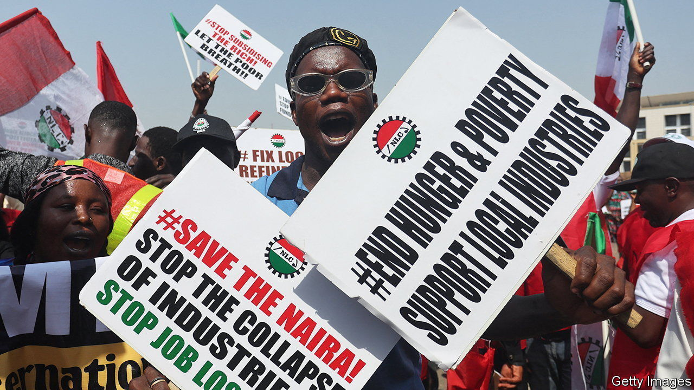
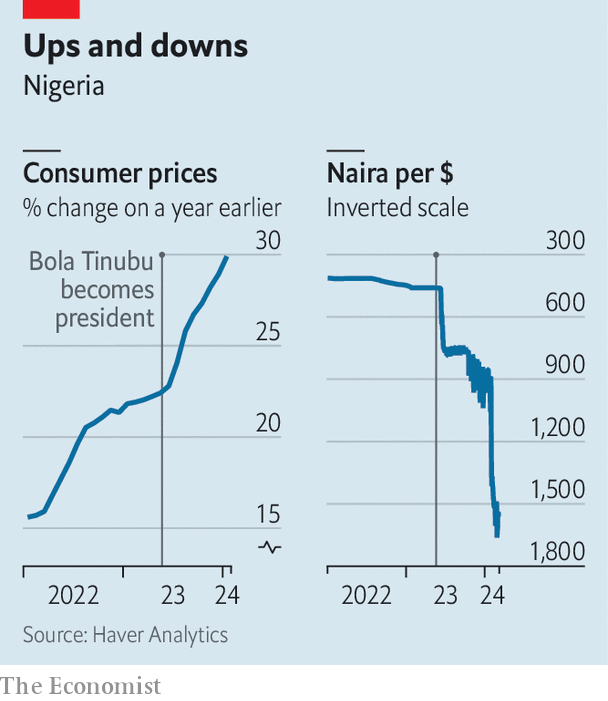

###### Yesterday’s price is not today’s price

# Nigeria’s currency crisis is decades in the making 

##### Fixing it requires deep reform 

 

> Mar 7th 2024 

On the wealthy peninsula of Victoria Island in Lagos, Nigeria’s commercial capital, no one knows how much their grocery shopping costs. Prices are changing so quickly that shopkeepers have given up on tags altogether. At the till, one might be shocked to discover that a tomato is now 120 naira (8 cents). Last year that could get you four, enough to balance out the hot spice in a pot of jollof rice. That staple dish is made dearer still by the soaring prices of onions and rice, forcing the poorest Nigerians to skip meals. Because Nigeria is dependent on imports, its weaker currency is pushing the annual inflation rate towards a three-decade high at almost 30%.

Last year 23 African currencies hit record lows against the dollar. The naira, which is moving towards being fully floated, has been devalued twice in attempts to close the gap with a parallel market rate. That makes it the second-worst-performing currency in the world, after the Lebanese pound. The decline is also eating into the hard-currency profits of multinational businesses. For example MTN, a South African telecommunications company whose biggest market is Nigeria, this month said its group profit could fall by 60-80% and that its Nigerian unit would make a loss because of the naira’s collapse. The currency volatility is eroding confidence, sparking protests from unions and deterring much-needed investment. 

 


For more than four decades, oil provided Nigeria with a steady stream of dollars that boosted the naira. In many cases this made it cheaper to import things than to make or grow them. But oil production has slumped over the past 20 years and no other big source of export earnings has replaced it. With hard currency in short supply, Nigerians are panic-buying dollars, putting further pressure on the naira. 

In a bid to curb inflation and attract foreign investment, the central bank, under a new governor, Olayemi Cardoso, increased interest rates to 22.75% last month. The juicy rates are having some impact: foreigners bought four-fifths of the short-term debt the central bank issued after the increase. The bank also says it has cleared $2.3bn of backlogged foreign-exchange transactions, which had been  and prompting multinationals to leave because they could not get money out of the country.

When Kenya bumped up interest rates in February and issued $1.5bn in bonds, its currency rallied. In Nigeria, however, so great is the demand for dollars that higher interest rates have moved the needle less. 

Taming the naira will take more than quick fixes and tweaks to monetary policy. “For the first time in ten years we have very clear direction on what [the central bank] is doing and why,” says Amaka Anku, who leads the Africa practice at Eurasia Group, a political-risk consultancy. “But the central bank cannot earn foreign exchange!” 

Almost a year since Bola Tinubu was elected president, there are questions about his government’s readiness to deal with a crisis of this magnitude. A steep new tax on firms that hire expatriates (costing $10,000-15,000 a year per foreign employee) is bound to discourage investment. And efforts to curb currency speculation are a distraction from the bigger reforms needed to make Nigeria an attractive place to do business. Only when the country can sell more of its own goods and services abroad, or win the confidence of foreign investors to fill the gap, will it solve its chronic shortage of dollars. ■

