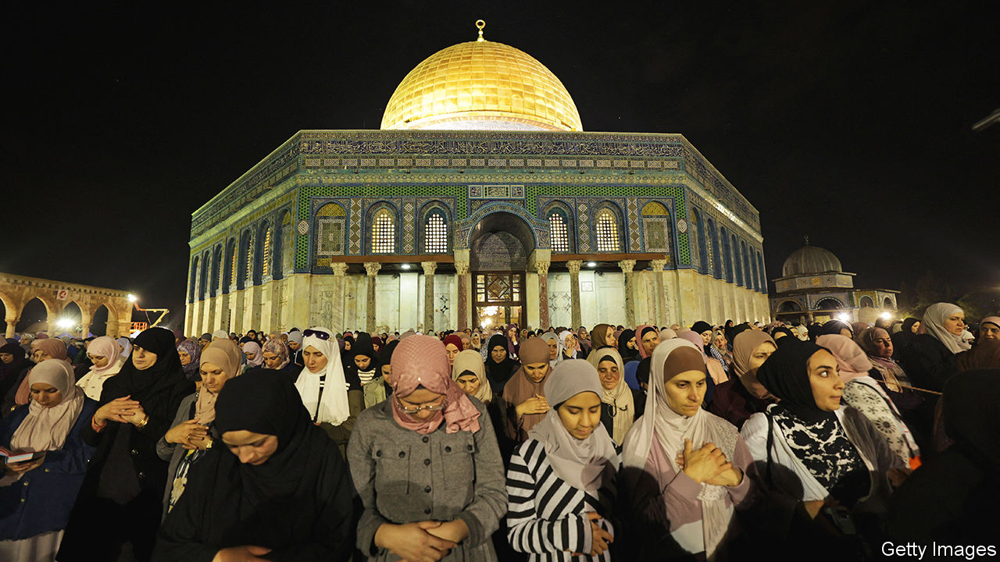

###### The war in Gaza

# Ramadan could see respite for Gaza, or widening violence 

##### Mediators are hopeful of a truce during the holy month 

 

> Mar 7th 2024 

THE ALLEYWAYS of the Palestinian bazaars in the Old City of Jerusalem have been deserted for five months. Since Hamas attacked Israel on October 7th, triggering the war in Gaza, tourism has collapsed and Israeli visitors have kept away. But the stall-owners are hoping for a revival during Ramadan, the Muslim holy month of fasting that starts around March 10th.

Ramadan is a time when families traditionally buy presents and new clothes, and when each night tens of thousands—and on Fridays hundreds of thousands—come to pray at the al-Aqsa mosque. The less devout fill the cafés and restaurants once the fasting is over, deep into the night. 


But Ramadan is also a period of heightened tension, when young Palestinians often clash with the Israeli police in east Jerusalem. In recent years the youngsters have barricaded themselves in al-Aqsa, throwing rocks at the police and at Jews praying at the adjacent Western Wall. 

In 2021 clashes during Ramadan triggered rioting by Arab Israelis and a 12-day war in Gaza. Hamas, which has taken a beating in Gaza (about 13,000 of its fighters have been killed, Israel reckons) and whose leaders are in hiding, is hopeful that Palestinians elsewhere will join in the fight. It has called for a march to al-Aqsa on the first day of Ramadan.

For nearly a century, events at al-Aqsa and the surrounding Temple Mount have often led to wider confrontations between Arabs and Jews. Since the war began, though, Jerusalem has been largely quiet, if still tense. Although there has been a rise in violence in the West Bank, perpetrated by both Palestinians and Israeli settlers, a widespread Palestinian uprising, or intifada, has failed to materialise. 

In the hope of keeping things that way, Prime Minister Binyamin Netanyahu rejected the demands of his far-right national security minister, Itamar Ben-Gvir, to restrict the number of Israeli Muslims allowed to pray in al-Aqsa during Ramadan. Rarely does Mr Netanyahu defy his coalition partner, the leader of the Jewish Power party, without whom he has no parliamentary majority, but the security services were adamant that restrictions would be an unnecessary provocation.

“Tension around al-Aqsa can lead to what Hamas has been trying to achieve since the beginning of the war, dragging the Palestinians in the West Bank and Arab Israelis into the war as well,” says an Israeli military official. Israel has beefed up its already heavy military presence in the West Bank, including with some units that were recently in Gaza. 

There are also rewards for peace. Since the war began, Israel has barred entry to 130,000 Palestinians who worked in Israel—the principal source of income in the West Bank. Security officials, worried that mass unemployment could cause rioting, have pressed for their return. But Israeli politicians have refused to lift the ban. A relatively peaceful Ramadan would probably lead to a change in policy. 

This should also be an inducement to the Palestinian Authority (PA), which controls the semi-autonomous parts of the West Bank, to do its part in keeping the peace. It would not just mean a boost to the Palestinian economy, but would also serve as proof that the PA, which is expected to get a new prime minister within days, can be trusted to retake control of Gaza, from which it was ejected by Hamas in a bloody coup in 2007.

Ultimately, the chances of having a calm Ramadan in Jerusalem and the West Bank are connected to the prospect of a ceasefire in Gaza. As  went to press, talks were under way in Cairo. Egyptian and Qatari mediators were hopeful a deal could be reached before Ramadan. 

The basic framework for such a deal would be a six-week truce during which Hamas would release about 40 of the Israeli hostages it has held for five months in Gaza. In return Israel would release hundreds of Palestinian prisoners. But there are sticking-points.

Hamas is anxious to restore its rule. It is demanding that, during the truce, Israel should remove its cordon that cuts off Gaza city from the southern parts of the strip, where most of Hamas’s surviving fighters are hiding. Israel is unlikely to allow full freedom of movement and has its own key demand: it wants a list of all the Israeli hostages still alive. Hamas has refused to supply this information.

Even if an agreement is reached, Hamas is set to hold on to some of the hostages, particularly IDF soldiers, whom it plans to barter for many more prisoners, including some of its most hardened killers. Israel still plans to continue its campaign against Hamas’s last stronghold in Rafah. But even a temporary truce over the holy month would be a blessed respite. ■

