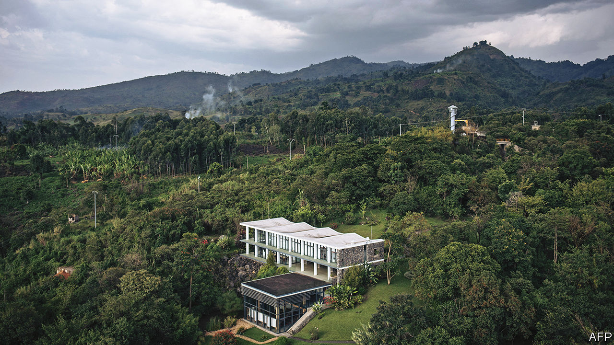

###### Cryptocurrencies in Africa

# Why Africa is crypto’s next frontier 

##### Cheap power is fuelling a new sort of mining boom 

 

> Mar 7th 2024 

“Bitcoin mining is like pouring water on an even floor. It will always go to the lowest point,” says Erik Hersman, a tech entrepreneur in Nairobi, Kenya’s capital, explaining how the energy-intensive activity of creating, or “mining”, the digital currency gravitates to places with the cheapest power costs. Until 2021 the Dead Sea for bitcoin was China, before the government banned it, citing the environmental harm it causes. The proverbial water swiftly , with its plentiful supply of cheap energy and deep capital markets. Profits soared. Within months America accounted for a third of global bitcoin production. 

Crypto-miners are again scouting for fresh ground ahead of the “halving”, which occurs every four years, when rewards for mining will be cut in half. This makes mining less profitable and can drive all but the most efficient miners out of business. Regulators are also growing more wary: in 2022 New York became the first state in America to rule out any new mining operations not based entirely on renewable energy. Wilder pastures such as Kazakhstan and Iran, which had recently welcomed the industry, have since turned hostile. 

Many governments fret that by competing for electricity with local homes and businesses, the miners’ energy-guzzling computers will fuel social discontent. “The worldwide search for cheap power is on,” says Troy Cross, a bitcoin expert at Reed College in Oregon. “If you don’t get cheap power, you don’t survive the halving.”

Enter Africa, with its cash-strapped states and vast—if still mostly untapped—renewable-energy resources. The continent has 60% of the world’s best places to generate solar power (and five of the ten countries with the world’s cheapest electricity). In the past year crypto-miners mostly from China and Russia have been arriving in Ethiopia, to take power from the recently built Grand Ethiopian Renaissance Dam, Africa’s largest. This month Ethiopia’s sovereign wealth fund signed an agreement with a Hong Kong-based firm to build a $250m data centre for data-mining and artificial intelligence. 

Neighbouring Kenya is likewise eager to get in on the action, says Mr Hersman, whose own crypto-mining company, Gridless, began operations in three African countries in the past year. Though the continent’s total contribution to global bitcoin production is negligible, some investors think that Ethiopia could match the capacity of Texas, the current hub. Africa is “definitely” the industry’s next frontier, says Adam Swick of Marathon Digital, America’s largest listed crypto-mining firm. 

The continent offers bitcoin’s boosters a chance to flip the script on an industry whose reputation has wilted in recent years, due to a succession of swindles, crashes and well-founded concerns about its contribution to climate change. Crypto-miners say the emerging model in Africa is the opposite of simply burning through fossil fuels. That seems paradoxical, since there are chronic shortages of electricity in many countries. Yet many of the continent’s renewable-energy projects are stalled because there are not enough local consumers who are able to buy electricity to make them financially viable. By offering themselves as buyers of last resort, crypto-miners can help to stabilise demand for power and ensure utilities turn a profit. In doing so, they might also incentivise the investment needed to provide electricity to the estimated 600m people in Africa, roughly half its population, who do not have access to power from the grid.

There has also been booming interest in using and owning cryptocurrencies in parts of Africa. That may have less to do with any intrinsic advantages they offer than with the weaknesses of domestic currencies such as , which is the world’s second-worst-performing this year.

There is, however, scant evidence that cryptocurrencies offer poor countries a shortcut to riches. In 2022 the Central African Republic became the second country in the world to make bitcoin legal tender. But the move the move failed to spur investment in this militia-plagued country.

The mining side of crypto may hold out more promise. But in the absence of global rules compelling the industry to use renewable energy, there is a risk that its expansion in Africa will be driven by unscrupulous miners whose activities outpace the capacity of governments to regulate them, says Ben Kincaid of Bridger Solutions, a green-crypto firm. In this regard, Kazakhstan’s bid to turn itself into a crypto-mining power stands as a warning. Miners there were soon forced out after being blamed for using too much power and causing blackouts. The brief boom may also have slowed the country’s transition to renewable energy by making fossil-fuel power stations more profitable.

The notion that African countries might “leapfrog” over deep structural problems is alluring. Ethiopia’s government sees crypto-mining as a quick fix for its crippling shortage of foreign currency. But the reality is rarely as simple as it sounds. Bitcoin may help pro-democracy activists evade state repression, for instance, but it can also fund corruption, organised crime and terrorism. As for crypto-mining, one recent study in Texas found that while it did indeed increase renewable-energy capacity, it also led to an overall increase in carbon emissions. “Ultimately, there’s no such thing as green bitcoin-mining,” argues Peter Howson, the author of “Let Them Eat Crypto”. Faced with such uncertainties, governments in Africa might want to look before they leap. ■

