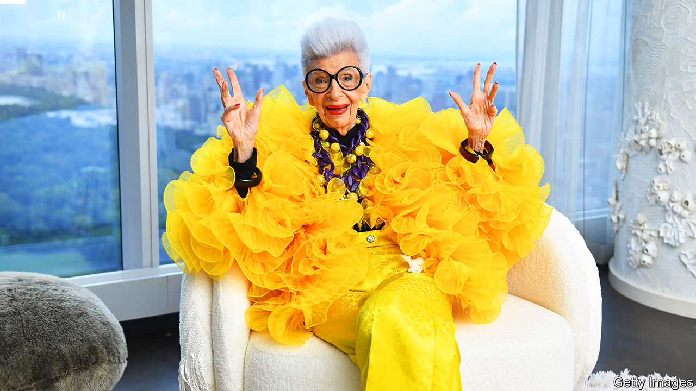

###### Age and magnificence

# Iris Apfel became a fashion icon in her ninth decade 

##### No geriatric nonsense was going to hold her back 

 

> Mar 6th 2024 

Her hair was grey, turning steadily to white. So what? Whether in a bob, a bouffant or a pompadour, she liked it that way. Carl, her lovely husband, also liked it that way. Dyeing it was out of the question. Her skin was wrinkled, way beyond what any serum or powder could obscure. But what the heck? Wrinkles were a badge of courage. If God had kindly given her all those years, why hide it? True, Iris Apfel was at the age where you just fell apart, and if you had two of anything, one of them was going to hurt when you woke up in the morning. But for her the cure was simple: after the necessaries, get dressed. 

Getting dressed was not a simple matter of going to a closet, or even walking into one. Between clothes and accessories, she had so many hundreds of pieces that they hung on a labyrinth of pipe racks. They came from the world over, Africa, Tibet, the Middle East, China, as well as any old flea market or discount store. Everywhere had treasures. Her racks held a glorious muddle. Who had time to organise? Certainly not her. Anyway, she preferred to be surrounded with possibilities. 

So, wandering through, she would pick what appealed that day. It was no intellectual exercise, just a gut thing. Perhaps a T-shirt under a shaman’s tunic, or couturier trousers with an explosion of fancy shoulder frills, deliberately clashing the colours because colour could raise the dead. The finishing touch, sometimes more like a ton weight, would be a necklace of huge beads or silver plates that covered her like armour, big chunky bracelets by the half-dozen, then bright red lipstick and her trademark, huge round glasses with black frames. Why shrink away as you got old? More was more, and less was a bore. 

All the same, when she became a “geriatric starlet”, it surprised her. She was 84 when the hoopla happened, in 2005, after the Metropolitan Museum in New York put some of her improvised outfits on display. She thought, when they first asked her, that they just wanted a few accessories to sit in a vitrine. Instead, the museum people were so astonished when they went through her collection, rooting through all the boxes, all the armoires and even under her bed, that they asked her to dress 85 mannequins, and the show, called Rara Avis (Rare Bird) was a sensation. Giorgio Armani and Karl Lagerfeld came, and she was the talk of the town.

 After that, deep into her 80s and 90s, she became a model and a fashion icon. Her gravelly opinions (Ripped jeans? Insanity! Strappy dresses on old women? Made them look like a horse’s arse!) were taken as gospel truth. She spoke to adoring crowds at Macy’s, many wearing her glasses as a tribute. An Iris Barbie appeared, certainly the oldest Barbie ever, in beads and a bright green trouser suit. At 91 she appeared in Comme des Garçons and huge hair-pieces on the cover of  magazine. At 101 she became the face of Ciaté, a cosmetics company, the “oldest living broad” to be thus employed. Shoot followed shoot in those years, and she rushed happily from one to the next. Having worked like a beaver all her life, she wasn’t about to slow down now (except when she broke her hip, tripping over the hem of an Oscar de la Renta gown). Slowing down was boring, and her love of glamour never flagged. Retire? She might as well be dead. 

No one would call her pretty, but she didn’t care for prettiness anyway. Instead, she had style. You couldn’t learn that, or buy it. But you could recognise it right away, even in tiny things, like the three-tiepin arrangement she praised once on an Englishman’s lapel. With her eye for quality as well as pizazz, from the 1950s she had built up a select reputation as an interior designer. She and Carl had started a company, Old World Weavers, to find and replicate rare fabrics from every corner of the globe. These had ended up in the apartments of Estée Lauder and Greta Garbo, as well as in the White House, from Truman onwards. By the 1970s she was using her mother’s apartment on Park Avenue, with its harpsichords and Venetian screens, and would escort guests to New York City’s fanciest clubs and restaurants. Yet when asked what her job was, she would simply say she put piles of cushions on sofas. 

What she did not reveal, with that remark, was that she made the cushions out of bits of material that hadn’t quite worked out as clothes. She also devised a coffee table once out of columns and glass from a demolished building in the Bowery. Economy and improvisation were the words she lived by. As a small child, bored on visits to her grandparents, she was allowed to sort through big pillowcases of fabric remnants, putting the scraps together as she pleased. It was great training. Like all the family (her grandfather was a master-tailor, her mother devoted to accessories, and money short during the Depression and the war) she learned early to sew, glue and paint to make something out of next to nothing. Improvisation was like jazz, she thought. You took patches and thread, or a ruby-red tunic, pyjamas and a torque, to build a marvellous ensemble out of the seemingly random.

No surprise then, though she wore haute couture, that her lifelong love was to browse in discount stores. Loehmann’s in Brooklyn, with gorgeous clothes at rock-bottom prices, was her Holy Grail. A plastic bracelet for four dollars and some change pleased her as much as if Carl had suggested a trip to Harry Winston, the luxury jeweller. (She also replicated her own pieces for the Home Shopping Network, giving less well-off women the chance to buy them.) Flea markets and souks were a joy. Nobody foraged and haggled more fiercely, or came away with more bags of junk. 

People would keep asking what her secret was. No sodas, no fatty foods, of course. No thoughts about death. A long and happy marriage. But, most of all, keeping a child’s curiosity. The world was full of wonder. Long before she had needed glasses she had started collecting them, intrigued by the pearl or diamante frames, and started her massive trove of pieces humbly, in a shoebox in her closet. When eventually she had to wear spectacles all the time, she made them as large as possible: less to advertise herself, than to say: Keep looking! Keep being amazed. ■

