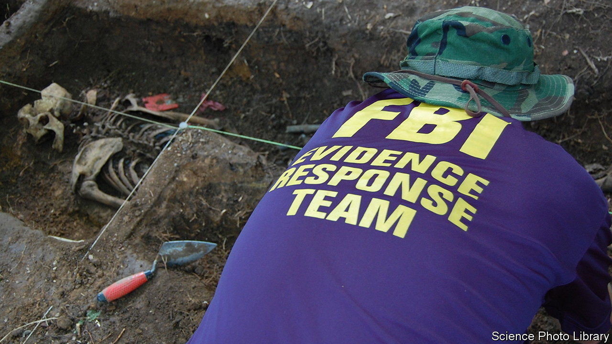

###### Final countdown

# A new technique to work out a corpse’s time of death 

##### AI could make the work of pathologists more accurate 

 

> Mar 6th 2024 

In fiction, hard-pressed pathologists presented with a corpse are able to take a bite of their sandwich and instantly pronounce a time of death. Reality is, of course, a lot messier, and the results—or lack of them—can make or break a case.

Now artificial intelligence is offering a helping hand. By analysing thousands of deaths and what follows, the technology can offer the best estimates so far of the post-mortem interval (PMI).

Working out when a person has died is the most basic (but frustratingly imprecise) part of a forensic investigator’s work. For decades these specialists have had to rely on intuition, combined with observations of the state of the deceased and clues such as temperature, both of the dead body and the environment. Different bodies decay at different rates, however, and individual circumstances can throw off the most careful PMI calculations. A body found in a ditch in northern England in 2004, for example, was given an erroneously late time of death because the ditch was shielded from sunlight and the colder-than-expected conditions had helped preserve the corpse. 

Forensic-science journals are full of such cases—some routine, others bizarre—while the potentially useful details of thousands more investigations are buried in case files around the world. Now forensic researchers in America are working to access and compile these valuable write-ups, and to use machine learning to analyse them. The result is an AI-powered tool, called geoFOR, that could offer the most reliable estimates of PMI so far. Sandwiches are not included.

Developed by a research team led by Katherine Weisensee at Clemson University in South Carolina, the model is based on data pooled from more than 2,500 death investigations, with more added each week. About 1,800 of these are real-world cases involving the discovery of a body. The rest are drawn from forensic experiments at so-called “body farms” in Texas and Tennessee, in which corpses are left to decay for weeks and months under varied circumstances. 

For this second group, the precise PMI is known. So photos and descriptions of their various states of decomposition over time, along with information about temperature, humidity, wind, soil type and other conditions, have all helped train the AI model. Like many good detectives, the algorithm can spot patterns and make connections between the clues.

To use the tool, forensic investigators attempting to date a body simply enter some specifics of their case into an app. Entering the location allows the AI model to factor in local weather conditions. The investigators then add observations about the deceased, such as whether they were obese, whether insects have moved in and whether dogs or rats have gnawed on the body. They must also add any indications of “purging”—a particularly grim scenario in which foul-smelling fluid oozes from the nose and ears of the corpse. In return, the AI compares the case with those in its training data and offers a likely PMI and, therefore, an estimated date of death.

At present the model offers a range of days within which it is 80% confident the true PMI lies, according to Dr Weisensee’s team. This confidence level should improve as experts and investigators around the world continue to add their own cases and examples to the database.

The results could be used to check alibis and help solve crimes, but they have other uses too. Madeline Atwell, a forensic anthropologist at Clemson University who works on the project (and serves as a deputy coroner for Richland County, South Carolina), says the model has already helped close several missing-person cases. Combining time of death with when people were last seen alive is very useful in identifying human remains. “You match it with missing-person records, and that helps narrow your time frame,” she says.

And sometimes a more reliable PMI simply gives bereaved families a better sense of a loved one’s last moments. “It helps with that process of understanding,” says Dr Atwell. ■


