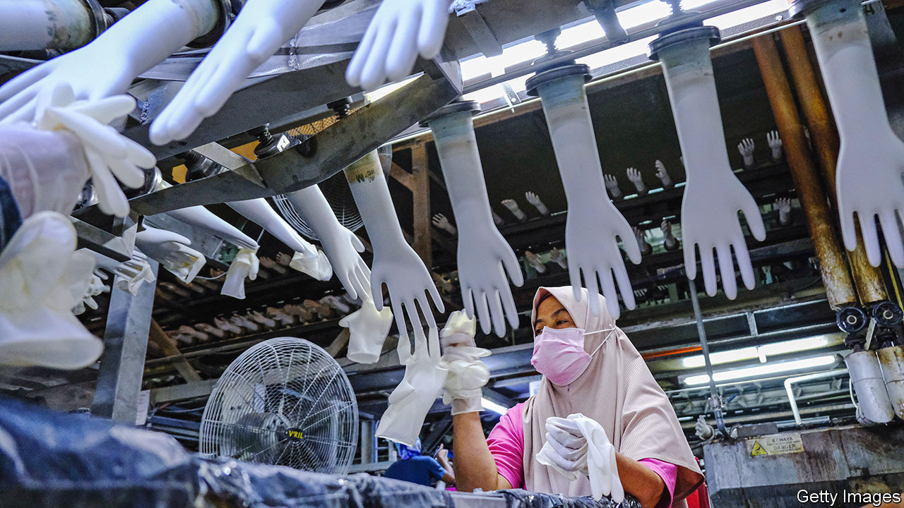

###### Advanced materials

# How medical gloves will help launch satellites 

##### Graphene rises to new heights 

 

> Mar 6th 2024 

GRAPHENE is strong, lightweight, flexible and an excellent conductor of electricity. In the 20 years since it was first isolated at the University of Manchester, however, it has also proved dispiritingly light in useful applications. That is slowly beginning to change, as its remarkable properties keep researchers well-stocked with inspiration. For Krzysztof Koziol at Cranfield University in Britain, for example, what began as a covid-era plan to use graphene to improve surgical gloves has now morphed into a project to use high-altitude balloons to launch satellites into space.

Graphene, which consists of monolayers of carbon atoms bonded in a repeating hexagonal pattern, can be made in a number of ways, mostly by stripping flakes of carbon from mined graphite (sticky tape and pencil lead will do). Levidian Nanosystems, a Cambridge firm, uses a more sustainable process. It captures methane, a potent greenhouse gas, from various industrial sources, and then zaps it with microwaves inside a reaction chamber. This cracks the gas into its constituent parts, with hydrogen emerging at the top and graphene flakes at the bottom.

Dr Koziol leads a team of researchers who work with Levidian on a variety of graphene-based applications, from reinforcing aircraft, cars and wind turbines to lining gas pipelines. In 2019, they also worked with Meditech Gloves, a Malaysian firm, to improve its surgical and examination gloves. The company makes these from latex, a mixture of water and natural rubber tapped from the bark of rubber trees. As some people are allergic to proteins found in latex, most medical gloves tend to be made from petroleum-based nitrile rubber instead. As covid took hold, some 80m pairs of gloves were being used by health workers every month, with the nitrile ones ending up in landfill. There, they could take roughly 100 years to decompose.

Cranfield helped Meditech speed up production. It developed a new latex formula to make the firm’s gloves hypoallergenic and then added graphene for a version that is lighter and stronger. Both types are currently being certified for medical use. They are more sustainable than nitrile gloves because natural rubber absorbs carbon dioxide rather than producing it, and they should biodegrade in about a year. 

Testing the integrity of surgical gloves involves filling them with air and looking for leaks. Treating them, in other words, like balloons. For Dr Koziol, the parallel was particularly intriguing. Most balloons used in aerospace applications (to conduct high-altitude monitoring, for example, or for communications) are produced with synthetic plastics and filled with helium, which is becoming scarce on Earth. A graphene balloon, however, could carry heavier payloads and be filled with hydrogen instead. The hydrogen might also power any on-board devices through a fuel cell.

The Cranfield team are working with Levidian and others to produce graphene-infused natural rubber aerospace balloons to operate at altitudes of 30km. Satellites could one day be sent into orbit from here on rocket-powered launch vehicles, which would need only a small amount of fuel having been lifted to a thinner atmosphere with lower gravity. The researchers are now investigating 3D-printing to make medical gloves and balloons. For safety reasons, rockets tend to be launched over remote areas or the sea. Balloons offer greater flexibility and Dr Koziol wants to build a launch pad at Cranfield, in the heart of the English countryside. There is plenty of room: as a former aeronautical college, it still operates an active airfield. ■


