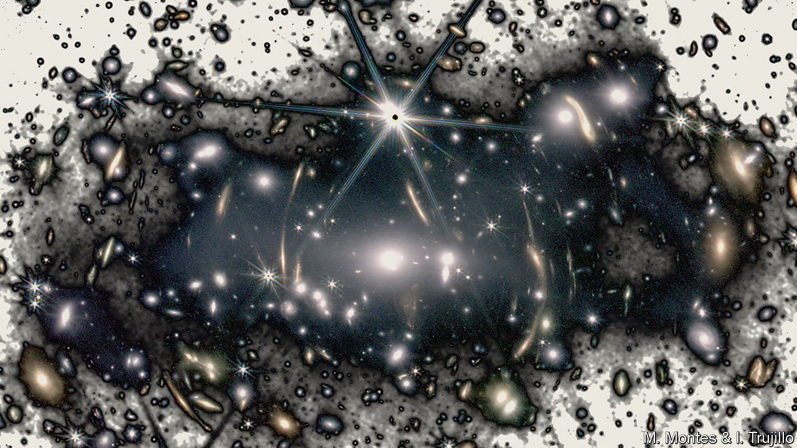
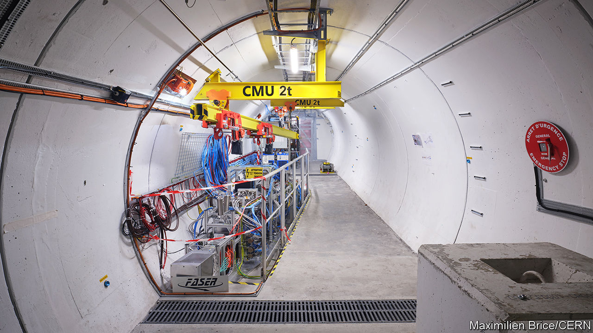

###### Dancing in the dark

# Physicists are reimagining dark matter 

##### There might be new particles, forces and perhaps even a Dark Big Bang 

 

> Mar 6th 2024 

Readers of this paper will probably need no reminder that most of the universe is missing. The atoms and light you see—from people to planets, stars and galaxies—make up just 5% of the universe. The rest is a two-part mystery—a substance called “dark energy”, which pushes space apart, comprises 68% of the cosmos; what’s left, around 27%, is dark matter.

Dark matter emits no light and scientists only know it exists because, when they look into the night sky, they see galaxies rotating a lot faster than they should. The laws of physics suggest that these galaxies should tear themselves to shreds at such colossal speeds. But astronomers do not see galaxies flying apart, which implies that there is a lot more stuff in them than can be observed in the form of stars, and therefore more gravitational force holding everything together.

For decades astronomers have been able to measure how dark matter behaves and can point to parts of the sky where it must exist. But what it actually —that remains a mystery. The leading hypothesis, which goes by the name “Cold Dark Matter” (CDM), suggests that dark matter is a fluid of particles that move sluggishly relative to the speed of light, and interact with each other and everything else in the universe mainly through gravity.

Giving up the ghost

But after more than half a century of fruitless searching, compounded by a string of recent astronomical anomalies, CDM is in trouble. Physicists are gravitating towards a different theoretical framework, known as “Self-Interacting Dark Matter” (SIDM), which proposes the existence of a hidden universe of dark particles and dark forces, that exists in parallel with the familiar particles and forces of normal matter. This dark universe could even have had its own “Dark Big Bang”, a birth event that would have taken place some time after the more familiar Big Bang that began the universe 14bn years ago.

CDM forms one pillar of the Standard Model of Cosmology. The other, which aims to explain dark energy, is known by the Greek letter Lambda. Together these descriptions almost perfectly reproduce the evolution of the kinds of large-scale structures that astronomers observe in the universe today—galaxies, galactic clusters and gargantuan galactic superclusters.

The theory is agnostic about exactly what particles make up dark matter. But the most promising candidates until now have been known as Weakly Interacting Massive Particles (WIMPs). These are particles with up to 1,000 times the mass of a proton and models of the early universe predict that—if WIMPs do exist—they should be present in the right quantities today to account for dark matter, a happy coincidence known as the “WIMP miracle”.

Dozens of highly sensitive detectors have been built around the world to spot WIMPs. Many hide hundreds of metres underground to shield them from noise and give them the greatest chance of detecting the subtle interactions WIMPs are predicted to make with normal matter. There have even been hopes that particle accelerators such as the Large Hadron Collider (LHC) at CERN in Switzerland might discover a WIMP candidate or two in the shrapnel of high-energy particle collisions. Unfortunately, despite more than 40 years and millions of dollars spent on the search, WIMPs have remained stubbornly elusive.

That is not the only problem with CDM. The theory does a terrific job at reproducing the large-scale structures of the universe but, as new telescopes allow astronomers to peer ever deeper into distant galaxies and rapidly improving supercomputer simulations allow them to explore the implications of CDM at smaller scales, it is becoming clear that the theory does not do as well at reproducing much finer-grained structures of the universe.

The dark side of the Moon

Two anomalies stand out. The first concerns the structure of galaxies. CDM implies that, since it moves slowly and feels the effects of gravity, dark matter ought to accumulate in unfathomably high densities in the cores of galaxies. But this is not what astronomers observe. The density of dark matter does rise as you travel from the edge of a real galaxy towards its centre. But, several thousand light-years from the middle, the density reaches a plateau and then remains steady all the way to the core. 

The second anomaly concerns satellite galaxies. CDM implies that large galaxies ought to be orbited by thousands of smaller satellite galaxies. But this is also not what astronomers observe. The Milky Way, and galaxies like it, tend to be orbited by a handful of satellite galaxies and those that astronomers observe are also smaller than predicted by CDM.

These discrepancies can be explained by SIDM. Simple versions of the theory propose just one new elementary dark matter particle and one new fundamental “dark force”; in more complex versions there is a smorgasbord of new dark particles and forces, continually interacting with each other. The more complex versions are inspired by the well-established Standard Model of particle physics, which is a quantum mechanical description of all the particles (such as quarks and electrons) and forces (the strong, weak and electromagnetic) of normal matter.

One version of SIDM introduces a new dark force that is equivalent to electromagnetism, which is felt by a hypothetical particle with “dark” charge—a dark electron, essentially—that interacts by exchanging “dark photons”. Unlike the familiar photon, however, which is massless and carries the electromagnetic force, dark photons could potentially carry a mass.

SIDM solves the problems that plague CDM while preserving all the features that made CDM attractive in the first place. If dark matter can interact with itself, its particles would be able to scatter off each other, generating a pressure in the centre of galaxies that prevents the dark matter from reaching unfathomably high densities. This is similar to the pressure in a balloon, caused by air molecules bouncing off each other. That would explain why the dark matter densities of galactic cores are so much lower than predicted by CDM.

This idea kills two birds with one stone. In a paper published in the journal  at the end of 2022, Victor Moreno and colleagues from Durham University showed that galaxies with less concentrated dark matter in their cores more violently cannibalise satellite dwarf galaxies in a process known as “tidal stripping”, where the gravitational pull of the larger galaxy strips both the matter and dark matter from its satellites. That would explain why there are fewer satellites than CDM predicts and why the ones that are observed are smaller than CDM predicts. They have been stripped down to a smaller size or stripped into non-existence.

Beyond solving issues with CDM, SIDM also makes predictions that allow it to be tested against CDM. In the conditions that defined the early universe, but which are thankfully no longer present in the universe today, both CDM and SIDM allow for the possibility of “dark stars”. These are not stars as we know them today but, instead, solar-system sized clouds of gas in which dark matter and its antimatter counterpart—dark antimatter—waged a war of constant mutual destruction. Because such interactions release exponentially more energy even than nuclear fusion, these gigantic diffuse clouds of gas would have glowed with the light of an entire modern galaxy.

 


In a paper published in the journal  in July 2023, Katherine Freese, a particle physicist at the University of Texas, and her colleagues identified three objects old enough, bright enough and compact enough to be dark-star candidates in data collected by the James Webb Space Telescope. “If these turn out to be dark stars—and that can be confirmed with more data—their masses, temperatures and emission spectra could one day be used to distinguish between dark-matter models, including between CDM and SIDM,” she says.

Dr Freese has also made the case for a Dark Big Bang that could have given rise to dark matter independently of normal matter in the days after the Big Bang. The traditional model of the universe says that matter and dark matter were produced at the same time. The earliest evidence of dark matter, however, only appears later in the early evolution of the universe, when cosmic structure starts to form. 

One explanation for this is that matter and dark matter did not, in fact, appear together, but that dark matter entered the universe in a second cataclysmic release of energy from the vacuum—the Dark Big Bang—as much as a month after the traditional Big Bang. The model that Dr Freese and her co-author Martin Winkler explored would explain why dark matter might be completely decoupled from traditional matter and it also naturally produces SIDM candidates. If there was such a Dark Big Bang, it would have left a clear signature—a pattern in the frequencies of the gravitational waves that hum across the universe—that could be picked up by future gravitational-wave detectors.

Finally, there may also be ways to detect self-interacting dark matter directly. The fact that SIDM candidates are considerably lighter than WIMPs means that traditional WIMP detectors, operating in the past few decades, are likely to have missed them. New experiments could change that. 

The FASER detector at the LHC, which began collecting data in 2022, is designed to detect extremely light dark-matter particles, such as dark photons, that might be produced in collisions at the LHC. Similarly the SuperCDMS experiment at SNOLAB will begin operations in 2024. Based in an abandoned mine in Canada, SuperCDMS is designed to detect subtle collisions between light dark matter particles—including SIDM candidates—and atoms in silicon and germanium crystals.

No longer afraid of the dark

For now, however, dark matter remains resolute in its refusal to yield its secrets. Fortunately, physicists are rarely short of ideas. SIDM may not be the one that unlocks the true nature of dark matter, but one idea eventually will.

In the meantime, it offers a romantic vision of the cosmos. There is comfort in the idea that, somewhere, astronomers made up of dark atoms peering through telescopes that magnify dark photons might also be scratching their heads, wondering why a small amount of matter is missing from their universe. ■


