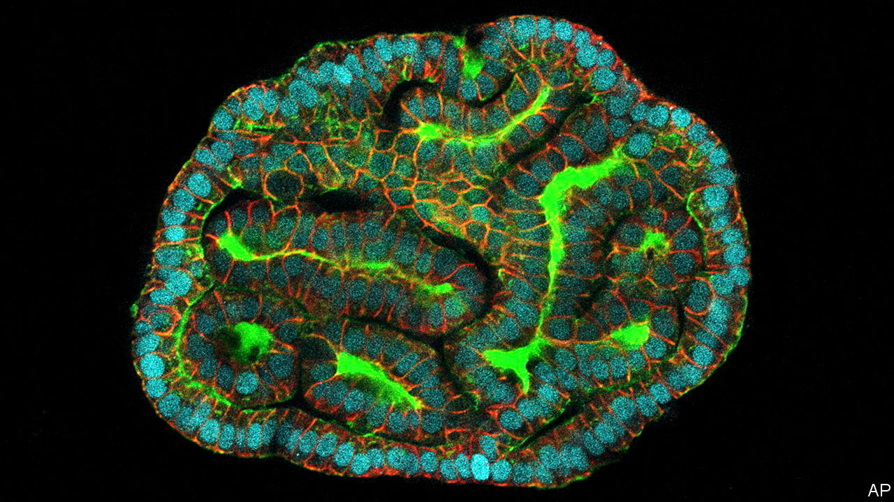

###### Model baby

# Scientists can help fetuses by growing tiny replicas of their organs 

##### They could be used to improve treatments in the womb 

 

> Mar 5th 2024 

WHEN A FETUS shows signs of trouble in the womb, doctors face a precarious task. They must find out what is wrong and how to help without jeopardising the pregnancy. Despite sophisticated modern genetic and imaging tests, many questions are difficult to answer—how severe a malformation is, for example, or how a fetus might respond to treatment. But now scientists have developed a way to create simplified versions of a fetus’s own organs, outside the womb, giving doctors the ability to prod and probe without putting anyone at risk. “For the first time, we can actually access the fetus without touching the fetus,” says Mattia Gerli, a stem-cell biologist at University College London (UCL).

The approach rests on using cells from the amniotic fluid that surrounds a growing fetus to grow an organoid, a structure that resembles a simplified organ. Because an organoid is made from a person’s (or in this case, a fetus’s) own stem cells, trials are demonstrating that they can reveal individual features of a disease and their specific responses to drugs or treatments. 

Making an organoid usually requires a biopsy, which is why it has not been possible to make them from living fetuses until now. Dr Gerli and his colleagues, writing this week in , got over this hurdle by extracting progenitor stem cells from amniotic fluid. These comprise around 1% of the fluid and, like other stem cells, they can turn into different types of cells in the body.

The researchers fished out the progenitor cells of 12 amniotic-fluid samples taken from second- and third-trimester pregnancies, and cultured them into kidney, small-intestine and lung organoids. Because the progenitors were already on their way to forming those organs, they needed little encouragement. Once they had become useful organoids, they had telltale features of the organs they were mimicking. The lung organoids, for example, had working lung cilia—hairlike structures that rhythmically beat to clear mucus and debris—just like the real thing. 

Crucially, Dr Gerli’s work was completed without interrupting any pregnancies. Amniotic fluid is routinely extracted to test for abnormalities and, because the organoids only take four to six weeks to grow, the technique allows ample time to both test and treat. The organoids can also be used to report on a treatment’s progress.

The team at UCL also grew organoids from fetuses with congenital diaphragmatic hernia, a birth defect that compresses the lungs and prevents them from properly developing as a child grows in the womb. They then compared organoids from amniotic-fluid cells taken before and after treatment, which was a small balloon inflated in the fetus’s windpipe. After the procedure, the organoids looked healthier, suggesting that the balloon was doing its job. Such studies would otherwise be “impossible” to conduct, says Paolo de Coppi, a biologist and paediatric surgeon who was part of the UCL team.

Oren Pleniceanu, a kidney researcher at Sheba Medical Centre in Tel Aviv in Israel who is not involved with the work, says organoids also show promise in basic research and drug discovery. His team looked at premature births, complications from which are the leading cause of death in children under five. When doctors think a baby might come early, they give the mother steroids to help the newborn baby’s lungs breathe ahead of schedule. But the treatment does not work in all cases. When Dr Pleniceanu exposed lung organoids in his lab to steroids, they sped up maturation just as they are meant to. He argues that such studies could be used as a benchmark against which to test other options.

It will take many years of tests and a lot more research for fetal organoids to reach patients in the clinic. And there are some limitations, since not all organs can be replicated this way either; the brain, for example, is unlikely to be a target for future organoids since amniotic fluid does not seem to contain the appropriate progenitor cells. Still, a prospective mother could soon look down a microscope and see a replica lung belonging to the baby she feels kicking inside—not bad for a first step. ■


