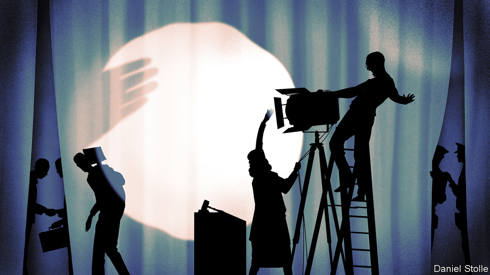
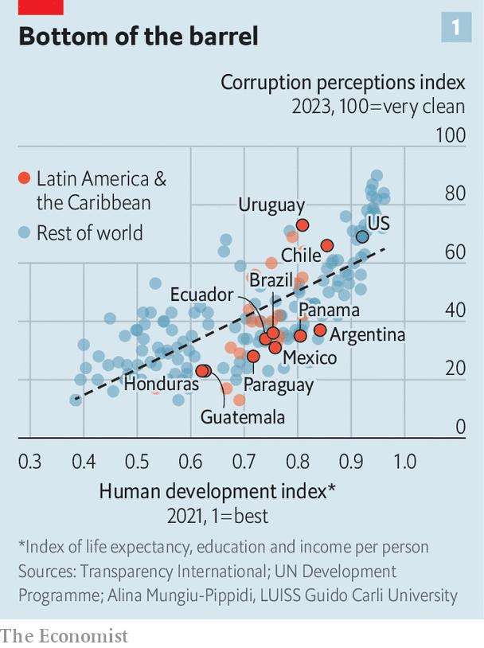
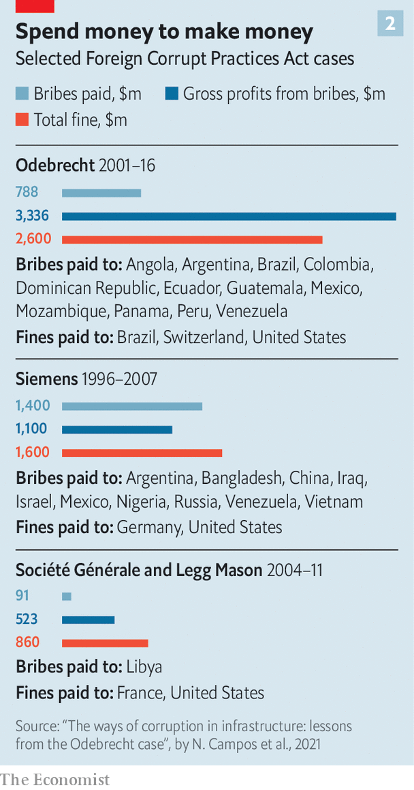

###### The legacy of Lava Jato

# Corruption is surging across Latin America 

##### Political blowback from a period of intense anti-corruption campaigns is to blame 

 

> Mar 7th 2024 

ON January 31st José Dias Toffoli, a judge on Brazil’s Supreme Court, suspended the payment of a $2.6bn fine by Novonor, a construction firm better known by its former name, Odebrecht. The previous month he had suspended another fine imposed on J&amp;F, which owns the world’s biggest meatpacking company, JBS. The companies had agreed to the fines as part of leniency agreements in which their executives admitted to bribing Brazilian officials. Mr Toffoli ruled that there was reasonable doubt about whether the agreements were signed voluntarily, and argued that the judge who administered the fines may have colluded with prosecutors.

The fines came after a series of Brazilian corruption investigations, the most famous of which, known as Lava Jato (Car Wash), started ten years ago this month. It was part of a wave of anti-corruption activity which swept Latin America in the 2010s. But Mr Toffoli’s decisions correspond with a new worsening of perceptions of corruption across the region. Brazil fell ten places in an annual index of perceived corruption released by Transparency International, a charity, in January. Peru fell 20 places, putting it among the countries perceived to be the most corrupt in the world. Most Latin American countries scored worse than their levels of development suggest they should (see chart 1).

 


Perceptions are not always reliable, but there is other evidence of a backlash against anti-corruption efforts. In November allies of Honduras’s new president bypassed congress to name an attorney general who is friendly to the ruling party. As  went to press, Peru’s congress was set to vote on whether to remove members of the independent body that selects prosecutors and judges, even as numerous legislators are currently under investigation for corruption. 

Mexico’s populist president, Andrés Manuel López Obrador, is trying to scrap the state body which looks into impropriety. Ruling politicians in Guatemala fought bitterly to stop Bernardo Arévalo, a former anti-corruption campaigner, from being inaugurated as president in January.

The roots of this backlash are found in the drama of the region’s anti-corruption investigations. Brazilian police started investigating Petrobras, the state oil firm, in March 2014. It had been doling out building contracts at inflated prices for years. Companies used the extra cash to bribe oil executives and officials. The investigation spun off into a dozen others, focused on construction firms. Between 2001 and 2016 Odebrecht paid almost $800m in bribes across three continents, gleaning over $3bn in profits for itself and its conspirators. It is the largest foreign graft case ever prosecuted by the US Department of Justice (see chart 2), which had jurisdiction because some bribes were funnelled through bank accounts in the United States.


The investigation was dubbed Lava Jato because its starting point was the examination of a car wash which was laundering money. It became perhaps the biggest investigation into graft since Italy’s Mani Pulite (Clean Hands) in the 1990s, and upended politics across Latin America. Almost a third of Brazil’s senators and nearly half of its governors were drawn in to some extent. The left-wing president at the time, Dilma Rousseff, was impeached in 2016. Her mentor, Luiz Inácio Lula da Silva (known as Lula), who was president between 2003 and 2010, was twice sentenced to jail (he was released after 580 days). Both cases were linked to Lava Jato. 

In Peru, five former presidents were investigated; one committed suicide as police came to arrest him. Former presidents were also investigated in El Salvador, Panama, Mexico, Paraguay, Ecuador and Colombia. Most maintain that the investigations were politically motivated. 

 


The sprawling Lava Jato investigation shook Latin American economies, too. The revenues of several implicated construction firms tanked in its wake. Some went bankrupt. In Peru, where construction contracts worth $17bn were probed by Lava Jato, thousands of workers lost their jobs as public works ground to a halt. For a while it seemed nobody could escape Lava Jato’s crime-busting tentacles.

Then came the fall. Errors and hubristic behaviour by zealous prosecutors cast doubt on the investigation’s impartiality. The most prominent Lava Jato judge, Sergio Moro, publicised a plea bargain which implicated Lula one week before the 2018 election. Lula’s favoured candidate lost to Jair Bolsonaro, a hard-right populist whose campaign had been boosted by anti-establishment sentiment generated by Lava Jato. Mr Moro then left the judiciary to become Mr Bolsonaro’s justice minister. The lead prosecutor, Deltan Dallagnol, became a congressman for a right-wing party. In 2019 leaked text messages published by , an investigative site, suggested that Mr Moro had been colluding on cases with Mr Dallagnol. Both men told  there was no collusion, and pointed out that the majority of judicial decisions on Lava Jato were initially upheld on appeal. Mr Dallagnol said the task force did not recognise the authenticity of the leaked messages, Mr Moro that they had “never been examined in open court”.

Critics also accused the Lava Jato task-force of using aggressive tactics to court media attention. Lula was arrested in 2016 using a bench warrant, usually used when a subpoenaed person refuses to attend a hearing, something he had not done. In Peru and Brazil, prosecutors were criticised for the extensive use of pre-trial detention. One Brazilian investigator forbade the rector of a university from entering his campus, and briefly imprisoned him on suspicion of corruption. The rector committed suicide soon after. He was innocent.

Politicians pounced on these cracks. “Lava Jato was like the Jacobin moment of the French Revolution,” says Marco Bastos of Southern Pulse, a consultancy. Brazilians gawked at their televisions as a parade of politicians were figuratively guillotined. Then the old guard struck back.

Dying light

Legislators may have ousted Ms Rousseff because they felt she was doing too little to protect them. Romero Jucá, a senator, was caught on a wiretap before her impeachment, telling a political ally: “This shit has to be fixed...the government needs to be changed to stanch the bleeding.” He said his words had been taken out of context.

In 2017 Ms Rousseff’s successor, Michel Temer, who was imprisoned for graft himself and repeatedly dismissed the accusations as lies, pardoned non-violent offenders jailed for corruption who had served one-fifth of their sentence. His decree claimed that this could curb the “exponential growth of the prison population”. In 2019 the Supreme Court reversed an earlier decision and ruled that defendants be allowed to exhaust all avenues for appeal before being jailed. That freed Lula and protected many politicians from prison. Congress passed a law criminalising “abuses” by prosecutors and judges in the same year, with a broad definition of abuse.

Mr Temer’s successor, Mr Bolsonaro, had his own reasons to break with Lava Jato, despite having ridden the wave of sentiment it created to power. He appointed an attorney general who threw out over 100 requests to investigate Mr Bolsonaro. In 2020, when Lava Jato began scrutinising one of his sons, who is also a politician, Mr Bolsonaro was swift to declare that “there is no more corruption in government.” (His son denies wrongdoing, and calls the investigations “political persecution”.) He disbanded the Lava Jato task force in 2021. Central America’s anti-corruption crusaders met a similar fate. Internationally backed courts in Honduras and Guatemala were both closed by politicians.

Mr Toffoli’s recent decisions show that the backlash against anti-corruption efforts continues. The judge himself has been linked to Lava Jato. In 2019  a Brazilian investigative outlet, published an article about emails sent by Odebrecht’s boss in 2007 which referred to Mr Toffoli, then the attorney general, as “the friend of my father’s friend”. The article alleged that “my father’s friend” was a reference to Lula, who was president at the time. He appointed Mr Toffoli to the Supreme Court in 2009. After the story was published, the Supreme Court deemed the article “fake news” and ordered it be scrubbed from the internet. Only public outcry forced the decision to be reversed. Along with suspending fines to be paid by Odebrecht and J&amp;F, Mr Toffoli has also annulled all evidence gathered in Odebrecht’s leniency agreement. He declined to comment. 

Few people in Brazil want to talk about corruption anymore, except to express disdain for Lava Jato. Gilmar Mendes, a Supreme Court judge, dismisses it as the product of foreign interference, “propaganda” by the media, and “anti-corruption fighters [who] like money a lot”.

Across the aisle

The blowback on Lava Jato is bipartisan. Mr Moro, now a senator, faces two trials which could bar him from office. One, concerning alleged campaign-finance abuses, was filed by Mr Bolsonaro’s party. The other, which alleges that Mr Moro committed fraud as part of an old plea deal, was launched by Mr Toffoli. Mr Dallagnol lost his seat in Congress after a decision by an electoral court on a technicality. He notes that the deciding judge was himself investigated by Lava Jato, and that lower courts had ruled in his favour. Mr Moro says both accusations against him are baseless.

On February 26th a different judge on Brazil’s Supreme Court authorised companies that had signed leniency agreements during Lava Jato to renegotiate the terms. They were given 60 days to do so, during which time all fines related to the case have been suspended. The companies claimed they felt coerced into signing the agreements, which “jeopardise their existence”.

The undoing of Lava Jato has resonated across Latin America. In Peru, former officials are pointing to the annulment of the Odebrecht evidence as part of their efforts to have their cases thrown out. 

The ancien régime has been fighting back, and it has been winning. But it should be careful. In a national poll released on March 3rd a plurality of Brazilians said Lava Jato was shut down due to political interests. Fully 74% of those polled believe that the Supreme Court’s recent decisions “encourage corruption”.■ 


