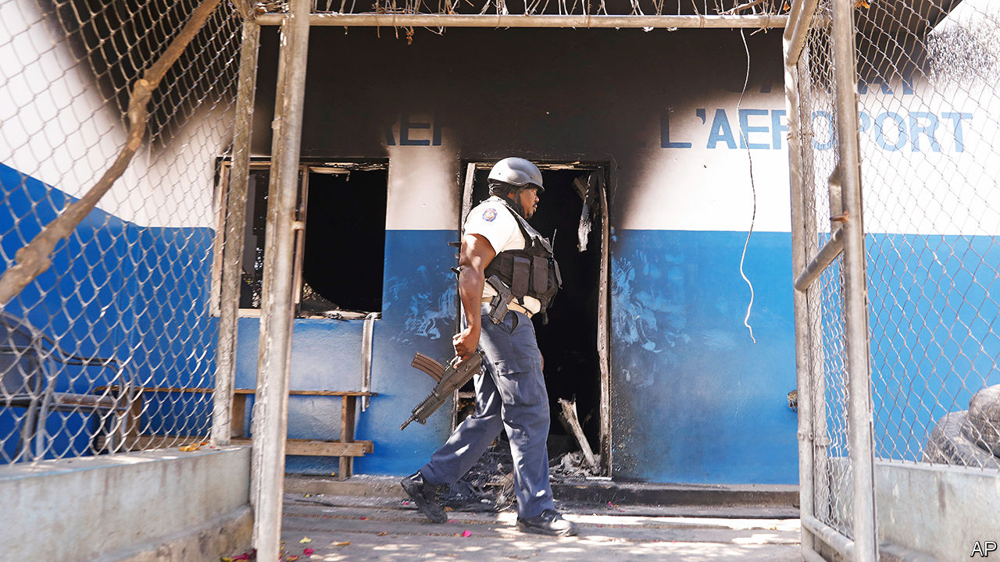

###### Lawless and disordered

# The last scraps of the Haitian state are evaporating 

##### Rape, murder and theft have long been facts of life 

 

> Mar 7th 2024 

Haitians have suffered through 19 changes of leadership in the 38 years since the Duvalier dictatorship fell. The 20th is nigh. As went to press on March 7th, gangs had an iron grip on Port-au-Prince, the capital. The prime minister, Ariel Henry, is currently in Puerto Rico. He is unable to return to the country he ostensibly governs, and is under pressure to step down from gang leaders and interested governments alike.

Haiti has long been a desperately poor, lawless place. Rape, murder and theft are facts of life. The country of 11.5m people has an annual budget of some $2.2bn, half that of the New York City Police Department. This desperate situation was already deteriorating after then-president Jovenel Moïse was assassinated inside his official residence in July 2021. February 29th saw Haiti plunge even deeper into the abyss. 

Mr Henry was in Kenya, signing an agreement with the African country for it to send 1,000 police officers to Haiti as part of a security mission that Mr Henry requested in 2022 and which the UN mandated in 2023. The gangs, which control 80% of the capital, took advantage of his absence. They attacked two prisons, released thousands of inmates, and laid siege to the international airport, in part to prevent Mr Henry returning. They have taken over police stations, banks and government offices. The Haitian police and military are outnumbered, and in many cases outgunned.

On March 5th Haiti’s top gang leader, Jimmy Chérizier, better known as “Barbecue”, told reporters in Port-au-Prince that there would be civil war and “genocide” if Mr Henry did not resign. For now the prime minister is stranded (there are rumours that he may soon fly to Jamaica, to talk to other Caribbean leaders about a transition government). It is too dangerous for his plane to land at Haiti’s airport. The Dominican Republic has refused to let him travel to Haiti via their side of Hispaniola, the island shared by the two countries. On March 6th the  reported that the United States is pressuring Mr Henry to step down. The official line is that Mr Henry needs to hand over the reins of power, first to a transitional government, then to an elected one.

Violence boils over “whenever there is a deadline looming that might threaten the gang leaders’ or the oligarchs’ livelihoods,” says a Canadian official with extensive experience in Haiti. The country has seen many international missions, most recently one run by the UN between 2004 and 2017. But unlike these missions, the Kenyans “don’t arrive with the money and civilian overhead the gang leaders count on to make money,” says the official. Gang leaders benefit from wealthy foreign missions because they own land, hotels, grocery stores, fuel and houses that are required to support operations.

The path forward is treacherous. The United States says it wants to fast-track the security mission, but it is struggling to drum up sufficient boots and cash. There are signals that Brazil is willing to commit people to the mission; other countries will be under pressure to do the same. The United States itself is only willing to offer “logistical support”, such as airlifting members of the security mission into the country. Republicans in Congress are holding up funding for the mission, though they worry that an exodus of Haitians will add to the numbers ending up at the US border.

Mr Henry is unpopular in Haiti, where he has faced pressure to stand down for some time. He has dragged his heels on organising elections, blaming the high levels of violence. That is a real problem. One diplomat notes that the gangs will be able to obtain their preferred outcome through threat of force in any election that is held while Haiti is in its present state. 

Still, Mr Henry’s promise to hold elections by August 2025 has proved to be too little, too late. “Henry’s only real legitimacy came from the United States and the international community,” says Jake Johnston of the Center for Economic and Policy Research, a think-tank in Washington. He appears to have lost that support. 

The contours of transition have been visible for at least the past year. It would involve a prime minister governing either alongside a judge, who acts as president, or next to a presidential council composed of several individuals from different parts of society. Many Haitians think that changing the people in office will not change the fate of their country, and that they would be “puppets” just like Mr Henry.

Would a transitional government and a security mission improve things? Curbing the gangs is feasible. Many of their members are “15-year-olds in flip-flops” paid $10 a day, according to the Canadian official, and will flee when faced with professional soldiers. The UN mission to Haiti did stabilise the country (though it is remembered for cases of sexual assault and inadvertently spreading cholera). 

But this time Haiti will need to be totally rebuilt. “There is no state to be secured,” says the Canadian official. “It’s gone.”■


