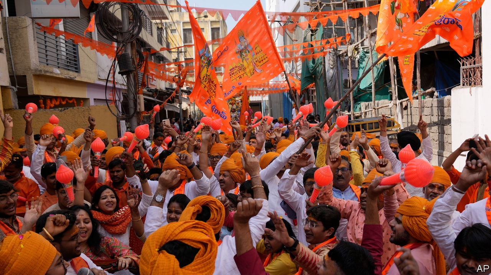

###### The Economist explains

# What is Hindutva, the ideology of India’s ruling party? 

##### It seeks to equate Indianness with Hinduism 

 

> Mar 7th 2024 

IN INDIA NATIONAL  are looming. Voters are expected to go to the polls in April and May. Narendra Modi, the prime minister, hopes to win a . To that end he has been playing up his religious devotion. On January 22nd Mr Modi inaugurated a new , a northern city believed by devotees to be that Hindu god’s birthplace. The temple was built on land previously occupied by a centuries-old mosque, which was torn down by a Hindu-nationalist mob in 1992. Addressing a crowd of supporters after the ceremony, which marked the unofficial start of his campaign for re-election, Mr Modi claimed the new construction was “not just a divine temple” but “a temple of India’s vision, philosophy and direction”. What did he mean?

Equating Hinduism and India in this way is one of the main tenets of Mr Modi’s ideology: Hindutva, or “Hinduness”. Adherents of Hindutva, including many members of Mr Modi’s Bharatiya Janata Party (BJP), believe in the hegemony of Hinduism in India—to the extent that they consider Hindu and Indian culture synonymous. Critics fear the BJP aims to to turn the country of 1.4bn people, 80% of whom are Hindus, from a secular state into a Hindu one. BJP officials deny this. They say they are trying to establish a Hindu national identity suppressed for centuries by Muslim and British invaders. 

Hindutva originated in the anti-colonial movements of the early 20th century. In 1922, while in jail for anti-British activities, Vinayak Damodar Savarkar wrote “The Essentials of Hindutva”, a pamphlet offering an ethno-nationalist definition of Indian civilisation. A Hindu, he argued, was anyone for whom India was both a “fatherland” and a “holy land”. 

Savarkar, an atheist, took a flexible view of whom could be considered a Hindu. Jains and Buddhists could be. But Muslims and Christians, as adherents of “non-Indic” religions, could not be part of the Hindu nation unless they renounced their faith. Contemporary Hindu ideologues tend to say that India embraces citizens of all faiths—but requires them to be loyal to an Indian nation defined by Hinduism. In support of this demand, they often cite an imagined golden age of Hindu kings—and decry the centuries-long period of colonial rule, under Muslim then Christian invaders, that followed. Millions of Hindus, they say, were forcibly converted to Islam or Christianity during that dark period. They often argue that their critics suffer from a “colonial mindset”.

After India gained independence in 1947, Savarkar’s vision lost out to the more secular, inclusive one preferred by Jawaharlal Nehru, India’s first prime minister, and other framers of the new Indian constitution. Yet groups such as the Rashtriya Swayamsevak Sangh, a paramilitary volunteer outfit that Mr Modi joined as a child, continued to promote Hindutva and Hindu nationalism. 

Their efforts have been hugely boosted, since the 1980s, by the rise of the BJP from the margins of national politics to centre stage. In power since 2014, Mr Modi has modernised Hindutva, making it symbolic of India’s national greatness. Alongside this, his party has also pushed many Hindu-nationalist priorities. In 2019 his government revoked the special status of Jammu and Kashmir, hitherto the country’s only Muslim-majority state, and split it into two territories that are governed from Delhi. Multiple states ruled by the BJP have tightened laws against  and religious conversion, ostensibly to protect Hindus from nefarious attempts to convince them to abandon their religion. The government promotes vegetarianism, which is mostly practised by high-caste Hindus. A currently-suspended plan to establish a national registry of citizens and amend the citizenship law could put the rights of millions of Muslim Indians at risk. 

The BJP’s opponents say the main effect of these policies has been to relegate non-Hindu Indians, particularly Muslims, to the status of second-class citizens. It has also empowered Hindu-nationalist vigilante groups. Such groups roam neighbourhoods for signs of illegal cow slaughter or attempts by Muslim men to seduce Hindu girls and convert them (a conspiracy theory known as “”). They frequently operate with impunity, often . When Mr Modi inaugurated the Ram temple the government encouraged citizens to celebrate the event as a moment of national pride. Many were eager to do so. But the celebrations carried a warning to those who demurred. Some neighbourhood associations sent notices to refuseniks encouraging them to pack up and move elsewhere.

Supporters and critics of Mr Modi differ on whether the consecration of the temple at Ayodhya was indeed a moment of national pride. Either way, the state’s unambiguous promotion of the event appeared to mark a significant break with the secular principles enshrined in India’s constitution. ■

