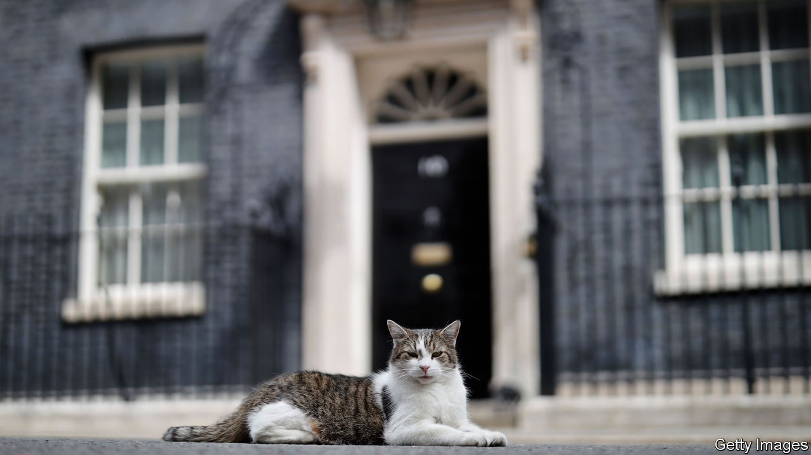

###### The Economist reads

# The best British political diaries 

##### Five volumes full of wit, cattiness and insight into the workings of power 

 

> Mar 7th 2024 

TWO OF THE most entertaining British political diarists of recent times, Gyles Brandreth and , both Conservative MPs, once sat down in the House of Commons tearoom to draw up a list of ingredients essential for a compelling political diary. They called the rules they came up with the “four I’s”. A journal should be —no rewriting history at a later date. It must be ; nothing is duller than a diary that dutifully keeps secrets. It should be , exposing the diarist’s quirks and habits to foster a close relationship with the reader. Finally it should be made  to the diarist’s contemporaries, perhaps with bad handwriting or codenames. Let posterity enjoy its indiscretions. 

A widely accepted maxim is that the best political diarists toil in the foothills of power. (Chris Mullin, a Labour MP, entitled his diaries “A View from the Foothills”.) If diarists were climbing to or occupying the summit they would have little time or energy left for late-night scribbling. The 1930s were the heyday of two fine examples of this type: Henry “Chips” Channon and Harold Nicolson. Both were junior ministers, and among the wittiest, most elegant chroniclers of goings-on in Whitehall and the drawing rooms of Belgravia. (Nazi luminaries  before the war.) Prime ministers have also turned out decent diaries. William Gladstone’s many volumes were a comprehensive portrait of society and politics in Victorian England. Harold Macmillan was an acute observer of people and events, when he wasn’t reading his beloved Trollope. Here are five of the best political diaries, presented in ascending order of greatness. 


Hugh Dalton was minister of economic warfare in Winston Churchill’s wartime coalition government, best known for his stewardship of the , an espionage outfit. According to his biographer, Ben Pimlott, this prickly, patrician Labour politician used his diary as a “companion, a sounding board for ideas, perhaps most of all an emotional release”. Dalton’s waspish portraits of his fellow cabinet members stand out, but it is his entry for Tuesday May 28th 1940 that lives longest in the memory. This was his account of Churchill’s passionate address to his “outer” cabinet in a packed room at the House of Commons. He was seeking their support in his dispute within the war cabinet with Lord Halifax, the appeasement-minded foreign minister. Dalton’s vivid account was the basis of a scintillating scene in the film “Darkest Hour”, which starred Gary Oldman as Churchill.

Dalton greatly admired Churchill, his political foe, and recorded his thrilling peroration that evening: “We shall go on and we shall fight it out, here or elsewhere, and if this long island story of ours is to end at last, let it end only when each of us lies choking in his own blood upon the ground.” 

By Tony Benn. 

Gladstone excepted, no diarist was more prolific than Anthony Wedgwood (Tony) Benn. The former Lord Stansgate started keeping a diary at the age of 15 during the second world war. He published nine volumes over 73 years. Of greatest interest is his depiction of the fierce policy battles and personal feuds within the Labour cabinets of Harold Wilson and James Callaghan in the 1960s and 1970s. Benn, a standard bearer for the far left, had a grandstand seat for those exchanges, first as secretary of state for industry, then for energy. These were the years of trade-union power and the three-day week, when Britain was branded “the sick man of Europe”. Usually around midnight Benn would sit down in his study and recount his day’s struggles into his cassette recorder, leaving others to transcribe the tapes. The narrative rarely slackens and the detail of meetings and conversations is quite remarkable. Benn would always tell journalists, a little pompously, that his interest lay in political argument, not in personalities. Yet there are plenty of colourful vignettes of both colleagues and rivals. Benn aimed his harshest criticism at people like Michael Foot and Neil Kinnock, who should have been his allies on the left of the party.

 By Alastair Campbell. 

Benn would have found his pretence that personalities don’t matter harder to sustain in the next Labour government, which came to office in 1997 after an 18-year wait. The relationship between the prime minister, Tony Blair, and Gordon Brown, his chancellor of the exchequer, was fraught. , Mr Blair’s spin doctor, captures its epic bitterness. Mr Campbell had been a tabloid journalist (he was political editor of the ). His spare, exciting prose, together with his brutal honesty, vivifies this enthralling story.  were like two medieval knights with loyal retinues. Mr Campbell was in Mr Blair’s (although he also tried to mediate between them). Because of his role at Number 10 he was uniquely placed to observe the rivalry, scheming and mistrust at the heart of the New Labour project. The Campbell diaries are a dramatic account of day-by-day—often hour-by-hour—life inside Number 10, where the pace of events was relentless, friction with the media was constant and relationships among advisers were intense, and often characterised by machismo. 

By Alan Clark. 

Of the diaries in this list, none is as deliciously readable as this one. Clark was a real stylist, and is by turns amusing, gloomy, vituperative and as indiscreet about people and events in Westminster as he and Mr Brandreth agreed a diarist must be. The elder son of , an art historian (who made the landmark television series “Civilisation”), he honed his writing as a military historian. “The Donkeys” was his controversial analysis of the quality of leadership by British generals during the first world war. 

Clark moved into politics as Conservative MP for Plymouth Sutton, and in the 1980s held junior ministerial roles in Margaret Thatcher’s governments. He adored “The Lady” with an almost desperate obsequiousness, and his record of the drama surrounding her downfall is the best on that subject.

Publishing a diary is a “baring, if not a flaunting, of the ego”, Clark asserted. He was happy to lay bare his snobbery, his lechery, his disasters (including a drunken appearance at the despatch box) as well as his triumphs. On the plus side of the ledger, his passionate campaigning for animal rights shines through.

By John Colville. 

No better depiction exists of Winston Churchill in his “finest hour” as wartime leader. The Colville diaries are an absorbing, behind-the-scenes portrayal of the great man and his inner circle, as well as a remarkably perceptive analysis of the state of the war. 

John (always known as “Jock”) Colville was well connected. His mother was a woman of the bedchamber to Queen Mary. He was just 24 when he became one of Neville Chamberlain’s private secretaries. When Churchill replaced Chamberlain as prime minister in May 1940, Colville was at first dismayed that an “adventurer” now had charge of the country’s fate. But he was soon under Churchill’s spell, and his growing admiration for his master’s skills is clear to see. Colville was an especially sharp observer of Churchill’s skilful wooing of Franklin Roosevelt and his emissary Harry Hopkins; the prime minister desperately wanted to bring isolationist America into the war. Colville would lock his diary in his writing table in Downing Street, but became so worried it might be discovered that he moved it to the family home in Staffordshire. Merely keeping a diary could have led to charges against him under the Official Secrets Act. But Churchill, for whom he was like a second son, would of course never have countenanced that.

Also try

British political diarists appear often in ’s pages. Our Bagehot columnist wrote an  upon his death in 1999 and followed up with an  of the final volume of his diaries. We wrote about Benn’s post-parliamentary career as a  and published an  about him. Here, Mr Campbell himself suggests a  to guide the practice of politics.

