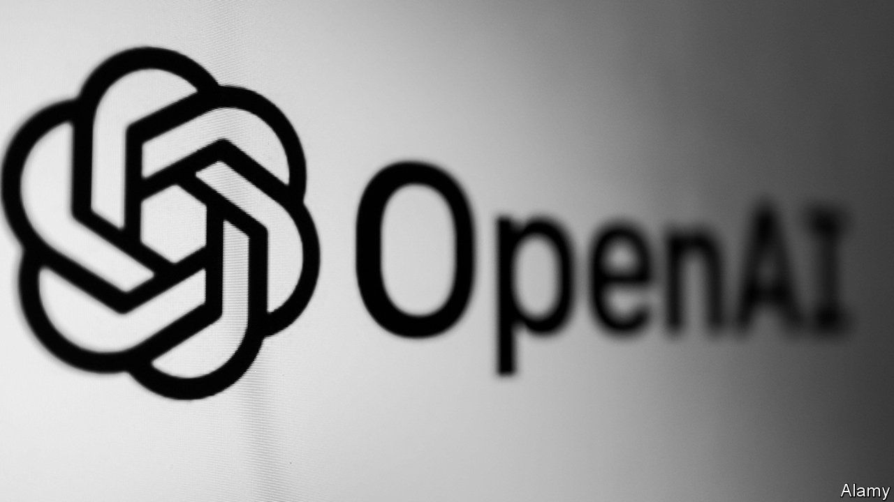
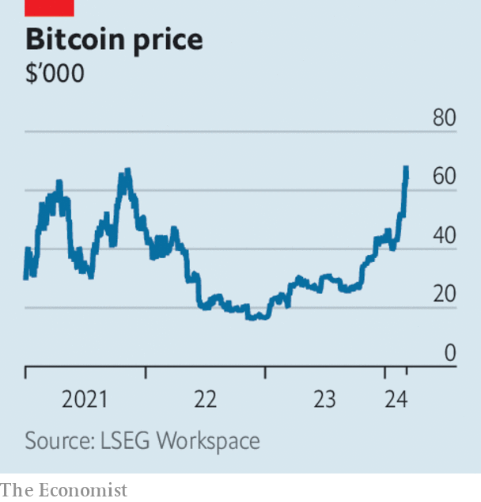

###### The world this week

# Business 

#####  

 

> Mar 7th 2024 

 hit back at  claim that he had been “induced” to make contributions to the startup, which he helped to found, on the basis that it would remain a non-profit organisation. Mr Musk has filed a lawsuit against OpenAI and Sam Altman, its chief executive, alleging that its partnership with Microsoft breaks a deal to make artificial intelligence free to the public. In a blog post OpenAI said that Mr Musk had “wanted us to merge with Tesla or he wanted full control” and left to create a rival AI business. “We’re sad that it’s come to this,“ the post said, “with someone whom we’ve deeply admired.”

In reverse

Tesla’s sales in China slumped by 19% in February from the same month last year, according to the China Passenger Car Association. This was in part because Chinese new year fell in February, but the news focused investors’ attention on the weakening demand for  and Tesla’s stock fell sharply. A new price war is under way in China to tempt buyers. Tesla reduced the price of its Model 3 and Model Y cars in January. This week BYD slashed the prices of the newer version of its bestselling Yuan Plus car and its cheapest model, the Seagull. 

Adding to  woes this week, the company stopped production at its factory near Berlin following an arson attack claimed by a far-left group. Local environmentalists have opposed the factory from the start, saying it soaks up local water supplies and damages woodland. 

Tesla is not the only business struggling in China.  sales of iPhones in the country plunged by 24% in the first six weeks of 2024, year on year, according to data from Counterpoint Research. Smartphone sales fell by 7% overall, though Huawei’s grew by 64%. Apple’s share price, already under pressure over its lack of direction on AI, fell further. 

Meanwhile, Apple was fined €1.8bn ($2bn) by the European Commission for restricting its  rivals from telling customers about their pricing models on Apple’s app store. It is the first competition fine levied against Apple by the European Union. The commission said the size of the penalty, the third-largest it has ever imposed in an antitrust matter, would act as a deterrent against similar practices. Apple is to appeal against the ruling. 

The  kept interest rates on hold, leaving its deposit facility at 4%. The euro zone’s annual rate of inflation fell to 2.6% in February, less than expected, but the ECB revised down its forecast of average inflation this year to 2.3%. 

The British government unveiled its , the highlight of which was a two percentage-point cut to national insurance, a payroll tax. It also increased the duty on business-class travel and extended a windfall tax on oil and gas companies. In another pivot, foreign nationals will no longer be able to avoid paying tax on money made overseas if they live in Britain for more than four years. An election is due later this year. 

 central bank floated its currency and lifted interest rates by six points. The Egyptian pound plummeted to a record low. The IMF, which had called for a more flexible currency regime, promptly increased its loan arrangement with the country from $3bn to $8bn. Egypt has also secured $35bn in investment deals from the United Arab Emirates. 

 grew by 1.5% in the fourth quarter, year on year, the slowest pace since the pandemic. That adds more pressure on the central bank to cut interest rates. 

Increased activity in mining helped  avoid a recession in the last three months of 2023, though the economy grew by just 0.6% over the whole year. As well as rolling power cuts and creaking infrastructure, businesses are contending with logistical problems at ports, which are hampering trade. 

 


 hit a new intraday record of $69,202 before falling back. The price of the cryptocurrency has surged this year, spurred in part by institutional investors piling into new American-listed exchange-traded funds in bitcoin. 

Markets shrugged off the decision by OPEC+, which includes Russia, to extend to July cuts to  that were due to expire this month. The cartel is hoping to boost prices for the commodity by curtailing its output, but America and Canada are expanding their oil production, filling gaps in the market. 

 revenue fell last year for the first time since 2016. Still, the retailer’s share price surged after it announced a turnaround programme to entice shoppers and said it would invest in new stores. 

The muppet show

Controversy ensued when Sesame Street’s Cookie Monster tweeted that “Me hate ! Me cookies are getting smaller”. Joe Biden mentioned the comment in a speech on fighting “corporate rip-offs”. A new bill from Elizabeth Warren and Bob Casey, two Democratic senators, would allow regulators to punish companies that reduce the size of their products but charge the same price. 

