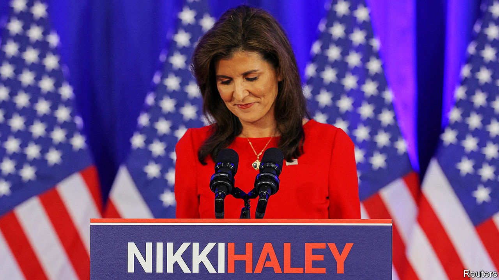
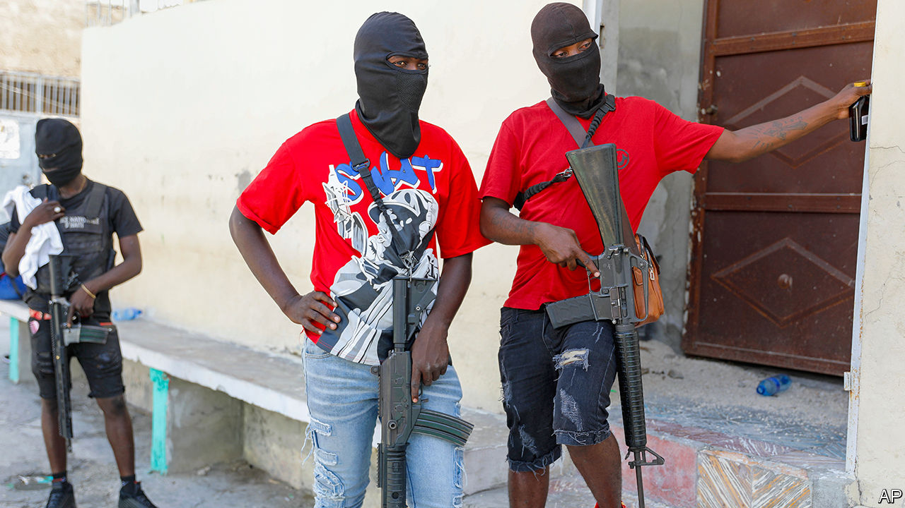

###### The world this week

# Politics 

#####  

 

> Mar 7th 2024 

Nikki Haley pulled out of the Republican presidential nomination race after  won 14 of the 15 primary elections on . Ms Haley did not endorse Mr Trump, but urged him to reach out to her supporters. He responded on social media that she “got trounced”. Earlier, the  ruled that individual states could not kick Mr Trump off the ballot. In a unanimous decision it found that the ad hoc removal of federal candidates from elections would cause chaos. 

Benny Gantz, a centrist member of  war cabinet, visited Washington, where he met Kamala Harris, America’s vice-president, and London, where he met David Cameron, Britain’s foreign secretary. Mr Gantz’s reception was a sign of growing frustration in Western capitals with Binyamin Netanyahu, Israel’s prime minister,  and ensuing humanitarian crisis. America has air-dropped emergency aid into northern Gaza and urged Israel to increase the flow of humanitarian supplies. Mediators in Cairo were hopeful that Israel and Hamas would agree to a temporary truce before the start of Ramadan.

Turnout was low in  parliamentary elections. Many voters stayed away in protest against a poll in which opposition figures were excluded from the ballot.

 president, Nana Akufo-Addo, said he would not sign into law a bill that would imprison people who say they are gay until the Supreme Court has ruled on whether it violates constitutional rights.

 election should be held on March 24th, the government announced. The Constitutional Council declared that a proposal to hold it in June, after President Macky Sall’s mandate ends, was unconstitutional. The election was originally scheduled for February 25th but just weeks before the poll Mr Sall postponed it indefinitely, throwing the country into crisis.

America imposed financial sanctions onpresident, Emmerson Mnangagwa, and other senior Zimbabwean officials for their alleged involvement in human-rights abuses and corruption. It has also lifted existing sanctions on Zimbabwe to make it clear its actions are aimed at specific people and not Zimbabweans in general. 

The  government was engulfed by an , after Russian media leaked a phone call among senior air-force officials discussing the provision of Taurus cruise missiles to Ukraine. Details of British and French assistance to Ukraine were also discussed. Russian intelligence intercepted the call because one of the participants dialled in to the encrypted conference via an unsecure link from a hotel in Singapore. 

Even in death he mocks me

Thousands of Russians defied Vladimir Putin by attending  funeral in Moscow. Hundreds more queued to pay their respects over the following days. America has imposed sanctions on three people in connection with the opposition leader’s death, including the prison warden of the penal colony where he was found dead. 

The International Criminal Court issued arrest warrants for two  for directing attacks on Ukraine’s electricity infrastructure from October 2022 to March 2023. Targeting civilian rather than military objects is a war crime. Meanwhile a Russian missile exploded in  near where Volodymyr Zelensky, Ukraine’s president, was holding a meeting with Kyriakos Mitsotakis, the Greek prime minister. 

 again warned that Russia was interfering in its domestic affairs and would try to meddle in a presidential election later this year. Last month Transnistria, an unrecognised pro-Russian breakaway region of Moldova, invited Russia to help it deal with “pressure” from the Moldovan government. Also last month the governor of Gagauzia, another restless Moldovan region, accused the government of oppression and asked Moscow for support. 

 became the first country in the world to explicitly enshrine the constitutional right to an abortion, after parliament voted overwhelmingly to support it. Some wondered whether this smacked of American-style culture wars: proponents of the measure had pointed to the rolling back of legal abortion in America. 

In George Galloway won a by-election in Rochdale, reducing the Labour Party, which had held the seat, to fourth place. Mr Galloway, a former Labour MP, ran a pro-Palestinian campaign aimed at the town’s large Muslim community (Labour had withdrawn support for its candidate over his remarks about Jewish people). The next day the prime minister, Rishi Sunak, gave a big speech warning against activists who “spew hate on protests or seek to intimidate people”, after MPs’ homes were targeted by pro-Palestinian supporters.

At the annual meeting of parliament, the prime minister, Li Qiang, laid out an ambitious GDP growth target of “around 5%”. Mr Li admitted that it will be tough to meet. The government is reluctant to crank up stimulus, even though the economy faces “many lingering risks and hidden dangers”, as Mr Li put it. It was also announced that Mr Li will not give a press conference at the close of the week-long event, ending a tradition dating back to the 1980s and highlighting the absolute power of China’s leader, Xi Jinping.

The Philippines accused the Chinese coast guard of harassing vessels that were trying to supply Filipino troops on the Second Thomas Shoal, one of the many disputed areas in the . The Chinese fired a water cannon, slightly injuring four Filipino crew. A Chinese coast-guard ship also ran into a Philippine one. 

Thousands of farmers in  renewed their attempt to march on Delhi, the capital. The farmers want the government to guarantee minimum payments for their crops and scrub out their debts. They had suspended their protest last month. 

The government in  increased the pressure on junior doctors to end their strike by threatening to cancel their medical licences. Representatives from the Korean Medical Association were questioned by the police regarding claims that medical law had been broken. 

 


The scant remnants of  government were on the point of collapse. Murderous gangs control the capital, Port-au-Prince, and are waging gun-battles with the police for control of the airport. America’s State Department asked Ariel Henry, the prime minister, to agree to a new transitional government. Few can get out of the country, or into it. For days Mr Henry was holed up in Puerto Rico. A proposed peacekeeping mission is not yet under way.

Alberto Otárola resigned as prime minister of  amid corruption allegations. He denies wrongdoing. The country’s president, Dina Boluarte, replaced him with Gustavo Adrianzén, a human-rights lawyer and Peru’s representative to the Organisation of American States. 

Unfree and unfair

 electoral commission set July 28th as the date for a presidential election, much earlier than expected. The opposition to Nicolás Maduro’s autocratic regime now has until only March 25th to register a candidate. María Corina Machado, who won the opposition primary, has been disqualified by the Supreme Court. America says it will reimpose sanctions if she cannot run. 

