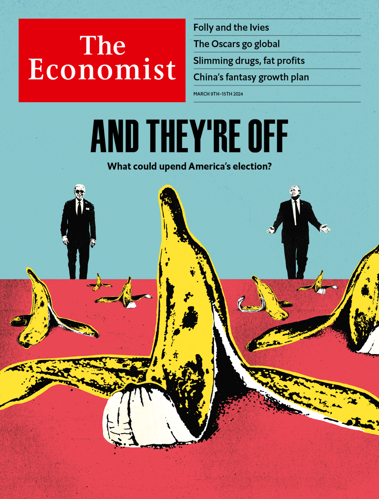

###### The world this week

# This week’s cover 

##### How we saw the world 

> Mar 7th 2024 

IN THE AFTERMATH of Super Tuesday, we focus this week on America’s presidential election. With just six states likely to be competitive in November, any one of a dozen things could tip the vote in favour of Joe Biden or Donald Trump. There are the issues: the economy, the border, abortion. There are the turnout and persuasion operations, the donors and the volunteers. And there are also three other big areas of uncertainty: the role of third parties, Mr Trump’s trials and the candidates’ age.

 


: 

: 

: 

