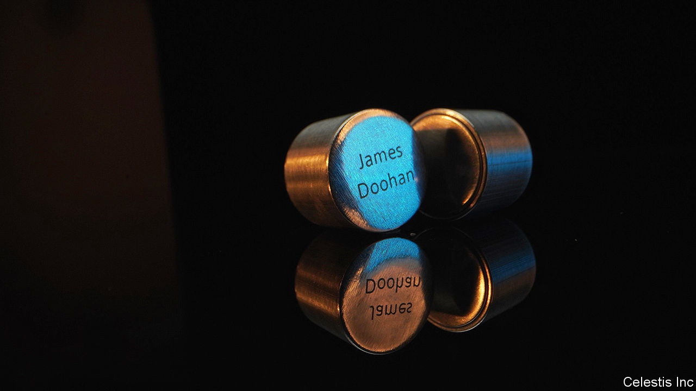

###### Celestial bodies

# A private company will send your ashes to the moon 

##### The Navajo Nation wants the feds to stop them 

 

> Mar 7th 2024 

Have you ever thought about what you want done with your body when you die? Many Americans opt for the traditional graveyard burial, others donate themselves to science. But if those don’t sound like the posthumous experience you are looking for, a Houston-based firm has something different on offer. For just $13,000—or a subscription fee of $99 per month until you pay it off—Celestis Memorial Spaceflights will send your cremated ashes to the moon.

If you choose to fly to space in an aluminium capsule the size of a lipstick tube you will be in good company. Celestis’s pioneer flight in 1997 carried the remains of Star Trek’s screenwriter, a German rocket engineer, a Princeton University professor, a restaurateur and a Japanese boy. In the quarter-century since, the firm has sent 2,300 capsules into orbit. It has no doubt been helped by a huge increase in the share of Americans getting cremated, from 21% in the mid-1990s to 61% today.

For some the prospect is life-changing. Don McInnis, a disabled man living in Nova Scotia who has never held a job, is only in his 50s but has already paid off 20% of his flight. He has dreamed of exploring space since he was six years old but his family always told him he wouldn’t amount to much. “Because I’m disabled NASA wouldn’t take me as an astronaut, so this might be my one crack at getting into space,” he says. He plans to go on the Voyager Mission, on which he hopes to perpetually circle the sun. 

But if the Navajo Nation has its way many like Mr McInnis will remain earthbound. In January tribal leaders met with the Biden administration to try to stop Celestis from sending ashes to space. To them the moon is sacred and death a taboo. They bury their dead within days, discard their belongings and never visit grave sites. If the moon becomes a full-on cemetery they will have to stop performing some traditional prayer ceremonies. “It’s illegal to dump in the Grand Canyon,” says Justin Ahasteen, the head of the Navajo Washington office, “why can’t that be the US policy for space?”

To their relief the latest moon-bound rocket burned up over the Pacific in February, with 70 capsules aboard. But since approval for commercial flights is not contingent on passing a religious test there will be more—Celestis’s next moon flight is set for 2025. Charles Chafer, the firm’s founder, considers the native plea absurd. “In 50 years when there are 1,000 people living on the moon, somebody’s gonna die and you can’t say we can’t dispose of this person because there’s an earthbound Native American tribe that doesn’t want us to,” he says. His three pups have been to space and back and he plans to follow them. When the time comes he has one simple request: “Fly me until there is no more of me.”■


