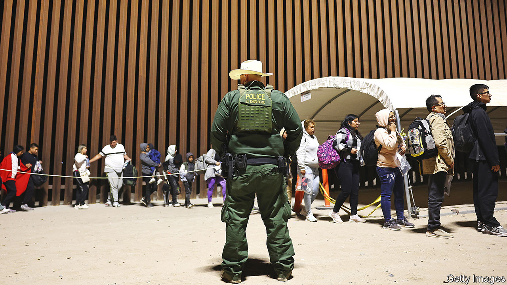

###### Executive inaction

# Can Joe Biden bring order to the southern border without Congress? 

##### The president is boxed in on all sides 

 

> Mar 7th 2024 

EVEN BACK when it looked as if the bipartisan border-security bill would get a fair hearing in the Senate, the Biden administration insisted that it was working on a Plan B. Then , owing to Donald Trump’s desire to deprive Joe Biden of any accomplishments to campaign on, and Plan B became Plan A. 

A month on Mr Biden has yet to roll out an executive order for the border—for two reasons. Politically, the border bill’s death revealed just how little congressional Republicans care about governing these days. Their intransigence gives Mr Biden an opening to try to convince voters that the Republican Party are the agents of border chaos. Practically, there is very little the administration can do to restore order at the southern border without money from Congress. Presidents are not powerless when it comes to immigration: Mr Biden’s liberal use of parole proves that. But in reforming the asylum system, the president is constrained by four things: the courts, a lack of cash, international law and Mexico. 

Congress has not passed substantive immigration reform since 1990, leaving presidential administrations to govern by executive fiat. The legality of these orders is increasingly challenged in the court system. The Biden administration has reportedly floated two ideas. One is an executive order that would further restrict the ability of migrants to seek asylum if they crossed the border between ports of entry. Yet Mr Biden implemented a version of that last year, and its effectiveness has been limited because of litigation and . The snag is not that crossing between ports is legal (it isn’t), argues Aaron Reichlin-Melnick of the American Immigration Council, an advocacy group. The problem is the inability of immigration courts to process people quickly. It takes more than four years on average just to get an asylum hearing. Staffing shortages—from Border Patrol agents to asylum officers and immigration-court judges—are why Mr Biden insists that congressional action, and the money that comes with it, is the only answer. 

The second idea would take a page out of Mr Trump’s immigration playbook. In 2017 Mr Trump restricted travel to America from several Muslim-majority countries under an obscure statute that grants presidents broad authority to suspend the entry of people who “would be detrimental to the interests of the United States”. The Supreme Court upheld Mr Trump’s order in , a case Mike Johnson, the speaker of the House, cites as proof that Mr Biden does not need Congress to act. But that law and that case are less relevant when the people being banned are already in the country, not waiting to fly over. 

This is where international law comes in. America signed the 1967 Protocol which expanded the United Nations’ . The treaty stipulates that asylum-seekers, no matter how they entered a country, may lodge an asylum claim. That provision is also enshrined in American law, and is the basis for the legal challenge to Mr Biden’s rule limiting asylum for those who cross the border between ports. America must also abide by the principle of , which bars countries from returning asylum-seekers to places where their life or liberty would be at risk. 

Mr Johnson’s other favourite suggestion—in lieu of his caucus doing anything—is that Mr Biden should reinstate Mr Trump’s “Remain in Mexico” policy, under which some migrants were returned to the southern side of the border to await a hearing. Mr Johnson waves off Mexico’s resistance to restarting the policy. “We’re the United States,” he told reporters. “Mexico will do what we say.” 

Things are not that simple. Mr Trump bullied Andrés Manuel López Obrador, Mexico’s president, into cracking down on migration by threatening hefty tariffs on imports. Mr Biden may be loth to apply such leverage when Mexico is now  and is helping to curb . What’s more, only about 80,000 migrants were enrolled in the Remain in Mexico programme between 2019 and 2022, a tiny fraction of those who crossed the border. 

In small ways, the Biden administration is making progress. The number of monthly “credible fear” decisions—the standard some migrants must pass to apply for asylum—has more than quintupled since 2022, speeding the process for many. Mexico’s crackdown on migrant trains and the removal of migrants to southern Mexico has diminished flows to Texas (but pushed them towards Arizona).

Despite the obstacles, the president may issue some kind of executive order anyway. “They will be immediately sued and probably blocked by the courts,” argues Julia Gelatt of the Migration Policy Institute, a think-tank. “Maybe that is helpful politically to say, ‘Well, we tried. We really do need you, Congress’.”■


