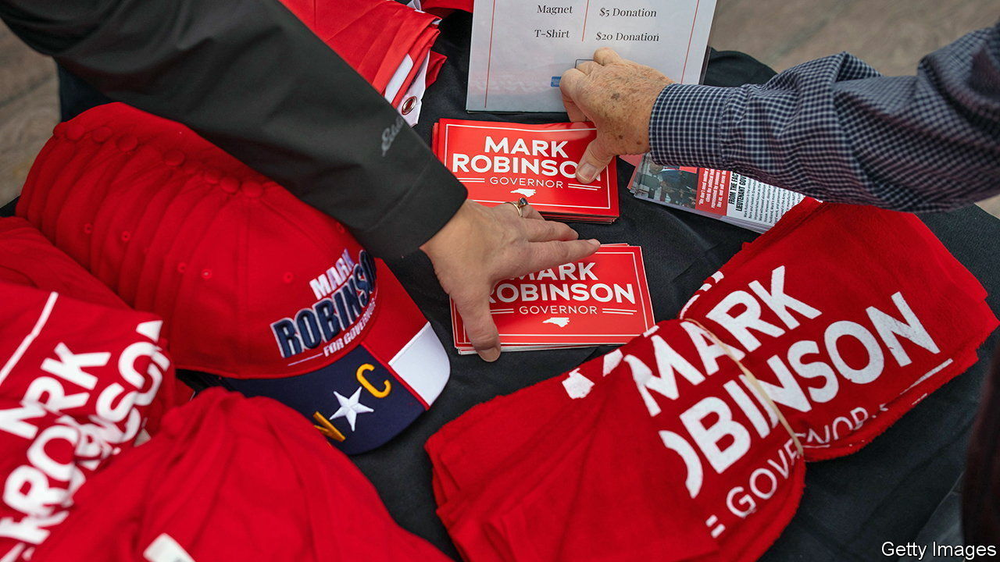
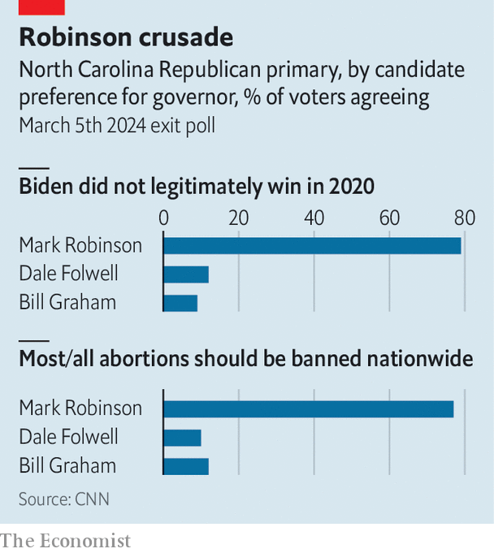

###### Sleepy Tuesday

# Donald Trump wasn’t MAGA’s only winner on Super Tuesday 

##### The Republicans’ populist wing also flexed its muscle in down-ballot races 

 

> Mar 7th 2024 

By the end of the night on Super Tuesday the 2024 presidential race remained largely unchanged. Donald Trump and Joe Biden are still the presumptive nominees. So great are their margins over their respective primary opponents that some pundits were splitting hairs over whether Mr Trump winning Texas by 60 points rather than his 65-point lead in polls boded poorly. 

But beyond the unsurprising presidential results, a glance at down-ballot races shows a familiar Republican strategy playing out again. In some states MAGA Republicans are repeating their 2022 playbook by nominating extremist candidates who perform well with their base in a primary contest but face a steeper climb in a general election.


In North Carolina Mark Robinson, the state’s lieutenant-governor, won the Republican gubernatorial primary. A conspiracy theorist who has quoted Hitler and compared gay people to maggots, he attracts hard-core voters (see chart). In November he will face the state’s attorney-general, Josh Stein, a moderate Democrat. In a state that runs three points more Republican than the country, the party was poised to be especially competitive in this race to replace the current term-limited Democratic governor. Instead Mr Robinson risks alienating moderates and independents.

 


Texas had a MAGA insurgency. That forced Tony Gonzales, a Republican representative, into a run-off with Brandon Herrera, a YouTube personality known as the “AK Guy” for his support of semi-automatic rifles. The state party had censured Mr Gonzales last March in part for supporting a gun-control bill in the aftermath of the Uvalde shooting in which 19 schoolchildren and two teachers were murdered. Mayra Flores, a Trump acolyte who voted against same-sex marriage, won her primary to face the incumbent Democrat, Vicente Gonzalez. And many of the Republicans who had opposed the governor, Greg Abbott, and the attorney-general, Ken Paxton, over the past two years suffered retribution. At least 17 of these candidates were either forced into run-offs or lost outright.

During the 2022 midterm elections, nominating conspiracy theorists and election-deniers proved to be a tripwire. Voters punished these candidates at the ballot box. Republicans failed to recapture the Senate and even lost a seat, missing out on the usual midterm gains for the party that does not hold the presidency. That has not stopped Republicans from doing more of the same.■


