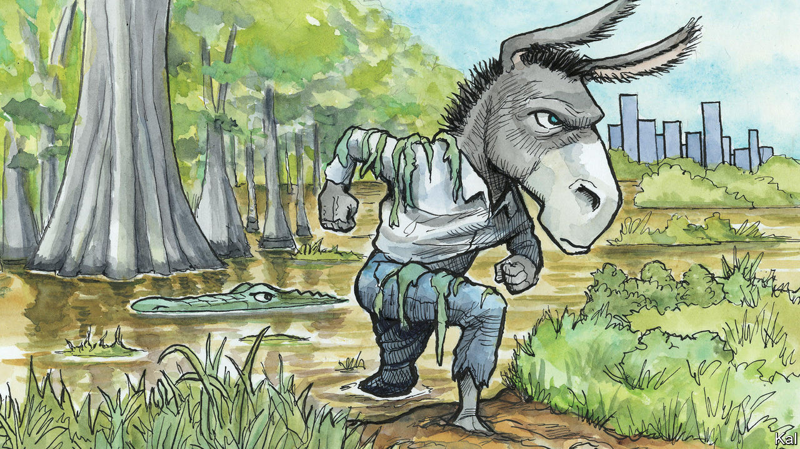

###### Lexington

# Has Ron DeSantis gone too far in Florida? 

##### Believing he has overreached, Democrats plot a path back to relevance 

 

> Mar 7th 2024 

More people live in Florida than in New York state, where the budget is nearly twice as big. From kindergarten through high school New York spends more than twice as much as Florida to educate each pupil, yet eighth-graders in both states score comparably on standardised tests, and Florida achieves higher high-school graduation rates, particularly for black and Hispanic students. Florida is building homes faster and, along with cheaper housing, it has a higher rate of home ownership and a lower incidence of homelessness than New York. At 3.1% in December, the unemployment rate was a third lower in Florida. 

Florida has its relative demerits, including more people without health insurance and a higher rate of homicide. But for its services the state charges its citizens no income tax, whereas New York imposes some of the highest rates in the country. Corporate taxes are also lower in Florida. Overall, Americans are concluding the balance favours Florida: its population grew by another 365,000 last year, while New York’s shrank by 102,000, continuing a four-year trend. 

All of which is to say that Democrats should be grateful that Governor Ron DeSantis of Florida, for reasons of conviction or perceived political interest, proved to be such a ferocious culture warrior. Had he been capable of running his state, and running for president, as a sunny champion of low-cost, effective government—the kind of candidate for whom reasonable people in both parties yearn—who knows how far he might have gone, and how little hope Democrats in Florida might have of ever clawing their way back to political daylight. 

True, they are in a deep hole. From an advantage of 260,000 registered voters when Donald Trump took office in 2017, Democrats were trailing by almost 800,000 by December. That swing came thanks to bad candidates and feeble organising in the face of a disciplined Republican operation. Failure begat more failure as donors closed their chequebooks. Republicans now hold all elected statewide offices and a supermajority in the legislature. 

But Florida politicos of both parties think Mr DeSantis weakened himself with his oafish presidential bid. Because of Florida’s term limits, he cannot run for governor again and so has less political leverage than he once did. In January Democrats flipped a state-House district in central Florida that a Republican carried easily in 2022. The Democrat there, a navy veteran, stressed bread-and-butter issues and protecting the right to abortion, whereas his opponent inveighed against “the woke mob”. Democrats also did the hard work to turn out the vote that they had been neglecting. 

Democrats were further heartened by the uproar last month after a teacher in Miami-Dade County sent a permission slip home asking parents to authorise the reading of “a book written by an African-American”, as part of Black History Month. Mr DeSantis testily insisted no such slip was required under his parental-notification law, known as the “Stop WOKE Act”. But other news reports have described the frustration of teachers and parents over having to fill out new forms for pupils to hear from speakers such as a Holocaust survivor.

The politics of abortion will supply the surest indication of whether one-party rule has led Mr DeSantis to overreach, as Democrats have at times in Democratic states like New York. In his first term Mr DeSantis signed a ban on abortion after 15 weeks of pregnancy. After he got the supermajority in 2022 and set his sights on the White House, he signed a six-week ban. Neither is in effect because the state Supreme Court is reviewing the 15-week ban. If the court upholds it, the six-week limit would take effect a month later. Polling suggests even most Republicans oppose it.

Early this year opponents of the ban produced the 891,000 signatures required to put a referendum on the ballot this autumn to protect abortion until about 24 weeks. They overcame new obstacles imposed by the legislature by mobilising some 10,000 volunteers. The referendum is also before the state Supreme Court. 

Florida is not a swing state this year, though President Joe Biden will probably try to bait Mr Trump into spending money there. State Democrats are looking beyond Mr Biden and Mr Trump. (Isn’t it reassuring that some people are?) They want to rebuild their voter base and political bench with an eye to 2028 and beyond. With north Florida solidly red, the state party is focusing on central and south Florida, in particular the most populous county, Miami-Dade. In a sign of how serious the Democrats’ problems are, and of how seriously the leadership takes them, the state party leader in early March suspended three local party chairmen she thought were underperforming, including in Miami-Dade. 

Night and Dade

The party is embarking on a voter-registration drive in Miami-Dade. Operatives point to one Democratic candidate for county office there whose father was kidnapped by leftist Colombian guerrillas, and another whose family fled from Cuba, as evidence that Democrats have learned from their damaging dalliance with Bernie-Sanders-style “socialism”. They are also resisting putting causes like LGBTQ rights front and centre, having seen how that can backfire. “All we’ve done in the last two years is take the trans community and, worse, trans kids, and put them on the radar of Republicans to be shot at,” says one experienced Democratic strategist. He says Democrats instead need to emphasise protecting freedoms for everyone—and stop using terms like “LatinX”, which irritates many Latino voters, among others.

Republican electoral successes in New York have prompted Democratic leaders to press back against some excesses of their own one-party rule. Whether or not Florida ever becomes a presidential swing state again, its citizens would benefit from a return to the intense, respectful partisan competition that provided Mr DeSantis with the happy story he did such a poor job of telling. ■


