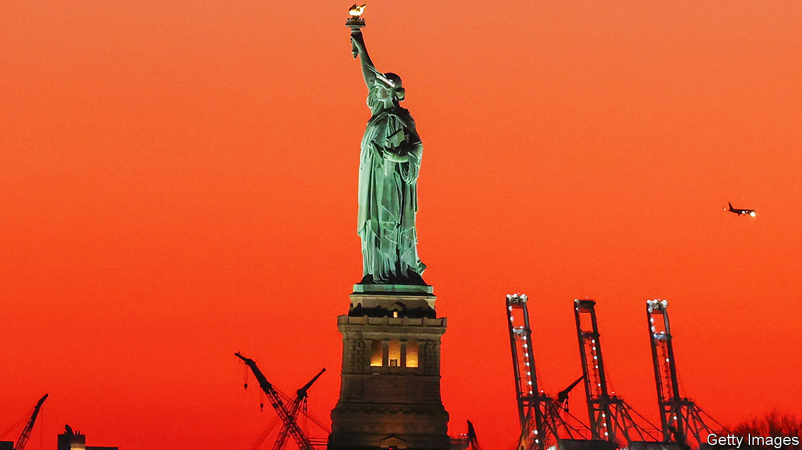

###### Words of warning

# Is New York rethinking its sanctuary-city status? 

##### Its mayor casts doubt on a time-honoured policy 

 

> Mar 7th 2024 

IN MANY PLACES it can take decades, if not generations, to be deemed a local. But as soon as anyone sets foot in the Big Apple, they are New Yorkers, regardless of immigration status or bagel preference. Eric Adams, though, New York’s mayor, has called for a change in the sanctuary-city law. This has triggered a debate on sanctuary cities and worry among immigrant groups. What is a sanctuary city and why is Mr Adams rethinking the policy?

Broadly, sanctuary cities (some 200 cities, counties and states) limit co-operation with immigration authorities: partly through laws and executive orders, but mainly based on the will of local people and the local government. When New York City became a sanctuary city in 1989, it was less an immigration policy and more a public-safety one. The then mayor, Ed Koch, wanted to encourage irregular migrants to co-operate with police when they were victims of a crime or witness to one. In return, their status would not be shared with the federal government. Those arrested were not necessarily handed over to immigration authorities.

Koch’s successors all abided by similar orders. Rudy Giuliani, a Republican who later served as Donald Trump’s lawyer, once said to illicit immigrants, “You’re one of the people who we want in this city. You’re somebody that we want to protect.” In 1996 he sued the federal government to stop city workers from turning over information about unlawful migrants in New York to immigration officials. In 2014 and in 2018 Bill de Blasio implemented measures further limiting co-operation. Police no longer honoured federal requests to detain people. Mr de Blasio evicted immigration officers from city jails. The law allows for exemptions, such as people with recent convictions for certain violent crimes and those on the terrorism watch list. Judicial warrants are obeyed. 

Sanctuary cities have “become the litmus test of the attitudes of local jurisdictions toward immigration”, says Muzaffar Chishti of the Migration Policy Institute, a think-tank. The term has become politicised and gets weaponised. Some seem to think immigrants are being hidden from law enforcement in the basements of city halls. After becoming president in 2017 Donald Trump tried to withhold federal funding from sanctuary cities (President Joe Biden later rescinded that order). The strong-arming galvanised Democratic leaders into further protecting their sanctuary cities. But now some may be wavering. 

Last year some Chicago lawmakers questioned its sanctuary status, but a move to put a referendum on the ballot was voted down. A few high-profile incidents involving recently arrived asylum-seekers, including the shooting of a tourist in Times Square, appear to have shaken Mr Adams’s resolve. “We need to modify the sanctuary-city law,” he said at a recent town-hall meeting. “If you commit a felony, a violent act, we should be able to turn you over to ICE [Immigration and Customs Enforcement] and have you deported.”

Some fear his comments will lead to mistrust and violence. “He’s intentionally misleading New Yorkers about the impact of immigrants,” says Marlene Galaz of the New York Immigration Coalition, an advocacy group. She says he is also misleading New Yorkers about what sanctuary cities are: the laws protect not just those who have been there for three hours, but also people who have been there for three decades. Some sanctuary-city opponents argue that immigrants increase crime. But new research from Stanford University suggests otherwise. Since 1880 immigrants have not been more likely to be jailed than people born in America. Indeed, immigrants are 30% less likely to be incarcerated than white people born in America and 60% less likely than black Americans. 

Since the mayor’s remarks there has been no change in policy. The city-council speaker has no plans to change the laws. But there has been a political impact. Troy Nehls, a Republican congressman from Texas, tweeted that “Democrats don’t even want to live under their policies.” The scheme to bus migrants from border towns to sanctuary cities has been effective. Mr Chishti says that Greg Abbott, the governor of Texas, “has not only weaponised this issue for his own party, but he has changed the politics of the other party as well.” ■


