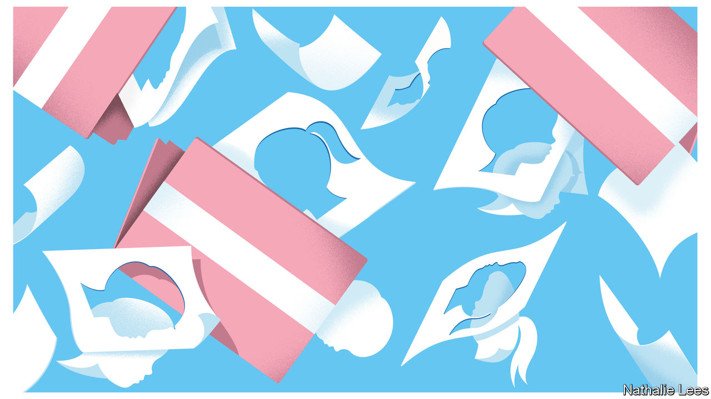

###### The WPATH files

# Leaked discussions reveal uncertainty about transgender care 

##### The files shed light on a controversial area of medicine that has largely retreated into the shadows 

 

> Mar 5th 2024 

FEW AREAS of medicine arouse as strong emotions in America as transgender care. The publication this week of hundreds of posts from an internal messaging forum will add fuel to this fire. The files show members of the World Professional Association for Transgender Health (WPATH), an interdisciplinary professional and educational association devoted to the field, discussing how to treat patients.

The non-profit group that published the files, Environmental Progress, which pushes strong views on more than just the environment, claims that the documents reveal “widespread medical malpractice on children and vulnerable adults”. That claim is questionable. But WPATH’s standards of care have been cited by other medical organisations, particularly in America. WPATH’s president, Marci Bowers, said in response that “WPATH is and has always been a science- and evidence-based organisation.” Yet the discussions show that the provision of so-called gender-affirming care is riddled with far more doubt than WPATH’s message that such treatments are “not considered experimental”.

Shedding light on this field is helpful, even if the leaking of private information—including names of practitioners—is ethically dubious. Because gender-affirming care has become politicised, its practice has retreated into the shadows. It is rare to get a sense of what it entails. 

Based on the files, WPATH has members who are worryingly dogmatic. But mostly the exchanges reveal a group of surgeons, social workers and therapists struggling with how best to serve patients. They debate the challenges of gaining informed consent for medical treatments from children and people with mental-health disorders. They exchange tips on how to deal with requests for “non-standard” surgery, such as patients who would like to preserve their penis but also have a “neovagina” (through a procedure known as “phallus-preserving vaginoplasty”). 

“I’m definitely a little stumped,” says one therapist about trying to get patients as young as nine to understand the impact that interventions would have on their fertility. (Hormone medications can permanently reduce fertility, and even cause sterility in some cases.) Colleagues agree that talking to a 14-year-old about fertility preservation brings reactions such as: “Ew, kids, babies, gross”, or “I’m going to adopt.” One clinician admits that “We try to talk about it, but most of the kids are nowhere in any kind of brain space to really talk about it in a serious way.” He adds: “That has always bothered me.”

Concerns about making irreversible changes to children’s bodies, and the impossibility of gaining their informed consent for this, have been at the heart of controversy over transgender medicine. In America 23 states have now restricted or banned such care for minors, even though almost all medical associations in America support it—an issue the Supreme Court has been asked to rule on. Much less focus has been on whether adult patients with psychiatric disorders can give informed consent for such procedures. On that matter the files are especially revealing.

In the autumn of 2021 several practitioners mentioned that they had a high number of patients with dissociative identity disorder (DID), formerly known as multiple-personality disorder. The group discussed the challenges of gaining consent from each “alter” (alternative personality) before starting hormone therapy, particularly when the alters had different gender identities. Some members appeared to view DID primarily through the lens of identity. As one therapist put it: “I too would love to hear from others how we as clinicians…can work with these clients to honour their gender identity and fractured ego identities.” For a field sometimes accused of over-medicalisation, such “under-medicalisation” is just as troubling.

Are you sure?

The conversation ventures into the absurd—and sounds more ideological than clinical—when talking about unusual requests for body modifications. “I’ve found more and more patients recently requesting ‘non-standard’ procedures such as top surgery without nipples, nullification [the removal of all external genitalia], and phallus-preserving vaginoplasty,” writes a surgeon from California. Several members recognise this and exchange tips. One asks whether “non-standard” is the best term as “they may become standard in the future”.

The surgeon from California shares his website, which includes a menu of surgical options, and adds that he’s “quite comfortable tailoring my operations to serve the needs of each patient”. This attitude to surgical shopping is uniquely American. Pandering to it will not help gender medicine with its argument that it is medically necessary and non-experimental.

In response to the leaks, the surgeon says he is comfortable performing these operations because WPATH “acknowledges these procedures and has established evidence-based guidelines on how to help a patient who is requesting them.” But a doctor in Canada says that after joining the forum her “expectations of scientific discourse were soon dashed”. Her posts were met with “emotional, political or social reactions rather than clinical ones”. 

WPATH, and those arguing for gender-affirming care more broadly, have felt the need to present a level of certainty in an area of medicine full of uncertainty. Bringing frank discussion into the open will surely be healthy. ■


