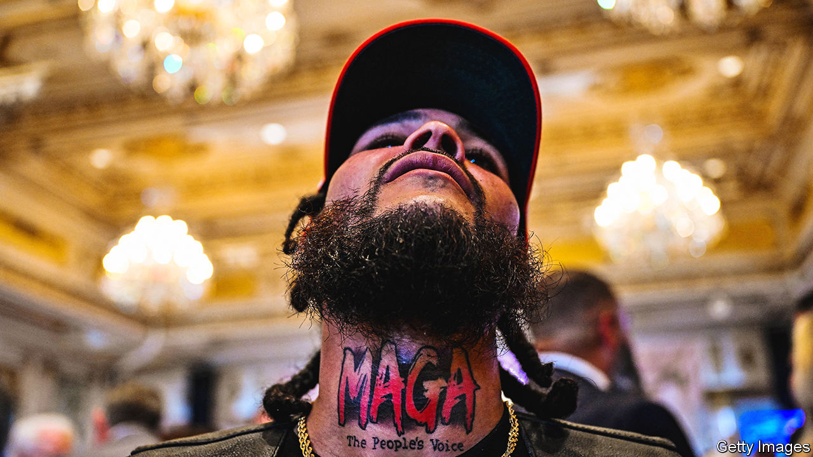

###### Brand Old Party

# Super Trump and his mighty MAGA machine 

##### After his Super Tuesday wins, Donald Trump moves swiftly to dominate the national Republican Party 

 

> Mar 6th 2024 

Nikki Haley became the first woman to win a Republican presidential primary on March 3rd, when she earned 63% of the roughly 2,000 votes cast in the District of Columbia. Donald Trump’s campaign quickly sent out a press release knocking Ms Haley for being “crowned Queen of the Swamp by the lobbyists and DC insiders”. Mr Trump is busy creating a new Republican establishment anyway.

Ms Haley notched up a second win, in Vermont, on March 5th, but that came amid an avalanche of defeats. Fifteen states and one territory held primaries, with 854 of the 1,215 delegates needed to clinch the Republican nomination up for grabs. Known as Super Tuesday, the typically important day proved unusually sleepy. As expected, Mr Trump dominated, as he has . The front-runner won every Super Tuesday primary but Vermont’s.


Before Ms Haley dropped out of the race on Wednesday morning, Mr Trump wrote that many of her supporters were “Radical Left Democrats” but he “would further like to invite all of the Haley supporters to join the greatest movement in the history of our Nation”. Ms Haley declined to endorse Mr Trump, who is now running unopposed and will soon officially clinch the delegates needed to become the party’s presumptive nominee.

Mr Trump did receive an endorsement from Mitch McConnell, the veteran Republican leader in the Senate and one of the last prominent holdouts. But the former president was already flexing his influence over the national party before Super Tuesday. The Republican National Committee (RNC), a 168-member body, is convening in Houston on March 7th and 8th, and merging the institution with Mr Trump’s campaign will be at the top of the agenda. Ronna McDaniel, the RNC’s chair since 2017, will finish her two-year term early after Mr Trump grew dissatisfied. Mr Trump has picked Michael Whatley, chairman of the North Carolina Republican Party, to replace her. Lara Trump, the former president’s daughter-in-law, is expected to join as co-chair. And Chris LaCivita, a top campaign official, will oversee day-to-day operations at the national committee.

Last month Ms Haley criticised these moves as premature, but presidential campaigns always integrate with the national committee eventually. “Of course he’s going to take over the building and the party,” says Sean Spicer, who worked at the RNC before joining the Trump administration. “It unifies the effort. You don’t need people swimming against the stream.”

Mr Trump was able to move faster than usual because he remains extremely popular with Republicans, and even his critics could see that only he could win the nomination. Both organisations will now co-ordinate strategy and spending that could pass $1bn. The committee traditionally focuses on get-out-the-vote operations and could take on some campaign expenses. Then there are Mr Trump’s legal bills, which continue to mount as he fights multiple criminal indictments.

Henry Barbour, a longtime committeeman, sought to pass a resolution preventing the RNC from picking up a legal tab that could run into tens of millions of dollars. He said ahead of the Houston meeting that the effort could not muster enough support even to come up for a vote by the full committee, though Mr LaCivita has said that Mr Trump will not rely on the RNC funds for legal liabilities.

A Trumpified RNC today does not guarantee one in perpetuity. The institution typically shrinks as it comes under financial pressure after presidential elections, and many Trump appointees will depart. The newly installed chair and co-chair will be up for re-election next year. Their successors will be chosen by RNC members, who generally support Mr Trump, but Republicans who have witnessed such transitions before say they can be unpredictable.

The presidential candidate will have greater influence over the future of the party by wading into congressional races. More than 90% of Trump-endorsed candidates won their primaries in 2022, and his endorsement remains potent in 2024. A Republican pursuing a US Senate seat in Montana dropped out days after Mr Trump endorsed his rival. A House Republican strategist declines to share details on discussions with the Trump campaign, but says Mr Trump wants to see the party’s majority grow: “He’s definitely a team player.”

Even a Trump loss in 2024 would not necessarily diminish the appetite for Trump-aligned populists in the future. “That is where the energy is in the party,” says Alex Conant, a Republican operative. “I expect it will remain that way for a while regardless of what happens to Trump.”

Mr Trump’s strength among primary voters should surprise no one, but some of the party’s money men have shown less enthusiasm. Many donors preferred Ms Haley or Ron DeSantis, the Florida governor whose $168m effort ended after the Iowa caucuses. Last year was the RNC’s worst fundraising year, adjusting for inflation, since 1993—and its Democratic rival brought in over $30m more. The DNC started 2024 with more than $21m cash on hand compared with just over $8m for the RNC.

Money is not all that matters. Hillary Clinton spent nearly twice as much as Mr Trump in 2016 and still lost. But in a close race, any extra advantage could decide the outcome. Mr Trump is a potent small-dollar fundraiser, but he appears to know he will need more billionaires onside. 

The Club for Growth, an influential anti-tax group that fell out with Mr Trump in recent years, has begun to reconcile with him lately. Jeff Yass, a billionaire trader, gave the group’s Super PAC $10m as it sought a Trump alternative. He later donated to the Super PAC for Chris Christie, a former New Jersey governor. On March 1st Mr Trump called Mr Yass “fantastic”.

Whether Mr Trump can —and more moderate Republicans—may depend on how he adapts his tone in the coming months. Most presidential nominees undergo a shift after securing their base, adopting a more moderate message during the general election. Mr Trump has been notably more circumspect on abortion and other social issues than his Republican rivals. But his broader strategy is unlikely to change: hammering Mr Biden for his handling of immigration and the economy while pointing to increasing chaos around the world. 

“Winning campaign messaging requires a few key ingredients: being simple, compelling and able to draw a clean contrast against the opposition,” says Rob Lockwood, a former RNC strategist. “Biden’s political prospects are primarily haunted by his record,” and Mr Trump can point to four years in office that polls suggest many voters recall fondly.

Mr Trump still faces the challenge of healing wounds within his own party. After Iowa, he opted for a unifying message. A week later in New Hampshire, visibly annoyed, he departed from his script and delivered a lengthy personal attack on Ms Haley. As the results came in on Super Tuesday, Mr Trump said: “We want to have unity, and we’re going to have unity, and it’s going to happen very quickly.” ■


