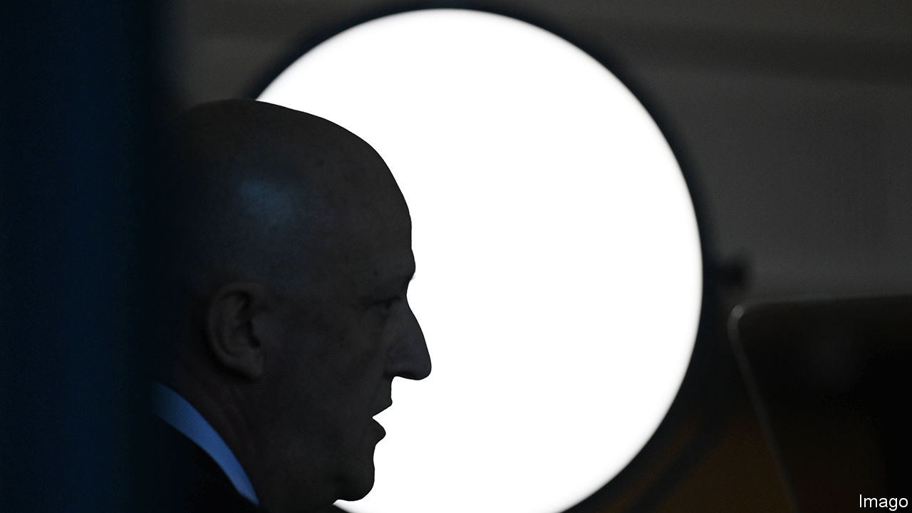

###### Spooked

# An Australian spy chief triggers a debate about China 

##### Its intelligence agencies are concerned about complacency 

 

> Mar 14th 2024 

Last month Mike Burgess, Australia’s chief domestic spook, sent shockwaves through Canberra when he declared that a former Australian politician had been recruited by a foreign spy ring and “sold out their country”. The ring was later revealed to be Chinese. The politician remains unnamed. The claim triggered fierce speculation, and a debate about whether Mr Burgess was stoking paranoia. Australian intelligence agencies “will do anything to destabilise any meaningful rapprochement” with China, said Paul Keating, a former Labor prime minister, on March 5th.

Mr Burgess rarely pulls his punches. He has warned of similar threats in speeches for his Australian Security Intelligence Organisation (ASIO) since 2020. He often flags foreign meddling. Last year at the first public meeting of the Five Eyes, an intelligence-sharing group of America, Australia, Britain, Canada and New Zealand, he said that “the Chinese government is engaged in the most sustained...and sophisticated theft of intellectual property and expertise in human history.”

Declassifying the information last month served two main goals, according to Mr Burgess. The first was to educate Australians about the growing threat of both espionage and foreign interference (which involves a foreign government secretly influencing people and politics). The second was to send a message to China: “We want the A-team’s bosses to know its cover is blown,” he said. Underlying that may be a concern about complacency over China.

Since Australians elected a Labor government, led by Anthony Albanese, in 2022 the bilateral relationship has improved. Mr Albanese’s government has not made major concessions to China and backs AUKUS, a submarine-building pact with America and Britain. However, it avoids calling out China publicly. As a result, China has lifted most of the trade restrictions it imposed on Australia in 2020, and may lift tariffs on wine shortly (see China section). Exports have boomed from A$147bn ($97bn) in 2020 to over $200bn in 2023. Most strategists agree that this is good news. But the “gap between what the government says and what it knows is big and getting bigger,” says Rory Medcalf at the Australian National University in Canberra. 

Some intelligence officials worry that Australians may miss the nuance, and that a “stabilised” relationship might be taken as a sign that the Chinese threat is abating. The share of Australians who say China is “more of a security threat than an economic partner” fell from 63% in 2022 to 52% last year, according to polling from the Lowy Institute, a think-tank in Sydney.

On the other side, the government is under fire from a small but vocal group of former Labor politicians. They are critical of what Mr Keating calls Australia’s “mindless pro-American stance” and accuse intelligence heads of tub-thumping over China. Successive governments have given “free rein in security policymaking to hardliners in the defence and intelligence community”, wrote Gareth Evans, a former Labor foreign minister, in December.

However, according to John Blaxland, the author of an official history of ASIO, “the threat of foreign interference is real.” China has long courted influence with Australian politicians. ASIO now says that the “A-team” is grooming well-connected Australians online, with offers of “consulting” jobs. An unnamed “nation-state” is using “top-notch tradecraft” to probe critical infrastructure networks for weakness, according to Mr Burgess. Meanwhile, his job will only become harder. Australia’s role in the Indo-Pacific power contest makes it a target. Under AUKUS, America will be sharing prized nuclear-propulsion technology with it. Foreign agents are already probing for information. ■

