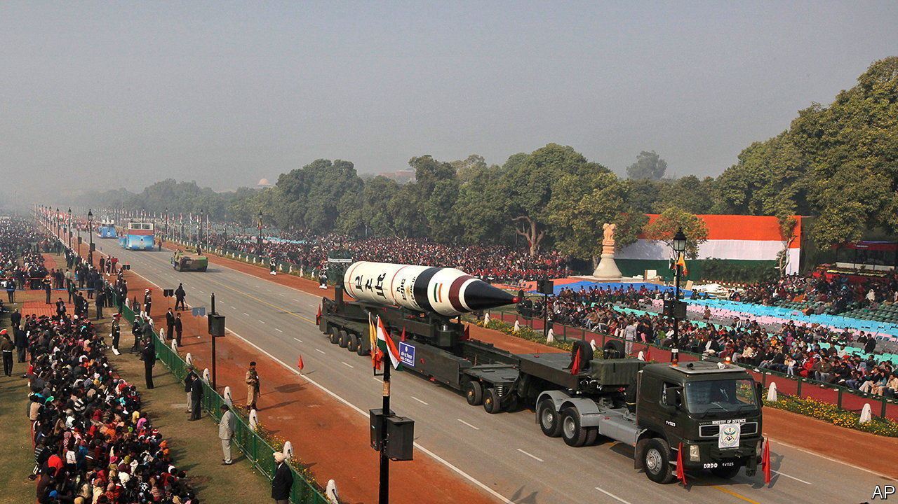

###### Hydra-headed nukes

# India is souping up its nuclear missiles 

##### For the first time it has tested a missile with multiple warheads that can each hit different targets 

 

> Mar 14th 2024 

To an idle observer on Abdul Kalam Island, an Indian territory in the Bay of Bengal, the missile that shot into the sky on March 11th was little different from scores of similar launches that have occurred there since the 1980s. A more discerning bystander might have noted that it was the tenth test of the Agni V, India’s first intercontinental ballistic missile (ICBM), capable of reaching any part of China. But even the most astute missile-watcher would not have known the significance of the launch, which lay inside the nose cone. 

This month’s launch is thought to be the first time that India has tested a missile with multiple independently targetable re-entry vehicles, known as MIRVs, first developed by America in the 1960s. These are small warheads, crammed atop a single missile, each capable of striking targets hundreds of kilometres apart from one another. The test is a technological triumph for Indian scientists. It “marks a significant development for India’s nuclear posture, and faster than we anticipated just a few years ago”, write Hans Kristensen and Matt Korda, experts at the Federation of American Scientists, a research group. It could also affect nuclear dynamics in Asia.

MIRVs have three advantages for India. One is that they give the country greater assurance that its nuclear warheads would get through any future Chinese missile-defence system. Another is that, even if China (or, less likely, Pakistan) were to destroy a portion of India’s missiles in a bolt from the blue, a small number of surviving missiles would still carry enough firepower to inflict existential damage in return. 

The third is that MIRVs allow India to substitute accuracy for firepower. The country’s test of a thermonuclear bomb in 1998 is thought to have failed. MIRVs allow it to use a larger number of less powerful fission bombs to deliver the same effect as one large H-bomb. And there is another upside, says Christopher Clary of the University at Albany in New York. “Missiles, especially long-range ones, typically cost quite a bit more than warheads,” he says. “So the cost saving for an equal number of warheads on target could be substantial.” That will appeal to India: its defence spending is vastly lower than China’s.

All this has drawbacks. MIRVs make it easier to launch a “disarming” first strike against an enemy’s nuclear forces. Conversely, in stuffing many warheads into a single missile, they are also attractive targets for an enemy’s first strike. That can encourage countries to build larger arsenals, and to launch them more quickly in a crisis. When America and the ussr began MIRVing their missiles in the 1970s, the technology contributed to an arms race.

Ashley Tellis, an expert at the Carnegie Endowment, a think-tank in Washington, has argued that India has little interest in using MIRVs for targeting Chinese or Pakistani nuclear missiles, a practice known as “counterforce”. Its missiles are probably not accurate enough for that anyway, he notes. India will need many more tests to have confidence in its MIRV capability.

Nonetheless, Mr Kristensen and Mr Korda are concerned. China has deployed MIRVs on some missiles, they point out, while Pakistan tested them in 2017. In America and Russia, there is talk of re-MIRVing missiles that were downgraded to single warheads. “A world in which nearly all nuclear-armed countries deploy significant MIRV capability”, they conclude, “looks far more dangerous.” ■


