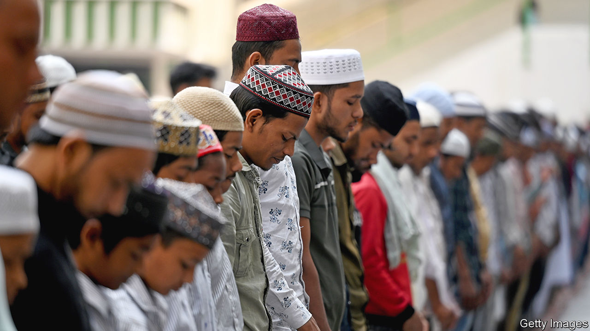

###### Religious politics

# India’s government implements a controversial citizenship law 

##### It may be trying please its base shortly before a general election 

 

> Mar 14th 2024 

Narendra Modi prides himself on getting things done. Yet when it came to implementing the Citizenship Amendment Act (CAA), a campaign pledge of his Bharatiya Janata Party (BJP), his government dragged its feet. The rules for implementing the law, which offers persecuted religious minorities from some neighbouring countries an accelerated route to Indian citizenship, were published on March 11th, four years after it passed parliament.

The law is controversial because it does not include Muslims. The government says that is because they are not a minority in any of the relevant countries. Yet some Indian Muslims worry the law could end up being used to challenge their own citizenship. Its exclusion of Muslims has certainly made it popular with the BJP’s Hindu-nationalist base. There is a suspicion its implementation was timed to rally Hindu voters ahead of a general election due by May.

The act allows for applications by refugees from Bangladesh, Pakistan and Afghanistan, as long as they are Hindus, Sikhs, Buddhists, Jains, Parsis or Christians and arrived in India before the end of 2014. Within India, critics have challenged the CAA for explicitly linking citizenship and religion, which they say violates India’s secular constitution. The fear that it could be used against Indian Muslims was exacerbated by another scheme, since suspended, to compel Indians to prove their citizenship in order to be included in a national register. The government denies that the law is discriminatory. 

The opposition suspects the timing of the announcement. A Congress party spokesman said it was designed to distract from a Supreme Court ruling, earlier the same day, which rejected a plea by the State Bank of India to be given more time to publish details about donors in a controversial BJP-designed campaign-finance scheme. It also followed the sudden resignation of an election commissioner over the weekend, days before the election date was expected to be announced. So far, the renewed debate over the CAA has taken oxygen away from these stories.■


