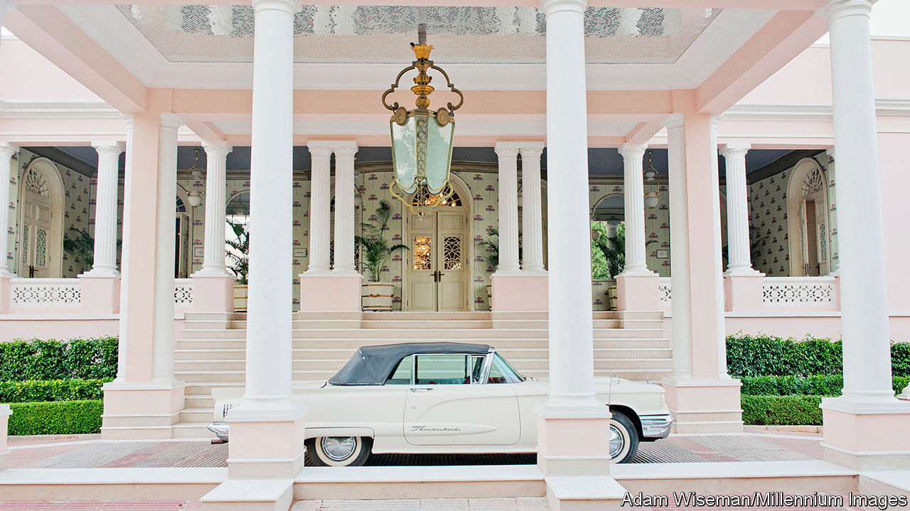
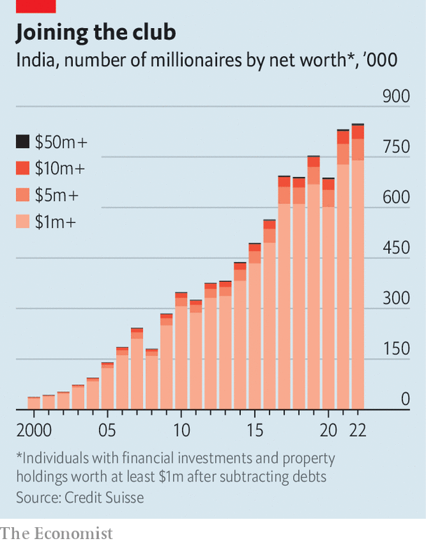

###### Wealth creation in India

# Inside the world of crazy rich Indians 

##### The new wealthy elites are younger and more adventurous than the old lot 

 

> Mar 11th 2024 

ALL OF INDIA was transfixed, as February turned to March, by the spectacle of Anant Ambani’s pre-wedding celebrations in Jamnagar, an unlovely industrial town in western India. Mr Ambani is the son of , India’s richest man and boss of Reliance, a giant conglomerate. Bill Gates, Mark Zuckerberg and Rihanna turned up, as did hordes of Indian business tycoons, cricket legends and Bollywood A-listers. The government temporarily converted the local domestic airport into an international one. For hundreds of millions of Indians following the lavish proceedings on TV, social media and in the papers, the festivities stood as shorthand for the tastes and power of India’s rich. 

The Ambanis and their fellow plutocrats are household names in India. But they are not representative of India’s wealthy. Billionaires, almost by definition, are a select few. According to , a compiler of lists, there are just 186 of them in India. Far more consequential to—and representative of— are the legions of dollar millionaires, whose ranks are expanding year by year. They have an outsize influence, relative to their numbers, on patterns of consumption, investment and growth. They tend not to make headlines or advertise their wealth. 

There is no fixed definition of “rich” used by the businesses that cater to them. But one commonly accepted threshold for being a “high-net-worth individual” is possession of net assets of $1m or more, including the value of primary homes. That could inflate numbers by counting someone who works for a modest wage but inherits a large seafront flat in Mumbai—$1m buys 1,100 square feet (100 square metres) of prime property in the city. But it does not account for those who hold illicit cash, depressing the real figure. Experts assume that these things roughly cancel each other out to provide a decent picture of a country’s wealthy people. 

 


By that definition, India had around 850,000 dollar millionaires in 2022, a net addition of 473,000 from a decade earlier, according to research by Credit Suisse, a Swiss bank. Between 2012 and 2022 the number of dollar millionaires grew at an annual rate of 8.5%, outpacing average GDP growth of 5.6%. The economy is rebounding even more strongly now. As a result, wealth managers expect the number of dollar millionaires to expand by 15-20% per year. These are the new rich. No datasets exist delineating the demographics of this cohort. But it is possible to draw broad trends from the people who manage their money. One unifying theme emerges: India’s new rich are nothing like the old. 

First, they are more spread out. No longer do Indians need to live in top-tier cities like Mumbai, Delhi or Bangalore to get loaded. Jaideep Hansraj, who ran wealth management for 15 years at Kotak Mahindra, a big bank, and now heads the securities business, says the surge in investors from small cities is phenomenal. They come from “Indore or Bhopal or Lucknow or Kanpur. I mean…Bareilly. It completely bamboozles me,” he says, referring to the sorts of cities an earlier generation of bankers would have sneered at. Rakesh Singh of HDFC, India’s biggest bank by market capitalisation, says he has seen half-million-dollar investments coming from places like Jorhat in , which most Indians would struggle to locate on a map. 

Driving this geographic diversification of wealth is India’s improving . This has lowered transport costs and sped up industrial shipments. It includes a big expansion in air connectivity, the spread of high-speed internet, and investment incentives from state governments keen to grab a piece of India’s growing economy. Wealth managers, too, are expanding their operations to serve customers where they are. 

A second change is in the average age of the wealthy. Where India’s rich might once have had a median age above 50, now 40- and 30-something millionaires are common. Some have benefited from government land acquisition for infrastructure projects, reaping big sums from previously unproductive holdings. Many are first-generation businessmen making consumer staples such as wafers (potatoes, not silicon), clothes or poppadoms, or unsexy but essential goods necessary for a growing economy, such as rebar or ball bearings. A huge chunk are salaried professionals with company stock options or prudent personal investments. These are first-generation millionaires with “strong middle-class values”, says Chethan Shenoy of Anand Rathi Wealth, which manages $6.6bn for nearly 10,000 clients. 

The third major shift is in what the new rich do with their riches, in terms of both investment and consumption. They are much more comfortable with capital markets than their parents were. “Earlier I could go and have one standard conversation with 90% of my clients,” says Nitin Chengappa, who heads private banking at Standard Chartered, an international bank. Today “diversification is the key. It’s not just mutual funds. It’s private equity, social causes, venture capital, what can I do in listed [companies], what can I do in non-listed?” The rich still buy plenty of gold and second homes, in India and abroad. But their interest in markets and their appetite for risk have increased, too. 

That does not mean they shy away from consumption. Foreign holidays are a common indulgence, as are extravagant weddings and fancy cars. (Mercedes-Benz expects India to become its third-biggest market outside Germany in three years, up from fifth.) European luxury brands and hotels are an increasingly common sight in India’s cities. Last year Dior held a show in Mumbai, and in 2022 the Swiss watch industry enjoyed a record year for exports to India. Tata, a big Indian conglomerate, has seen robust growth in its luxury-goods and five-star hotel businesses, especially from smaller cities. It is planning to open 25 hotels this year, many of them high-end. An international airport due to open in Mumbai next year will have a fifth of its parking spots reserved for private jets. 

Two risks could stall the growth of India’s new class of wealthy. The first is political, regulatory or tax changes. Risk-taking in investment and free-spending consumption are driven by confidence among the rich that they will only get richer. Political instability could prompt a retreat to safer investments and lower spending. And although they are mostly immune to domestic inflation they are particularly sensitive to changes in taxation, especially on income and luxury spending. 

The other risk is that the rich might flee. Henley and Partners, a high-end immigration firm, reckons that 7,500 Indian millionaires moved abroad in 2022. Many more have quietly acquired second homes in Dubai, London or Singapore, as well as the right to move there as a way of keeping their options open. Most hope to send their children to foreign universities. Professionals with international firms are also highly mobile, tempted by higher quality of life, better schooling for their children and a . 

India’s new rich, like the previous elite, are a patriotic group. Many are keen to give back and help improve the lives of other Indians—while also having a good time. But even as they change, they would like India to change too. As one banker puts it, “As rich as you get you cannot do anything about the pollution.” ■


