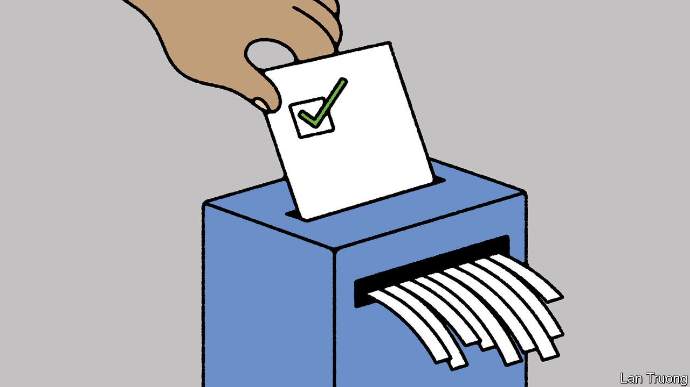

###### Banyan

# Pakistan’s generals look increasingly desperate 

##### A fraudulent election may not keep Imran Khan’s fans at bay 

 

> Mar 14th 2024 

Nawaz Sharif’s Pakistan Muslim League party (PML-N) is back in power. Following elections last month, the thrice former prime minister’s younger brother, Shehbaz, has been installed in the ruling post. His daughter, Maryam, is the new chief minister of populous Punjab. So why is Mr Sharif so glum? The 74-year-old “lion of Punjab” has said little publicly since the vote. Bunkered down in his mansion outside Lahore, he is said to be depressed.

He has reason to be. The PML-N’s success is much less than Mr Sharif was promised when he returned home last year. He had spent four years in exile in London because Pakistan’s generals—stage managers of its democracy—were against him. They rigged an election in 2018 in favour of his main rival, Imran Khan. But then they fell out with Mr Khan and reverted to the lion. A former cricketing god, Mr Khan is now in jail on graft charges. His Pakistan Tehreek-e-Insaf (PTI) party has been dismantled. PML-N was therefore expected to sweep the election and Mr Sharif to become prime minister for a fourth time. Instead, something unprecedented happened.

Despite the army’s myriad ploys to prevent Pakistanis voting for Mr Khan, it seems most did so. Standing as independents, candidates linked to his party swept the country. Early counting put them on track for two-thirds of Punjab’s seats and an overall majority. At which point the army intervened to a degree that might make a tin-pot tyrant blush.

Army agents were allegedly sent into counting stations with alternative tallies. Salman Akram Raja, a Supreme Court lawyer running as a de facto PTI candidate in Lahore, had been informed that he had won by 95,000 votes. And then—whoops—that he had lost to the PML-N candidate by 13,500. Mr Sharif’s party would otherwise have faced oblivion. As it is, it won only 75 of 264 seats. It cobbled together a majority by striking a deal with the Pakistan Peoples Party, which is run by another fading dynasty, the Bhuttos.

This might seem like Pakistani business as usual. The country has been ruled by the army, directly or at varying degrees of remove, throughout its history. In a cycle that Mr Sharif has been through several times, the generals put a biddable civilian in power then, after he or she dares to act independently, switch to a different proxy or army rule. Thereby Pakistan has had four army dictators and none of its 20 civilian prime ministers has completed a five-year term. This helps explain why it is so badly governed. Having little prospect of a full term, Pakistan’s civilian regimes abjure long-term decision-making in favour of populist giveaways and graft. As recently as 2006, Pakistanis were better-off than Indians; now the average income in India is 60% higher than that in Pakistan.

A big question arising from this latest turn of the wheel is whether the army can maintain control. There are two reasons to think it could struggle. The first is Mr Khan. Perhaps unwittingly, given his erstwhile compliance with the army, he has channelled Pakistanis’ long-standing despond into anger at the military establishment. This has put Pakistani politics on new terrain. Had the army chief, General Asim Munir, responded to the vote count by calling a state of emergency, as his predecessors might have, he would have risked an uprising. “There is this sense that the gravy train needs to stop,” says Mr Raja, an old acquaintance of Banyan. “We can’t be forever governed by two families in cahoots with the powers that be.” 

The second factor endangering the status quo is a protracted economic crisis. The inflationary shocks experienced in many countries have in Pakistan combined with the effects of long-standing malgovernance to deliver chronic inflation, joblessness and balance-of-payment problems. Mr Khan’s ousting in 2022 now appears well timed for him. Mr Sharif’s decision to let Shehbaz lead an 16-month-long replacement government instead of calling early elections looks like a major blunder. It has hung the crisis around his party’s neck. With Pakistan’s 24th IMF bail-out set to expire this month, and a bigger loan urgently required, the new government will need to take measures that will make it even more unpopular than it is. Its prospects—and Mr Sharif’s hopes of rebuilding his party—appear dire.

The same could be true for the army-run establishment that Mr Sharif has unhappily rejoined. It may have got away with its latest election heist. But in the process Mr Khan’s supporters have made the army look desperate and vulnerable. ■


