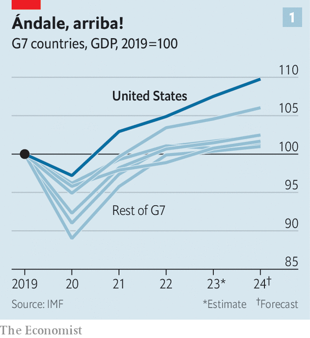
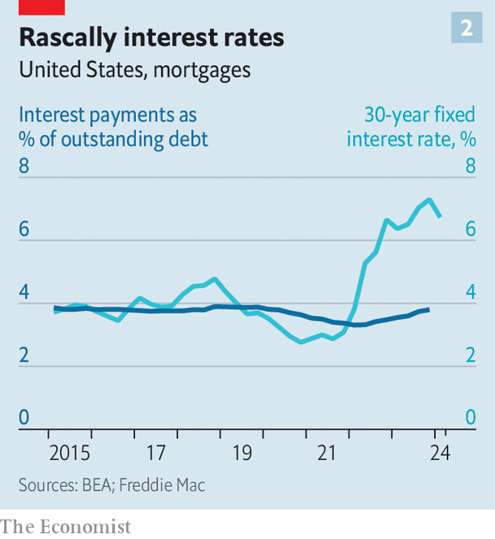
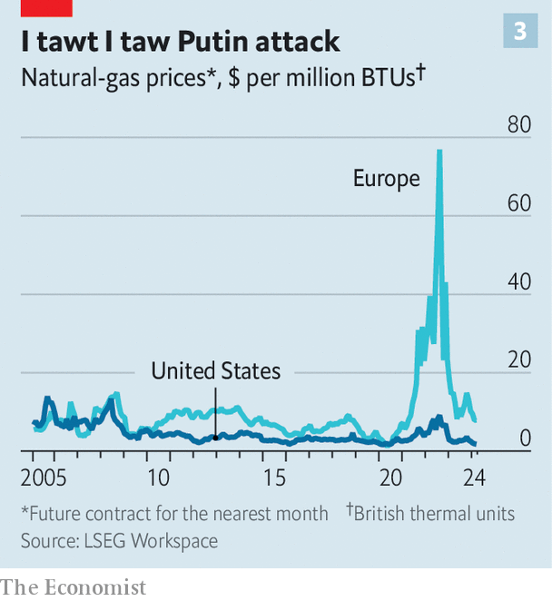
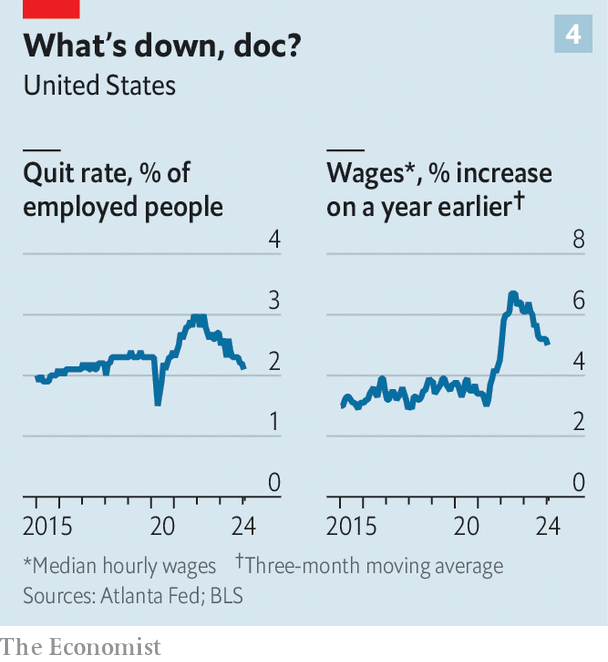

###### Who’s afraid of Wile E. Coyote?

# America’s economy has escaped a hard landing 

##### But there are still pitfalls ahead 

 

> Mar 14th 2024 

WHICH CARTOON character does the American economy most resemble? The consensus view in recent years, as propounded by a former Treasury secretary, a former president of the New York Federal Reserve and the chief economist of a big asset manager, is Wile E. Coyote, the dogged but hapless adversary of Road Runner. They were referring to the unfortunate predator’s tendency to careen off a cliff, defying gravity for a few moments before plunging into the canyon below. America’s run of heady growth, the analogy implied, could not persist amid rampant inflation; a reckoning was inevitable. But in fact, since late 2022, it is inflation that has plunged, whereas the economy has pulled off something that the coyote never managed and leapt across the canyon.

 


Since the end of 2019—a period that includes the covid-19 pandemic and its aftermath—America’s economy has grown by about 8% in real terms (see chart 1). During that same time, the euro area has expanded by only 3%, Japan a piddling 1% and Britain not at all. America is the only big economy that is back to its pre-pandemic growth trend.

Alan Blinder of Princeton University has examined the 11 previous episodes over the past six decades in which the Fed raised interest rates to quell inflation. Most ended at the bottom of the metaphorical canyon, in recessions. The Fed did manage to guide the economy through a couple of less harmful descents, but has only once previously achieved a painless one, in 1994-95. Mr Blinder thinks its current steering is the most impressive, however, given the starting point: the economy was gripped by much higher inflation this time around, forcing the Fed to raise interest rates rapidly. “We’re there. We’ve had the soft landing,” he says.

Calling it a soft landing may in fact be an understatement, for what is most striking about the American economy at present is not its deceleration but its continued momentum. On February 26th the National Association for Business Economics published its quarterly survey of professional economists. Three months ago the median forecast was for growth of 1.3% this year; now it is 2.2%, just short of last year’s 2.5% growth. Yet the steady expansion has not stopped inflation from falling: the same economists see it receding to an annual rate of 2.1% by the end of 2024 (using the Fed’s preferred gauge), almost bang on the central bank’s target of 2%.

It is not just economists who are upbeat. America’s stockmarkets keep hitting new records. Corporate earnings are set to rise strongly this year. Ordinary folk, too, are growing more optimistic.

Meep, meep

How exactly has America done this? One way of looking at its run of strength is to focus on demand. Every element of it—consumption, investment, foreign trade—added to growth last year, and may well do so again this year. Three factors have underpinned this broad-based strength: buffers, fiscal catalysts and diversification.

When the Fed jacked up rates in 2022, it seemed inevitable that the abrupt tightening would hobble the economy. That, after all, was the point: to bring down inflation by slowing growth. The median projection of Fed officials at the end of 2022 was that the unemployment rate would rise by a percentage point last year; many others assumed the damage would be much worse. Instead, it barely budged, remaining below 4%, close to a 50-year low.

That is because both consumers and businesses have been insulated to some degree from the chill of higher rates. The insulation is partly a product of the giant stimulus doled out by both the Trump and Biden administrations at the height of the pandemic. This marked America out at the time: in 2020 and 2021 its government deficit averaged 14% of GDP. In the euro area the average was 6%. Both directly (handouts) and indirectly (a quicker economic recovery) this support padded Americans’ bank accounts.

Those savings have lasted a surprisingly long time. Researchers with the San Francisco Fed have estimated that households’ excess savings (compared with the pre-pandemic trend) peaked at $2.1trn in August 2021. Early last year they thought this stash would be used up in a matter of months. But after data revisions towards the end of 2023, they concluded that households were sitting on an extra $400bn, enough to last through the first half of this year.

Suffering succotash no more

As time has gone on, the distribution of the excess savings has skewed towards richer Americans. They normally spend a smaller proportion of their income than the poor. But Ellen Zentner of Morgan Stanley, a bank, calculates that the top fifth of the population by income has recently accounted for 45% of consumption, up from 39% before covid, thanks in part to “revenge” spending on travel and luxury goods. “Wealthy consumers have drawn down their excess savings much more aggressively than their historical behaviour would have suggested,” she says. This prodigality, in turn, has helped to propel the economy.

 


Another layer of insulation has come from fixed-rate lending. Home-buyers, for example, often obtain 30-year fixed-rate mortgages. The average interest on the stock of these is now about 4%, less than before the pandemic and well below the 8% rate on new mortgages last year (see chart 2). That has drawbacks: in order to keep their inexpensive mortgages, people who might otherwise have moved are staying put. But it does mean that many Americans do not feel the full force of higher rates.

Fiscal policy has also added to America’s economic momentum. The government is running a gaping deficit. After narrowing to about 4% in 2022 it was back to 7.5% of GDP last year, a level typically seen only during wars or recessions. 

Yet not all deficits are equally stimulative. Unlike the gusher of spending when covid struck in 2020, last year’s deficit stemmed in part from weak revenues (taxes on capital gains took a hit) and technical factors (high rates reduced the Fed’s payments to the Treasury). Scholars at the Brookings Institution, a think-tank, find that the federal government’s fiscal stance only modestly boosted growth last year.

Yet in another way fiscal policy has been an economic engine, and may still be revving up. Three big spending packages passed by Congress (on infrastructure, clean tech and semiconductors) are incentivising private firms and state governments to spend lavishly as well. Construction of factories is booming as makers of electric vehicles and semiconductors expand operations in America: altogether, investment in manufacturing added about 0.4 percentage points to GDP growth last year. Investment in infrastructure has been slower to rise but seems to be climbing now, too, with state and local governments piggybacking on federal funding for highways, power grids, airports and more. “These policies are starting to show up in the data. It delays the timing of a cyclical slowdown,” says Satyam Panday of S&amp;P Global, a credit-rating agency.

Finally, America, as a big producer of oil and gas, is benefiting from high prices elsewhere without suffering as much from them itself. Natural gas costs about a quarter of what it does in Europe, for example (see chart 3). Last year America became the world’s biggest exporter of the liquefied sort (lng). No wonder that foreign trade added about 0.6 percentage points to America’s growth rate last year.

 


Strong demand is, however, only half the story. Were it not for a similar expansion of supply, all of the spending would have simply translated into more upward pressure on prices. That inflation has instead eased markedly is a sign of growth in America’s productive capacity. At its most basic an economy’s ability to supply goods and services is limited by how many of its people are working and how productive they are. Both of these factors have increased strongly in America of late.

Start with the labour force. America now has about 158m workers, nearly 4% more than at the end of 2019. In part that is because a higher share of working-age adults are employed. Yet by far the biggest driver of the expanded workforce has been immigration. The American-born labour force is a bit smaller than it was on the eve of the pandemic. The foreign-born labour force, in contrast, has swollen by more than 4m, or 16%, since the end of 2019. 

While most of those entering via America’s southern border end up in blue-collar jobs, there has also been an increase in immigrants destined for white-collar work. Student visas have rebounded strongly since the pandemic, with the total last year four times higher than in 2020. That has created a big reservoir of young, educated workers for companies to hire. Looking at data that includes asylum-seekers, Tiffany Wilding of PIMCO, an investment firm, estimates that about 3m immigrants arrived in America last year, up from 1m in pre-pandemic years.

Even so, expansion of the labour force does not in itself account for the economy’s overall growth. Consider the final quarter of last year: GDP rose by 3.2% at an annual rate but total hours worked increased by just 0.6%. This is only possible thanks to a surge in productivity. Workers in non-farm business were about 2.6% more productive than a year ago, according to official estimates. To be clear, no serious economist thinks such productivity growth is sustainable. Since the end of 2019 labour productivity has grown by 1.6% a year, less than a tenth of a percentage point faster than its pace from 2007 to 2019.

Nonetheless the jump in productivity over the past year is notable. The simplest explanation is that pandemic frictions have disappeared as supply chains have returned to normal, and that this has shown up in the data as an improvement in productivity. Some economists, though, are tempted to conclude that fundamentals may also be changing. One possibility is that increased competition in the labour market is engendering a reallocation of workers to higher-paying firms, which are potentially more productive, according to research by David Autor of MIT and Arindrajit Dube and Annie McGrew of the University of Massachusetts Amherst.

Julia Coronado of MacroPolicy Perspectives, a research firm, notes that the relative scarcity of workers has also prompted firms to invest in labour-saving technology, at a time when businesses software has been getting better. “It’s possible that like the 1990s we’re in the middle of a stronger productivity cycle, but that this time it is more focused on technology for businesses rather than consumers,” she says.

 


Can the good times roll on? The factors that have led to America’s strong performance over the past couple of years remain in place to varying degrees. Buffers for businesses and households are, by definition, thinner than two years ago, before the Fed jacked up rates. But the cheap loans that consumers and businesses took out before inflation struck will continue to shield them from higher interest rates for some time to come. Economists with Goldman Sachs, a bank, have calculated that the average rate on corporate debt will rise from 4.2% in 2023 to just 4.5% in 2025. “At some point higher rates will start to bite. But my take is that we may still have a little bit more runway,” says Mr Panday of S&amp;P.

The government’s investment splurge in manufacturing and infrastructure is far from over. Indeed, as procedures for allocating the money are established, the fiscal stimulus may well accelerate. The Department of Commerce has just started approving big grants for chipmakers, such as a $1.5bn award for GlobalFoundries in February. Meanwhile, more LNG export terminals are coming online, which should lift American energy exports yet higher.

On the supply side, immigration may slow as the political climate turns harsher, but many recent arrivals are still joining the labour market. The Congressional Budget Office estimated in February that the current wave of immigration would, even as it slows, add about 0.2 percentage points to annual GDP growth from 2024 to 2034. As far as productivity goes, it is notoriously difficult to observe in real time but optimists think the improvements may soon become more evident. “This is potentially going to give us a stronger foundation for growth than we had in the last economic cycle,” says Ms Coronado.

Debt-rackin’ varmints

It is not all roses. The labour market is showing a few cracks. Hiring has trended down since early 2022. Fewer workers are changing jobs (see chart 4). The main reason that unemployment has remained so low is that lay-offs have been modest. Yet that may be a sign not of confidence, but of concern. Companies may be hoarding workers, afraid to fire them after struggling mightily to hire them. What is more, America’s doughty consumers may at last be losing steam. Delinquencies on credit cards and auto loans soared last year, rising above pre-pandemic levels, according to the New York Fed. “It’s concerning to see that even before the unemployment rate increases,” says Ms Wilding.

 


The finance industry, too, has some obvious vulnerabilities. Commercial property threatens to blow a hole in loan books, a problem that will be particularly acute for smaller lenders. And many banks, big and small, are sitting on hefty paper losses on their bond-holdings because of the rise in interest rates.

Even if these problems prove manageable, America’s success has engendered another difficulty: how to unwind the rate rises of the past two years. No one knows with any certainty what the perfect interest rate is for the economy—the neutral level which is neither a spur to economic activity nor a drag on it. But it is clear that the central bank’s current range for short-term rates of 5.25-5.5%, the highest in more than 20 years, will weigh on growth. The question for the Fed is when to begin to cut, and how quickly.

In this sense, declarations that America has achieved a soft landing look premature. It is true that growth has been remarkably resilient and that inflation has softened. But the final stretch of squeezing out inflation may prove arduous given that prices are still rising at an annual pace of about 3%, above the Fed’s 2% target. At the same time, the central bank must start acting soon to bring rates back to a more normal level. Until both are achieved, things could yet go awry. Worriers often focus on a possible resurgence in prices. But the bigger danger may be that the Fed overprescribes its tough medicine. It is in this context that rising consumer debts and slowing labour markets look troubling. 

Jerome Powell, chairman of the Fed, has said that to deliver the ideal glide path for the economy, the central bank should start reducing rates before inflation hits 2%. The Taylor rule, a formula for gauging the appropriate level of interest rates, suggests that the Fed may be waiting too long. Given that the rule implied, correctly, that the Fed was being slow to raise rates as inflation surged in 2022, Mr Powell might want to pay it more heed now.

“Higher rates are like termites on the economy,” says Mark Zandi of Moody’s Analytics, a research company. “With each passing day, they dig deeper into the foundations, and at some point a wind is going to blow the building over.” America’s post-pandemic economy has been a marvel, especially in comparison to other countries. But it will not be impervious to high interest rates for ever. ■

