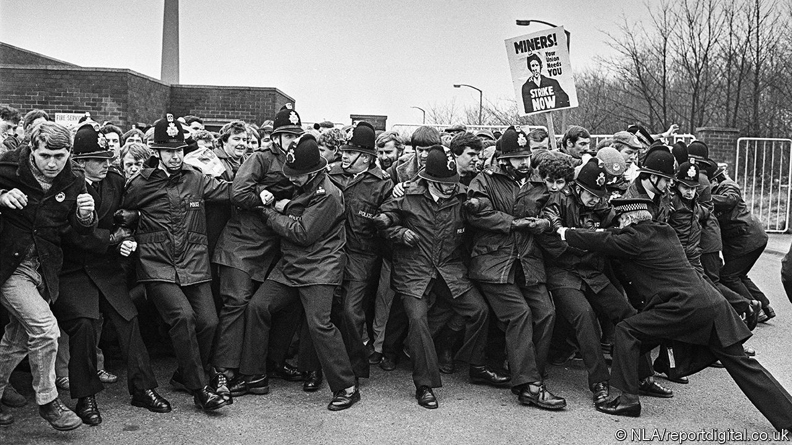

###### Forty years on

# British museums remember the 1984 miners’ strike 

##### Their exhibits suggest the country is tired of division 

 

> Mar 14th 2024 

The danum Gallery, Library and Museum in Doncaster feels the need to explain something to visitors to one of its exhibitions. “A trade union”, a screen in the gallery informs them, “is an organisation of members who are employees in a particular industry or service”. The gallery goes on to explain what coal is, and provides a lump of the stuff for illustration. It seems odd, until you realise how few Britons are now members of unions and how very little coal is mined or burnt in the country. Forty years is a long time. 

In March 1984 most British coal miners struck in protest against pit closures. It was the beginning of a bitter dispute that lasted for a year and ended in defeat for the miners. At least ten museums and galleries have put on exhibitions to mark the anniversary, some larger than others. Four are in Yorkshire, where miners were particularly militant and clashes with the police were violent. The exhibitions are strikingly ambivalent—so much so that they hint at a profound change in Britain. 

An easy way to commemorate the strike is to depict it as a clash between plucky, principled miners and the mighty British state, led by Margaret Thatcher. Curators at the National Coal Mining Museum near Wakefield considered that approach, and rejected it. Instead, in November, the museum asked people whose stories have rarely been heard to get in touch. It particularly wanted to hear from miners who kept working, known to strikers as “scabs”. 

The museum’s exhibition, “The Longest Year”, not only airs their memories but also includes the thoughts of mine managers and a London Metropolitan Police officer, one of many non-locals who were drafted in. He or she says that not all officers behaved violently (though some assuredly did) and complains that: “we are always shown as Maggie Thatcher’s boot boys.” 

Even the children of striking miners speak of their confusion and regret. One, who was 15 during the strike, remembers feeling ashamed by the poverty into which the household sank. Another remembers a father who stayed on strike but understood why others could not. “Looking back, the strike achieved absolutely nothing,” argues another. “All it did was hurt families.” The National Union of Mineworkers and its leader, Arthur Scargill, are not remembered fondly by everyone who walked out. 

The other exhibits in Yorkshire are less obviously revisionist. But they too allow doubts to creep in. The Clifton Park Museum in Rotherham displays a striking miner’s diary, open to a page in which he remembers a boring day on the picket line (“just stood there shouting ‘scab’”). It includes a photo of police officers queuing for ice-cream, suggesting they did not spend all their time behind riot shields. 

The exhibits also nod to the stifling environment for women in pit towns, which the strike helped to dislodge. “We’ve had to challenge all the ideas and arguments that say ‘our place is in the home’,” wrote a group of Yorkshire women after the strike. “Well—we are not going back!” The Danum Gallery, which has objects from former miners and local people, displays a pair of smart women’s shoes from the 1980s. It points out that the decline of heavy industry and the rise of office work suited many. 

Time has softened the scar tissue that built up during the strike. As the Clifton Park exhibit notes, all the mines around Rotherham have gone. “In their place, there are shopping centres, housing developments, country parks and woodlands.” And the region is no longer dependably Labour. The Yorkshire coalfield is part of the “red wall”, much of which voted Conservative in the 2019 general election. The exhibitions do not mention this, although some of the visitors do. “Red wall voters: remember what Thatcher did to your communities!” writes one, as though trying to pull people back to ancient battle lines. 

The museums’ determination to tell multiple stories of the strike, and to reflect the hesitancy and confusion of those involved, suggests something else may have happened. Perhaps Britain is growing tired of the politics of division and cultural clash, which arose in the 1980s and has intensified during the past decade. The exhibitions tell the story of the miners’ strike. They are also about Brexit Britain. ■


