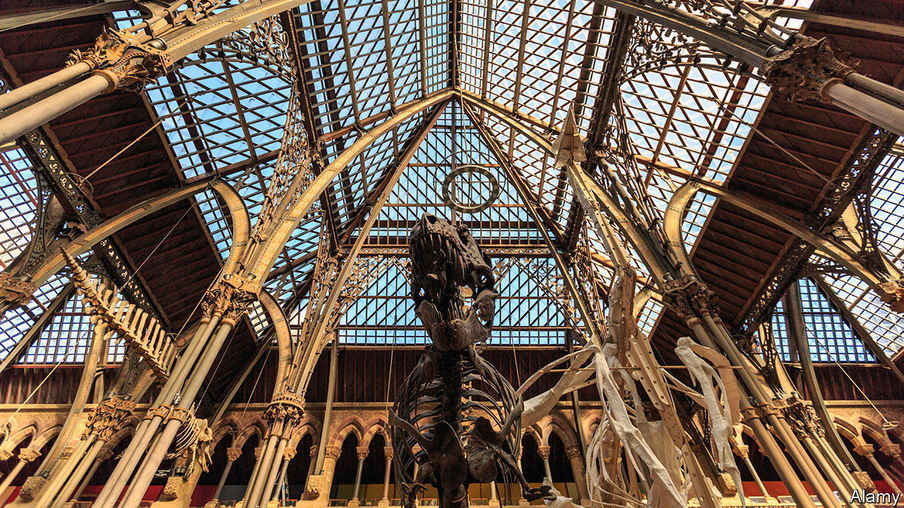

###### Yellowing red tape

# England’s historic buildings are causing headaches 

##### Does the process for protecting architecture need an update? 

 

> Mar 11th 2024 

THE GLASS roof on the Oxford University Museum of Natural History has long proved troublesome. In its 160-year history it has collapsed once, partially blown off twice and leaked constantly. All the while, it has poured sunlight onto the natural wonders within. Red butterflies are bleached white; the skins of stuffed creatures are cracked. 

The  is an example of a problem faced by many of England’s historic buildings. Its roof is a striking period feature, rightly protected by law. It also, in effect, creates a greenhouse. As the building gets older—and the world outside it warmer—preservation of the edifice will become harder to reconcile with preservation of the collections inside it. 

England’s most prized buildings are “listed” as being of special architectural or historical interest; that makes it a criminal offence to alter them without permission. Administered by Historic England, the government’s heritage watchdog, the list is about 500,000 buildings long. For many, that is a nuisance. In Norfolk mobile-phone signals are often patchy because masts cannot be built near listed structures. In Starcross, a seaside village in Devon, the columns of a listed pub obstruct the road, causing several traffic jams a day. 

Yet the list does also protect heritage. The strictest sort of listings are grade I, to which the museum belongs, and grade II*; Oxford has more than twice the national average of these kinds of listings as a proportion of the total. Making changes to grade I and II* buildings requires consultation with Historic England. That safeguards the city’s architecture, some of which dates back to the 11th century. It seems sensible that the museum had to apply to add UV-blocking film to the roof, as it did successfully in 2016. 

But listings often include parts of buildings that are not integral to them, such as shelves or air-conditioning units. The museum finds itself asking for permission to paint the walls of a storeroom or change a fence on its front lawn. Timelines for routine fixes can stretch out. Replacing the dodgy handrails on the museum’s staircases could take a year and a half, reckons Laura Ashby, its head of operations. 

Bigger changes mean more bureaucracy. Applications to de-list a particular room, or to add or remove an entire building from the list, must be personally approved by the secretary of state for culture, media and sport. In more than 99% of cases, they simply follow the advice provided by Historic England, says Paul Jeffery, its head of listing. But not always: in 2022 Nadine Dorries, then culture secretary, went against the advice of Historic England to add to the list a controversial plaque near a statue of Cecil Rhodes at Oriel College, also in Oxford. 

Getting the plaque off again would be hard. Things are removed only if they are damaged or changed beyond recognition. Three buildings in Oxford were delisted last year: one because of fire damage, two because it turned out they no longer exist. That is surprisingly common: about a third of last year’s de-listings were of buildings that aren’t there any more. The museum’s own list entry reads much as it did when it was drawn up in 1954, even though much has changed since then.

The trade-offs between heritage and modernity are real. To preserve the dinosaurs inside the museum, it would be best to “paint the roof black or something”, says Ms Ashby. (For now, some specimens are being moved to purpose-built facilities with no windows and temperature-controlled rooms.) Those trade-offs would be easier to manage if the list was less bureaucratic and more up to date. ■


