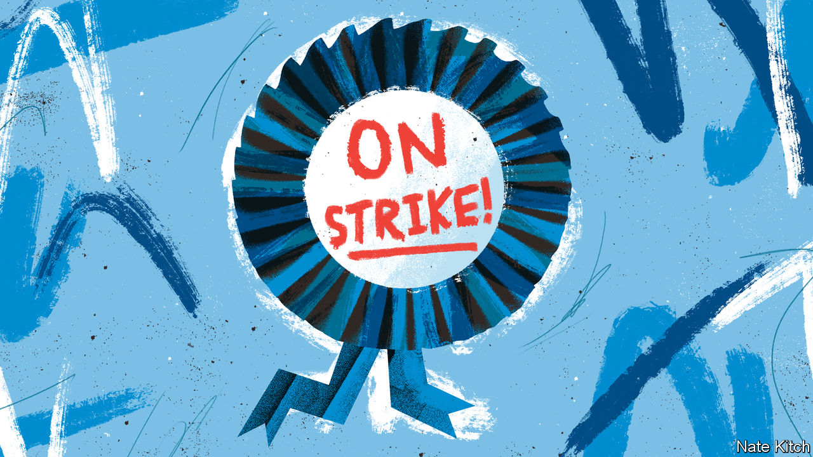

###### Bagehot

# How Britain’s Tories came to resemble the trade unions 

##### The new enemy within 

 

> Mar 13th 2024 

The 50th birthday party of the Centre for Policy Studies (CPS) on March 6th was a swish affair. Rishi Sunak, the prime minister, and scores of Conservative MPs tucked into champagne and pork in the gothic splendour of the London Guildhall. There was much to celebrate. Founded by Margaret Thatcher and Keith Joseph in 1974 to “think the unthinkable” about Britain’s stalling post-war economy, its ideas and policies had powered her administration. The think-tank’s principles remain the government’s lodestars, Mr Sunak declared. “In no small part, we live in the world created by the Centre for Policy Studies.”

But triumphalism was mixed with gloom. It fell to Michael Spencer, chairman of the CPS, to share the bad news. Lately the Thatcherite revolution has not been going so well. Britain has struggled to produce growth that would have been the norm 20 years ago, he said. It is saddled with high debt and high taxes. 

The government is in part a victim of external shocks in the form of covid-19 and the war in Ukraine. But much of the blame lies with Conservative backbenchers, whose approach to governing has come to resemble that of the trade unions whose strikes drove inflation, blackouts and shortages 50 years ago. Back then the CPS gave Thatcher her blueprint for breaking the shop stewards. Now the Tories themselves are the problem. 

Some Tory MPs see themselves less as part of a project of national government, more as delegates sent to negotiate with it. Their job is to extract benefits for their voters and to see off reforms that threaten them. Leaders of Tory factions issue dark threats of industrial action in the form of “vote strikes” or a calendar of sabotage they term the “grid of shit” (a phrase of which Arthur Scargill, a miners’ leader from the 1980s, would have been proud). In the 1970s trade-union leaders ambled up Downing Street to extract bumper pay deals over beer and sandwiches; today backbenchers arrive for breakfast rolls to exert pressure on behalf of their constituents and supporters. 

Those Tory supporters are disproportionately found among the old. That is a problem. Britain’s most pressing challenge, says Robert Colvile, the CPS’s current head, is demography. As the population ages, keeping spending on the over-65s at its current 10% share of gdp would require the economy as a whole to expand by nearly 3% a year. Yet much of the Tory party ducks this looming crunch, much as the unions of the 1970s refused to engage with post-war governments’ trilemma of combining full employment, low inflation and high wage growth. Fifty years ago Joseph wanted to convince Tory MPs to take on the Labour-backing unions. Mr Colvile wants them to reckon with their core vote. 

“Our role in society is to look after our members, not run the country,” shrugged Joe Gormley, a miners’ leader from the 1970s. The same attitude prevails among Tory MPs at budget time. The public finances are fragile: Jeremy Hunt’s promise to reduce Britain’s debt as a share of gdp in five years’ time rests on heroic assumptions about spending restraint. Rather than confront that challenge, each year backbenchers present the Treasury with lists of tax cuts for their favoured groups (inheritors of large estates, pub landlords, motorists, dog-owners and so on) and pleas for “levelling up” cash for their areas. Their rhetoric is Thatcherite; their behaviour is clientelist. To his credit,  on March 6th, Mr Hunt favoured tax cuts that will benefit workers and reward firms that invest. A smart party would have cheered them as proof they were grappling with intergenerational justice. Instead, some Tory MPs moaned that their older voters had been neglected.

Keeping a lid on taxation (due to hit 37.1% of GDP by 2029, the highest share since 1948, according to Britain’s official fiscal watchdog) means tackling productivity. Yet when productivity-enhancing measures threaten the well-being of the core Tory electorate, MPs go on strike. The CPS wants sweeping liberalisation of ; successive governments have caved to Tory backbenchers who have fought like picketing miners to restrict building. Britain’s housing shortage is the Conservative equivalent of the “closed shop”, which shielded unionised workers from pay competition. Insiders, who own homes, benefit from rising asset prices; outsiders pay the price. 

Restraining spending would also mean reinventing the welfare state. Over 14 years in government, several schemes to fund adult social care—among them duties on property, payroll taxes and insurance schemes—have been proposed and then strangled. Like the carworkers’ unions that fought off modernisation, a desire to see off short-term pain has prevailed over the long-run benefits of a reformed social-care system. 

Which side are you on, boys?

In 1974 the unions appeared unstoppable. Yet they were sowing the seeds of their own demise. Many union leaders knew their pay demands were unsustainable but they spurned repeated pleas from sympathetic Tory and Labour governments to reform labour relations. The government became “a gigantic Las Vegas slot machine that had suddenly got stuck in favour of the customer”, said Tom Jackson, a postmen’s leader at the time. As the number of losers from inflation grew, Thatcher could reap the electoral rewards of taking on the “enemy within”. The unions failed to compromise when they had the upper hand, and paid the price.

Therein lies the lesson for Tory trade unionists. Demography and sluggish growth are straining the post-cold-war model of low-ish taxes and a generous welfare state. But when their electorate faces hard choices, Tory backbenchers protect their voters’ short-term interests. In failing to forge new settlements on taxation, public services and Britain’s ability to get things built while they have enjoyed influence, the Tory militants are set to hand the initiative to a future Labour government. They have left it to their opponents to think the unthinkable. ■


