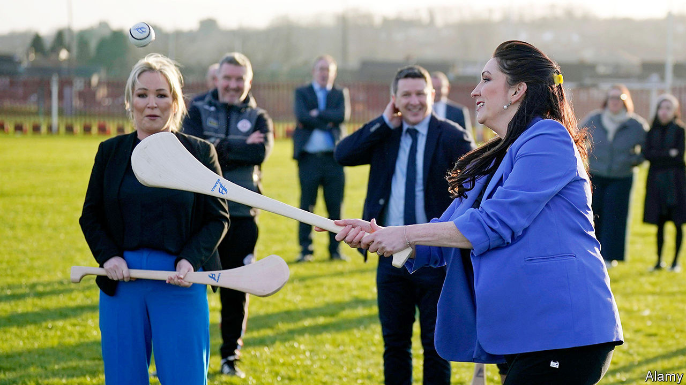

###### Warm words, tough choices

# Northern Ireland’s new government puts on a show of unity 

##### But there is little sign of it taking hard decisions 

 

> Mar 12th 2024 

A surreal atmosphere prevails at Stormont, the hill overlooking Belfast which is home to Northern Ireland’s devolved administration. It is not the return of a power-sharing government that has people scratching their heads; it is how that government’s leaders are behaving. Imagine Joe Biden and Donald Trump suddenly working together in harmony, and you have a sense of the strangeness. 

The government was restored in February, after a two-year hiatus following a walkout by the main unionist (pro-British) party, the Democratic Unionist Party (DUP). The DUP had objected to the customs and regulatory border established in the Irish Sea after Brexit, which ensured that the land border between Northern Ireland and the Republic of Ireland remained open. It  when the sea border was softened.

Devolved government has come and gone before. This time, however, the DUP returned to a very different political landscape. In elections held during the hiatus Sinn Féin, which wants a united Ireland, overtook the DUP for the first time, meaning its leader in Northern Ireland, Michelle O’Neill, is now first minister. 

The DUP has thrown itself enthusiastically into the new arrangements. Emma Little-Pengelly, the deputy first minister (the roles have equal powers, but the title is symbolic) good-naturedly tried hurling, a Gaelic sport, in front of the TV cameras. Paul Givan, the education minister, spoke a few words of Irish at a school which teaches pupils in the language; seven years ago he contributed to a previous collapse of devolution by cutting a trifling amount of funding for an Irish-language bursary. Sinn Féin has been no less magnanimous. Last month Ms O’Neill stood respectfully for a rendition of “God Save The King” at a Northern Ireland football match. 

Warm gestures are welcome but no guarantee of success. When Ian Paisley, a loyalist firebrand, and Martin McGuinness, a former IRA commander, led a devolved administration in 2007, the former foes were known as “the chuckle brothers” for their laughing and joking; less than ten months into office, Paisley was ousted by the party he had founded. Now, as then, the greatest vulnerability to the power-sharing government comes from within the DUP. Many of the party’s most senior figures did not support a return to Stormont. One party member bemoans the DUP’s “glee” at making symbolic compromises. 

Yet the DUP and Sinn Féin also have very good reasons not to topple Stormont again. For the DUP, having no government has been bad for the union. Although a united Ireland is not imminent, more people in Northern Ireland are likely to see it as an alternative if devolution repeatedly fails. For Sinn Féin, an all-island party that has its eyes on the next general election in the republic, which is due to be held by March 2025, the priority is to show that it can be trusted in government. 

Even if both parties have an incentive to work together, the task ahead is hard. The province’s roads are full of potholes; hospital waiting lists are the worst in the country; and teachers’ pay badly lags behind that in England. Lough Neagh, source of over 40% of Northern Ireland’s drinking water, is chronically polluted. 

There is little sign that the Stormont executive, which also has ministers from the Alliance Party and the Ulster Unionist Party, is ready to take hard decisions. The British government offered more than £3bn ($3.8bn) if devolved government was restored, including a £559m debt write-off if the executive raised £113m of its own revenue. Northern Ireland’s leaders, who boast that they have the lowest household taxes in Britain, are planning to raise only about £30m while demanding billions more from London. 

David McCann, an academic at Ulster University, notes that a four-party coalition also means an array of competing priorities. “Monday will see health as a priority and by Wednesday it’s child care and then by Friday it will be school uniforms. The result is instead of doing three things really well, we end up with 12 things that are done in a half-hearted way.”

The executive has produced some positive imagery. But “we’ve seen that movie several times before,” says the leader of the opposition, Matthew O’Toole of the Social Democratic and Labour Party. “If the script doesn’t include a credible plan to rescue public services, then the public will grow quickly and justifiably cynical.” ■


