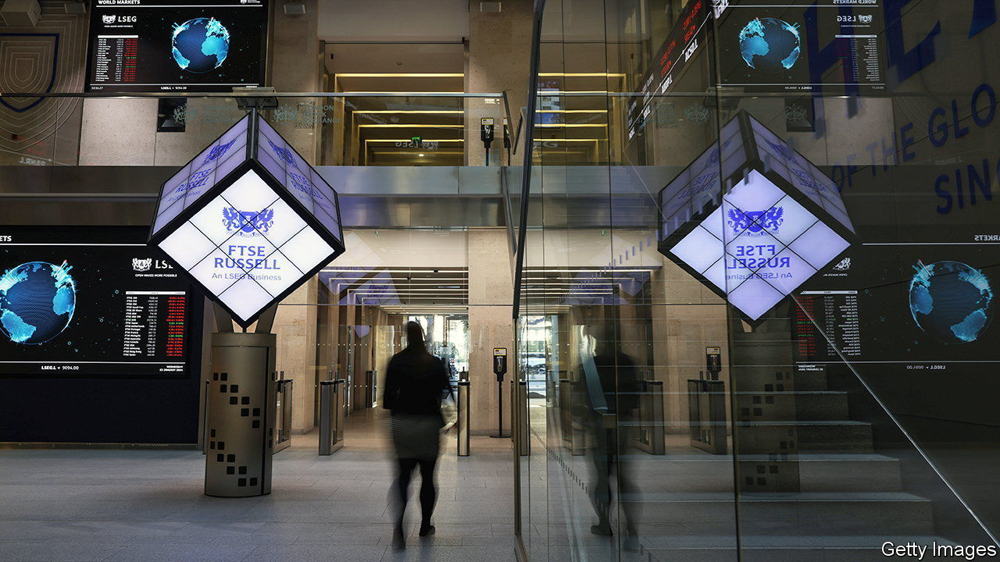
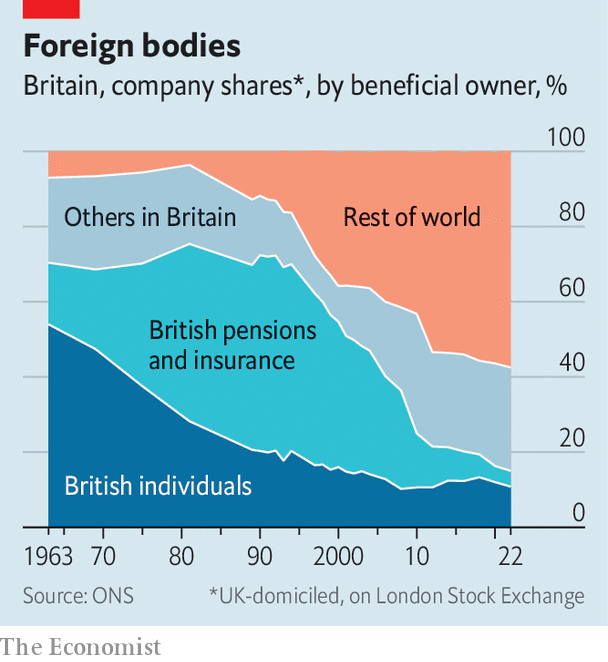
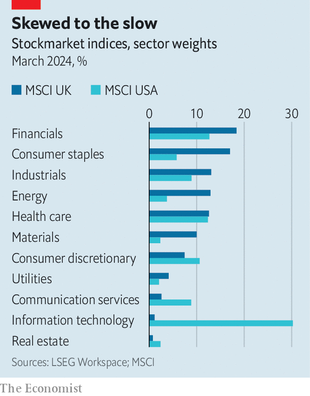
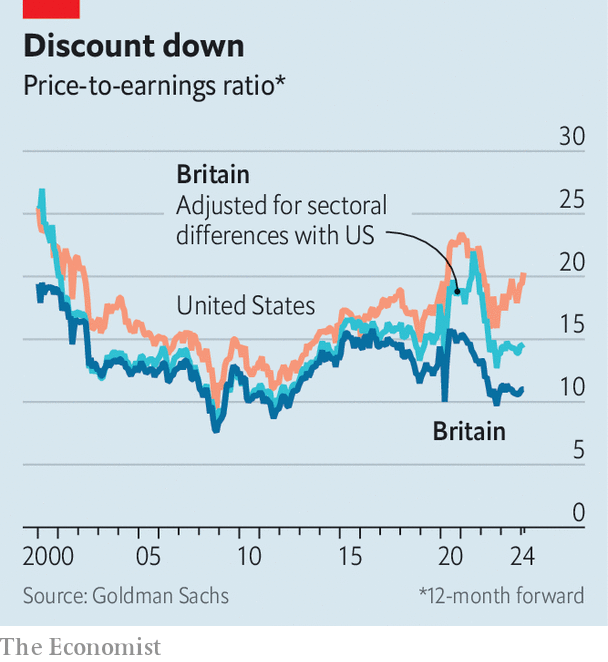

###### Home biased

# The government wants investors to buy British 

##### But protectionism is not the answer to years of underwhelming returns 

 

> Mar 14th 2024 

For British investors, patriotism is costly. Sticking money in domestically listed equities over the past decade has meant total shareholder returns two-thirds lower than investing in a global index that strips out Britain. It should be no great surprise, then, that British investors exhibit less “home bias”, an over-allocation to domestic equities, than most rich-world peers (see chart). A decent financial adviser would call this shrewd. Geographic diversification is core to good investing. Financial theory even suggests that savers should avoid their home market to offset the exposure of living and working there. 

 


But Jeremy Hunt, the chancellor of the exchequer, sees this as a problem. He wants to “encourage more people to invest in UK assets”. In his  he announced plans for a “British ISA”, an additional £5,000 ($6,390) tax-free annual allowance to invest in local shares, as well as flagging up name-and-shame rules to force some pension funds to disclose how much they invest in British-listed firms. 

Cajoling domestic investors to buy British is not the remedy for underperforming markets, however. British households invest only 11% of their financial assets in stocks, compared with 23% in France and 36% in America. Such habits won’t change without sustained strong returns, and insufficient capital is not to blame for those. 

 


The need for domestic capital is least pronounced for the public firms listed in benchmarks like the FTSE 100 or FTSE 250. These indices have disappointed in recent years, but their weakness partly reflects industry mix: only 1% of large-cap British equities are in technology compared with 30% in America (see chart). Goldman Sachs, a bank, reckons that differences in sectoral composition explain half of the valuation gap between British and American stockmarkets. The remaining gap stems mostly from the firms themselves, which tend to be older and slower-growing. Over the past decade earnings per share for British-listed firms have grown half as quickly as for those in America (see chart). 

 


Financial-market reforms would be more helpful than capital protectionism. Some progress has been made: changing listing rules to allow companies to launch IPOs with fewer shares floating (10%, not 25%) makes Britain a more attractive place to list. Abolishing stamp duty on shares, a 0.5% transaction tax, would help, too. Research by the Centre for Policy Studies, a think-tank, suggests that the tax depresses share prices by 4%. 

The situation in private markets is somewhat different. Although there is plenty of money in Britain for early-stage venture capital and mature investments like infrastructure,  Most of it comes from abroad; highly fragmented British pension funds generally lack the scale or sophistication to invest in unlisted assets. Plans to consolidate local-government pension schemes are a good start.

But it is worth keeping some perspective. Britain’s capital markets are highly internationalised, both for private and public assets. Any companies that are being shunned by sophisticated global investors are unlikely to offer British investors spectacular returns. Holding more unlisted equities would not make a vast difference to investors’ portfolios. Much of the difference in returns between public and private assets reflects different accounting: the former are marked to market each day, the latter are not. For British businesses, the most persistent barriers to growth and investment are issues like planning. 

Markets may soon look up in any case. Historical underperformance means stronger expected future returns for British-listed firms. AQR, a fund manager, projects 4.7% annual medium-term real returns for British equities compared with 3.8% for large listed firms in America and 4% for developed markets broadly. One sign that British firms may be discounted too heavily is interest from private-equity investors. The prospect of a more stable post-election environment adds to the case for optimism. But savers and pension funds must choose for themselves. The government should not decide for them. ■


