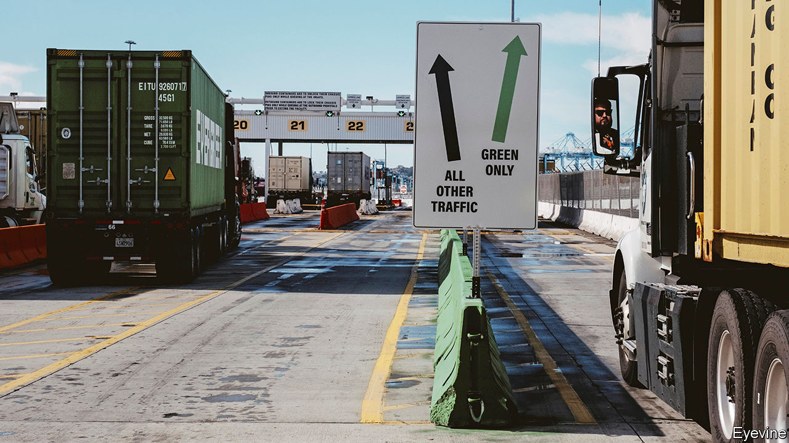

###### A freighted question

# Can lorries go green faster? 

##### The long road to zero-emission commercial vehicles 

 

> Mar 12th 2024 

YOU MAY think that if you splashed out $100,000 for a vehicle you would take delivery of something flash—a Porsche, say. In fact, many such buyers care less about the badge on the bonnet and more about how much load the thing can carry. For this is also the price of a large lorry. 

Commercial vehicles such as lorries and vans keep supply chains humming and deliveries moving. They also make lots of money for their makers. In 2023 vans accounted for a third of the €190bn ($207bn) in sales at Stellantis (whose largest shareholder, Exor, part-owns ’s parent company). Daimler Truck, the world’s biggest manufacturer of medium-sized and large lorries, earned revenues of €56bn last year. Ford Pro, the American car giant’s commercial arm, made a net profit of $7.2bn on sales of 1.4m units, compared with $7.5bn at Ford Blue, its car division, which sold twice as many vehicles. Lorries made by Volvo and Daimler rake in margins typical of an upmarket carmaker. 

Given both the already high upfront cost and the attention buyers pay to operating expenses, you might expect commercial vehicles to go electric fast—not least because they are also disproportionately heavy emitters (lorries and buses spew over a quarter of the carbon on EU roads). Business buyers value this total cost of ownership more than individual motorists, who may pay a premium to salve their climate conscience. Alas, for many businesses the calculation continues to favour petrol and diesel. Can that change?

Even in , which in 2023 accounted for 85% of global sales of heavy-duty e-lorries (the largest sort), just one in 25 such vehicles was green, compared with one in three new passenger cars. In Europe the figure is one in 70, and one in seven for passenger cars. When an eu ban on sale of cars with internal combustion engines comes into force in 2035 only three-quarters of lorries may be electric, according to bcg, a consultancy. idTechEx, another consultancy, forecasts that zero-emission lorries will make up 13% of sales in America by 2030, far short of President Joe Biden’s goal for 50% of car sales.

In the next six years electrification is likeliest for smaller vehicles operating over shorter routes, such as last-mile delivery services, thinks Alexander Krug of Arthur D. Little, one more consulting firm. The economics of small e-vans look compelling. Batteries can be smaller and vehicles can be recharged overnight at depots. Electric vans that travel relatively short distances in a day but cover lots of miles in a year could have a 10% cost advantage over conventional ones, calculate consultants at McKinsey. Uwe Hochgeschurtz of Stellantis notes that going electric can also insure against ever tougher emissions rules in cities. Lars Stenqvist, Volvo’s technology chief, sees no reason why cities in Europe should not run electric bin lorries. 

Even if they are not yet cheaper, going electric allows delivery firms such as FedEx and DHL to help merchants they serve meet carbon-cutting pledges which many shoppers demand. FedEx has set a target for half its parcel-delivery vehicles to be electric by 2025. dhl wants the same for 60% of its last-mile vehicles by 2030. Amazon has 10,000 electric vans on American roads and hopes to have 100,000 by 2030.

The economics are a heavier lift for heavy-duty vehicles. Optimists note that plenty of routes are well within current e-lorries’ range. America’s Department of Transportation reckons that last year the distance travelled by three-quarters of all goods ferried by road in the country was less than 250 miles (400km). Volvo calculates that 45% of goods in Europe travel less than 300km. Marco Liccardo, head of technology at Iveco, an Italian lorrymaker (also part-owned by Exor), expects electric lorries to reach total-cost parity with conventional lorries in 200km runs between logistics hubs in a couple of years. 

Regulators are trying to speed things along. In America they have proposed requiring that half of sales of new buses and a quarter of new heavy-duty lorries be all-electric by 2032. Buyers of such clean vehicles can also count on tax credits. The eu is requiring cuts of 15% to the average emissions of carmakers’ fleets by 2025 from their level in 2019, and of 43% by 2030.

So far this is having little effect. Only a few electric models are on sale. The large and bulky batteries they require drive up the purchase cost. Electric trucks set businesses back between two and three times as much as a diesel one does, and have limited range. The largest trucks, of which 2m or so were sold worldwide in 2023, are the hardest to wean off internal combustion. Volvo shifted 6,000 electric ones last year, just 2% of its total sales. 

Even if the cost disadvantage can be overcome, that leaves the problem of infrastructure. Van fleets can recharge overnight at depots and lorries on shorter routes can be charged at either end, while they are loaded or unloaded. However, longer routes will require public charging stations. And dedicated fast chargers for lorries need far more power than for cars, plus lots of parking space. The fastest chargers that top up cars in a few minutes would take around 90 minutes for a lorry. 

A few “megawatt chargers”, which are ten times faster, are in operation in Germany and the Netherlands. But a Europe-wide charging network requires investments of up to €36bn, estimates PwC, a consultancy. One to refuel lorries with hydrogen—a zero-emissions alternative to batteries—would not be cheap either. Cash-strapped governments are unlikely to want to foot the bill. On March 12th the Biden administration unveiled a strategy to build public charging for lorries. But even if the plan works, it will not happen overnight.

Watch out for speed bumps

Vehicle makers themselves are another problem. Moving swiftly to an all-electric world would “write off seven or eight years of profit”, says Robert Falck, boss of Einride, a Swedish commercial-vehicle startup. Whereas legacy carmakers were forced into electrification first by Tesla and then by cheap but decent Chinese models, the lorry business has faced less disruption. Tesla unveiled the Semi, its electric lorry, in 2017 but started shipping it only in late 2022 and has a fleet of around 100 on the road. Its plans to produce 50,000 a year by the end of 2024 look wildly optimistic. Nikola, which launched to great fanfare in 2014 and in 2019 struck a joint venture with Iveco to develop zero-emission lorries, has struggled. Its founder was jailed in 2023 for misleading investors. Its market value has crashed from $29bn in 2020 to around $900m. Last year its joint venture with Iveco was disbanded and it sold just 35 hydrogen-fuel-cell vehicles. It has paused production of its battery lorries. 

Startups eyeing last-mile delivery vans have had similarly mixed fortunes. Ramping up production and raising capital is proving tough. Lordstown, an American firm, and Volta Trucks of Sweden have gone bust. Arrival, a British one, is teetering on the brink, despite an order of 10,000 vans from ups, a rival of FedEx and DHL. Rivian, which in 2019 signed a deal to sell 100,000 vans to Amazon, and Canoo, which counts Walmart among its customers, are struggling to make vehicles at scale and are burning cash. Other manufacturers, such as REE and Tevva, which make battery-powered vans and lorries in Britain, or Harbinger and Workhorse, which make medium-sized trucks in America, are hopeful but have even further to go. 

The threat to legacy lorrymakers from China is also far less acute than in the market for passenger cars. As with electric cars, China has stolen a march on everyone else in commercial EVs, thanks to its world-beating battery industry (and strong government incentives). Maxus, a British brand acquired by saic, a Chinese carmaker, is selling vans across Europe; one model was Britain’s best-selling electric van in December. byd, China’s biggest electric-car company, has exported a handful of large battery-powered lorries to America. 

But China’s lorrymakers will find life harder in foreign markets even than its carmakers, which are viewed with suspicion by many Western governments. One car executive calls Europe’s strict regulations for lorries “the equivalent of tariffs”, adding that this makes Chinese commercial EVs uncompetitive on the continent.

Mr Falck hopes to shake up the market with a new business model, which he calls “Uber for freight”. Volvo and Iveco are trying to increase the appeal of their electric lorries with a financing deal that sidesteps high upfront costs in favour of customers paying by use. Einride goes a step further, owning its own fleet of vehicles (built by partners and financed by investors) and providing the lugging of goods as a service. The company already operates fleets for Maersk, a shipping giant, ab InBev, a brewer, and Lidl, a supermarket chain. That is an interesting path to electric freight. But it, too, looks long and winding. ■


