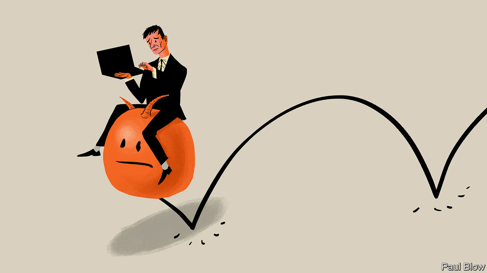

###### Bartleby

# Every location has got worse for getting actual work done 

##### Working from nowhere 

 

> Mar 14th 2024 

Work would be so much better if you could get work done. It has always been hard to focus amid the staccato rhythms of meetings, the relentless accumulation of messages or the simple distraction of colleagues thundering past. But since the covid-19 pandemic, every single place of work has become less conducive to concentration.

Start with the home office. The promise of hybrid working is that you can now choose your location depending on the task at hand. If you need to focus on work, you can now skip the commute, stay home and get your head down. This tactic would have worked well in 2019, when no one else was ever at home. Now there are likely to be other people there, too, grabbing the best spot for the Wi-Fi, merrily eating your lunch and talking loudly to a bunch of colleagues in their own workplaces. Home has become a co-working space but without any of the common courtesies. 

Even if none of your family or flatmates is at home, they now know you might be. That spells disaster. Parcels are delivered with monotonous regularity; large chunks of the day are spent being photographed on your own doorstep holding intriguing packages that are not for you. Children who want food or money know where to track you down. 

Worst of all, jobs that once required a day off can now be done at no personal cost by booking them in for days when someone else is at home. “Are you going in today?” might sound like an innocuous question. It should put you on high alert. It means that a bunch of people with drills will storm the house just as you settle down to the laptop.

One natural response is to head to the place you were trying to avoid—the office. But its role has changed since the pandemic. It was never a great place for concentrating (the periods of lockdown were glorious exceptions). But it has become even less suitable now that the office is seen as the place where collaboration and culture-building happen. 

Before you might have been able to sit in a cubicle, fenced off from other people; now openness is in vogue, which means fewer partitions and greater visibility. Before you might have had a normal chair and a desk; now you will be asked to wobble awkwardly on a tall stool at a champagne bar. Before you were interrupted; now you are being given an opportunity to interact. There is much more emphasis on meetings, brainstorming, drinking, eating, bouncing around on space-hoppers or whatever appalling activity builds team spirit. There is much less emphasis on single-minded attention. 

Home is heaving, the office is off-putting. What about other places, like co-working spaces and coffee shops? These too have got worse since the pandemic, for two reasons. First, there is more competition for spaces. Everyone else who is finding it hard to concentrate has had exactly the same idea of heading to a third location. 

Second, online meetings have made it acceptable to reach everyone everywhere. It used to be said that you are never more than six feet away from a rat; now the same is true of a Zoom call. Wherever you are—homes, offices, cafés, libraries, monasteries—someone is within earshot, yapping away about something that manages to be both tedious and impossible to ignore: the plight of local papers in Maine, the risk calculations behind Solvency 2 or why Denise is so impossible to work with. 

There are ways around the concentration problem. One is to become richer: everything is so much easier if you have another wing of the house, or indeed another house. Another is deliberately to swim against the hybrid tide: if Monday is the day when most people work from home in order to focus, the office is going to be a better place to work that day. The most common and least healthy answer is to defer focused work until the evenings and weekends. 

This is not a lament for the pre-pandemic world. Just because each location has got worse as a place to do focused work does not mean that things have got worse overall. Hybrid work allows people to pick the most appropriate locations for specific tasks. The option of occasionally staying at home, even if home is noisier than it was before 2020, is still better for many workers and employers than the pre-covid norm of coming into the office every day. But wherever you are, other people are more likely to be there or to have a greater expectation of interacting with you. The ability to concentrate is sold as a benefit of flexibility. It can be the price you pay for it.■


