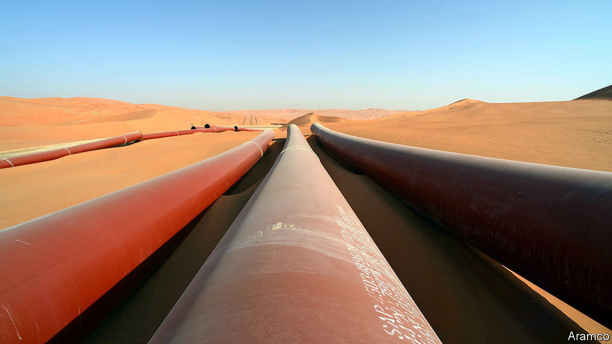
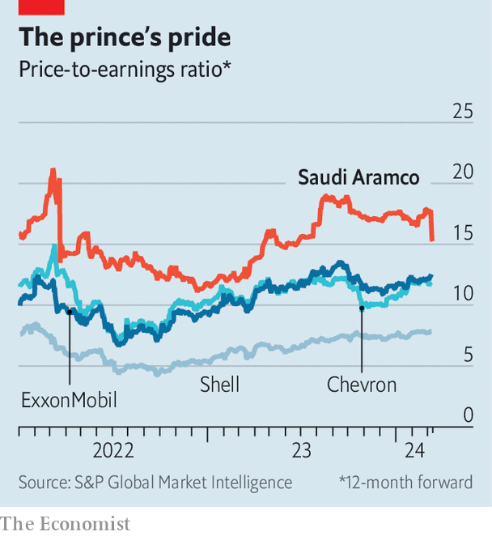
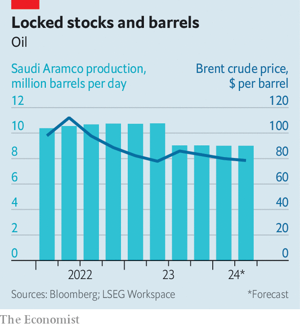

###### Not beyond petroleum

# Is Saudi Aramco cooling on crude oil? 

##### Don’t bet on it 

 

> Mar 11th 2024 

HAS SAUDI ARABIA stopped believing in a future for petroleum? In recent weeks the question has hung over Saudi Aramco. The desert kingdom’s  has a central position in the world’s oil markets. Its market value of $2trn, five times that of the second-biggest oil firm, ExxonMobil, is predicated on bountiful reserves of crude and a peerless ability to tap them cheaply and, as oil goes, cleanly. So the Saudi energy ministry stunned many industry-watchers in January by suspending the firm’s plans to expand oil-production capacity from 12m to 13m barrels per day (b/d). Did the kingpin of crude finally accept that  would soon peak?

 


For an anwser, all eyes turned to Aramco’s results for 2023, reported on March 10th. No one expected a repeat of the year before, when high oil prices and surging demand propelled its annual net profit to $161bn, the highest ever for a listed firm. But analysts and investors were still interested in the extent of the decline in revenue and profit, in any changes to capital-spending plans and, possibly, in the unveiling of an all-new strategy. 

Profits did fall, to $121bn, though that was still the second-best tally in Aramco’s history. Thanks to a recently introduced special dividend, the firm paid nearly $100bn to shareholders last year, 30% more than amid the bonanza of 2022, and promised to hand over even more in 2024.

Shovelling a larger chunk of a smaller haul to owners could, on its own, imply that Aramco is indeed less gung-ho about its oily future. Except that the rich dividend was accompanied by two developments that point in the opposite direction. First, Aramco is rumoured to be preparing a secondary share offering that could raise perhaps $20bn in the coming months—a move typically associated with expansion rather than contraction. Second, more tangibly, it is ramping up capital spending. Investments rose from less than $40bn in 2022 to some $50bn last year. In a call with analysts on March 11th Aramco confirmed that suspending the planned capacity expansion will save around $40bn in capital spending between now and 2028. But, it added, this does not mean it is not investing. On the contrary, the aim is to spend between $48bn and $58bn in 2025, and maybe more in the few years after that. 

 


A bit of that money will go to clean projects such as hydrogen, carbon capture and renewables. Some will go to cleanish ones, such as expanding Aramco’s natural-gas production by over 60% from its level of 2021 by 2030, and backing liquefied-natural-gas ventures abroad. But most is aimed at ensuring that Aramco can maintain its ability to pump up to 12m b/d of crude. Given its actual output of around 9m b/d (see chart), this does not hobble its ability to move markets. If anything, it strengthens Aramco’s position, for it implies spare capacity of 3m b/d—above the firm’s historic average of 2m-2.5m b/d, according to Wood Mackenzie, a consultancy. Aramco is, in other words, committed both to pumping oil and to preserving Saudi Arabia’s role as the market’s swing producer. 

That is in part because it is also committed to pumping money into the economic vision for Saudi Arabia championed by Muhammad bin Salman, the kingdom’s crown prince and de facto ruler. This became more evident on March 7th, when Aramco announced the transfer of 8% of its shares, worth $164bn, out of the hands of the government and into the Public Investment Fund (PIF), a vehicle for Saudi sovereign wealth which Prince Muhammad has tasked with. This leaves the PIF with 16% of Aramco, compared with the 2% or so that is owned by minority shareholders (the rest remains directly in the government’s hands). 

Saudi Arabia’s plans to suspend the expansion of production capacity do not, then, reflect a U-turn away from hydrocarbons. Rather, the pause is born of a hard-headed assessment of market realities: a surge in oil production in the Americas, soft demand in China and cuts to output from the OPEC cartel (of which Saudi Arabia is a member). As Amin Nasser, Aramco’s chief executive, summed it up in the results presentation, “Oil and gas will be a key part of the global energy mix for many decades to come, alongside new energy solutions.” And so will Aramco. ■


