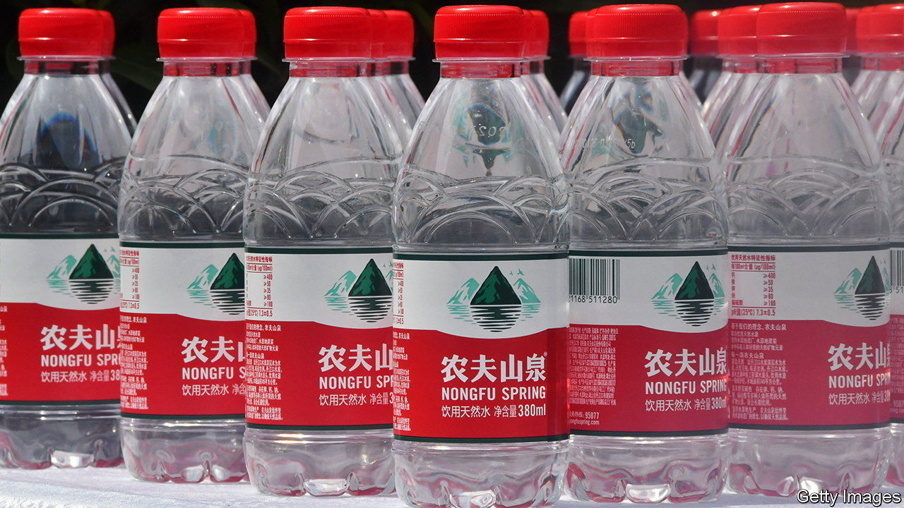

###### Domestic strife

# Why are Chinese nationalists turning on Chinese brands? 

##### Even Huawei isn’t patriotic enough, apparently 

 

> Mar 14th 2024 

EXCITABLE CHINESE netizens have long inveighed against foreign brands’ perceived insults of Chinese culture. Nike, an American shoemaker, was once attacked for depicting a man beating a dragon in a game of basketball. Marriott, an American hotel chain, was hit with an online campaign after it listed Taiwan and Tibet as countries. Dolce &amp; Gabbana, an Italian fashion label, got an earful in 2018 over an ad that showed a Chinese model clumsily eating Italian food with chopsticks.

Now China’s online nationalists are taking aim at a new target. In the past two weeks they have besieged Nongfu, a bottler of spring water whose founder, Zhong Shanshan, is China’s richest man. Its sin? Typography. The Chinese character for tea used on Nongfu’s new beverage includes four brushstrokes resembling plus signs. To the online nationalists, the stylisation resembles the Yasukuni shrine in Tokyo, where Japanese generals who committed war crimes in China are commemorated.

It takes a wild imagination to spot the likeness. But Nongfu’s critics are, it seems, a wildly imaginative bunch. They have unearthed other pro-Japanese symbolism. A mountain on its water bottles, one of China’s most recognisable logos, is Mount Fuji, supposedly. Set against a white backdrop, Nongfu’s red plastic bottle cap becomes, unmistakably, the Japanese flag. What is more, the name of Mr Zhong’s son, Zhong Shuzi, sure sounds Japanese (in a worse betrayal, he is an American citizen).

A few local brands have been accused of mimicking Japanese style in the past. Miniso, a homeware retailer, was pilloried in 2022 for selling figurines in Chinese garb and labelling them as geishas. But the latest furore looks both more severe and broader. The Nongfu imaginings are already doing real damage. Daily sales of the spring water fell by more than 30% over the past fortnight. A few 7-Eleven convenience stores have vowed to stop carrying the products. The company’s market value is down by about 5% since the drama began, costing shareholders some $4bn.

And Nongfu is not the only firm in the nationalists’ sights. Li-Ning, a Nike rival known for tracksuits with “China” emblazoned in Chinese characters on the back, has drawn criticism over the supposed likeness between a new line of jackets and Japanese military uniforms from the second world war. One netizen wrote on Chinese social media that if he were caught wearing one, his grandfather would shoot him dead. Even Huawei, a technology giant that in the West is synonymous with Chinese patriotism and pride, has come under fire. Its transgression was to call its new homegrown semiconductors Kirin in English. The word is a Japanification of Qilin, the chips’ Chinese name, which refers to a mythical beast. 

 State media have told the self-appointed culture police to calm down. One prominent nationalist, Hu Xijin, has called for an end to the madness. That only infuriated many of his erstwhile supporters, who turned on him instead and now call him a “traitorous running dog” on social sites. As Mr Hu is finding out the hard way, nationalism, both online and in the real world, is easier to whip up than it is to contain. ■


