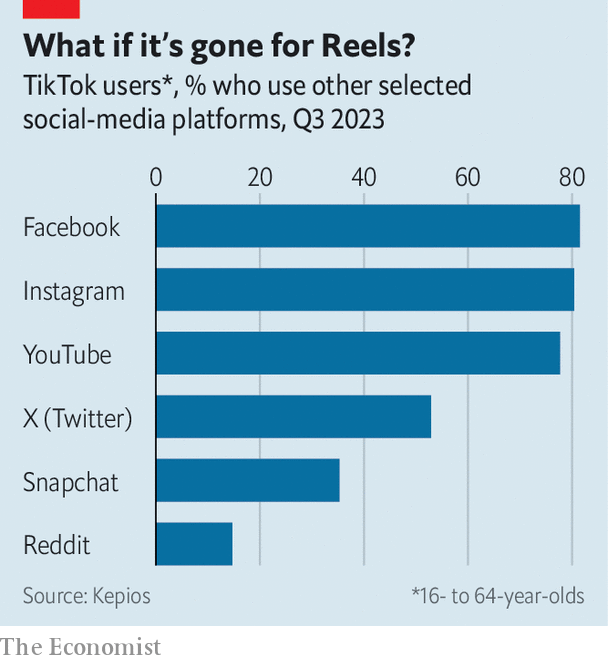

###### Tick, tock

# Will TikTok still exist in America? 

##### As Congress starts the clock on a ban, the app must consider its options 

 

> Mar 13th 2024 

LISTEN CLOSELY and you can hear the influencers wail. On March 13th America’s House of Representatives passed a bill barring app stores and internet providers from distributing “foreign-adversary-controlled applications”. The target is clear: TikTok, a hit short-video app to which 170m Americans are glued for an average of 56 minutes a day.

TikTok’s position in America . Although the firm is based in Los Angeles and Singapore, it is a subsidiary of ByteDance, a Chinese tech darling. That has fed bipartisan fears that the Chinese government could use it to spy on American citizens or shape public opinion. TikTok has denied that the Chinese government wields any influence over it, and has sought to assuage concerns by enlisting Oracle, an American software giant, to fence off the data of American users into local servers and inspect its source code. It points out that American investors, such as Carlyle and General Atlantic, are among ByteDance’s biggest shareholders. 

If it becomes law, the bill would compel ByteDance either to sell TikTok’s American operations within six months or to shut them down. Pressure for such a move has been building since TikTok’s boss, Shou Zi Chew, was hauled before Congress last March. The firm was nevertheless caught off guard by the speed with which America’s typically sleepy lawmakers have acted. 

The proposal gained momentum partly as a consequence of disquiet over the app’s handling of misinformation and antisemitic content following Hamas’s attack on Israel in October. TikTok’s efforts to stall the bill failed spectacularly. On March 6th it sent a notification encouraging users to lobby Congress against the legislation. That seems to have backfired: some undecided lawmakers were persuaded that TikTok does indeed hold sway over voters. In the event 352 of them backed the bill; only 65 were opposed.

But before President Joe Biden can sign the bill into law, which he says he will do, it must first pass the Senate. Given its bipartisan popularity you might think this was a formality. Not so. Donald Trump, who as president almost forced TikTok into a sale in 2020, has changed his tune. On March 8th he complained that banning TikTok would benefit Meta, the social-media colossus which owns Facebook and Instagram—and which, unforgivably, exiled Mr Trump from its platforms after his supporters stormed Congress in January 2021. The motivation for his intervention may not be entirely public-spirited. A week earlier Mr Trump met Jeff Yass, a hedge-fund billionaire and prospective donor whose investment firm, Susquehanna, happens to own a stake in ByteDance.

Republicans in the Senate may follow Mr Trump’s cue—he has, after all, just sealed their party’s nomination for the presidential election this November. Lindsey Graham, who is both vociferous in his criticisms of TikTok and sycophantic in his adulation for Mr Trump, said on March 10th that he was unsure how he would vote. 

If the bill does become law it is likely to face a challenge in the courts, probably on free-speech grounds. Still, there is a reasonable chance that TikTok would have to shut up shop in America. A year ago the Chinese government said it would oppose a sale. Hours before the House vote it denounced America for “resorting to hegemonic moves when one could not succeed in fair competition”. ByteDance, which reportedly generated $110bn of revenue last year, is believed to make around four-fifths of that in China, where it operates TikTok’s sister app, Douyin, and Toutiao, a news aggregator. Although its investors would lobby to allow a sale, China’s government could prove intransigent, dooming the American business. It could also feel the need to retaliate against American firms operating on the mainland. 

 


Were advertisers forced to shift their spending from TikTok, America’s homegrown social-media companies would be in for a windfall. Not all will benefit equally. According to Kepios, a research firm, 82% of global TikTokers use Facebook, 80% scroll Instagram and 78% watch YouTube, which is owned by Google’s corporate parent, Alphabet (see chart). Only 53% use X, the debating forum formerly known as Twitter, and a mere 35% are on Snapchat, a messaging app. If Americans redirect the roughly 3trn minutes of attention they lavished on TikTok last year to other apps already on their phones, Meta and Alphabet, the dominant duo in online advertising, will be the winners.

His grudge against Meta notwithstanding, Mr Trump may have a point when he grumbles that the firm will be the biggest beneficiary. Reels, a TikTok-like offering embedded into Instagram, has gained more traction than similar ones from YouTube and Snapchat. Many TikTok influencers already repost their content on Meta’s app. After India banned TikTok (and dozens of other Chinese apps) in 2020 following a skirmish on its border with China, Instagram surged in the country. In 2019 it was the sixth-most downloaded app in India. By 2021 it was top of the charts.

Meta will not be so lucky if ByteDance’s investors succeed in persuading China’s government to allow a divestiture. The American firm would doubtless be barred from snapping up TikTok on antitrust grounds, as would Alphabet. The list of other potential suitors is limited by TikTok’s price tag, which could run to 12 figures if ByteDance, fearing knock-on crackdowns elsewhere, throws in TikTok’s operations in other countries. 

Amazon, America’s e-commerce champion, may take a look, given TikTok’s growing focus on incorporating shopping into its app (though it, too, would face pushback from trustbusters). Apple and Netflix, which both passed when TikTok was sounding out a sale in 2020, could reconsider, given slowing growth in iPhone sales and streaming subscriptions, respectively. Back then Oracle teamed up with Walmart, a retail behemoth, to buy minority stakes in TikTok. But that deal fell through after Mr Trump left office. After its $28bn acquisition in 2022 of Cerner, a health-records business, Oracle is probably now too indebted to mount a bid. 

Microsoft, another American tech titan, could weigh in. Its own bid four years ago to acquire TikTok’s business in America, Australia, Canada and New Zealand ended after ByteDance balked at giving it full control of the app’s data and source code. But the company has long coveted a greater presence in consumers’ lives, which may bring it back to TikTok—if ByteDance were to loosen its terms. Other mashups have also been suggested. Bobby Kotick, former boss of Activision Blizzard, a video-game studio which Microsoft acquired last year, has reportedly pitched the idea of a bid for TikTok to various partners, including Sam Altman of OpenAI, maker of ChatGPT. 

However, as the artificial-intelligence race heats up, it seems doubtful that China would want to hand TikTok’s data or clever algorithm to any American interests. An alternative would be to sell off TikTok as a standalone business rather than merge it with an existing one. This would dodge antitrust concerns. But the deal’s size could again be a problem. The largest amount ever raised in an initial public offering was for a $26bn stake in Saudi Aramco, a state oil leviathan, in 2019. The largest leveraged buy-out in history was that of TXU, a utility, for $45bn in 2007. The value of TikTok would exceed even that, though it helps that ByteDance’s American investors could swap their stakes for a slice of the new company.

Assuming it can be untangled from Bytedance, an independent TikTok would need to hire plenty of techies to replace the ones in Beijing. Still, a separation could pay off. Mark Shmulik of Bernstein, a broker, reckons that the firm became less aggressive in expanding its business than it could have been, as it sought to keep a low profile. It could do more to link its servers with those of advertisers—the better to track the efficacy of their spending, as Meta has done—and to speed up the roll-out of TikTok Shop, its e-commerce platform. In less than a decade a Chinese-linked TikTok has managed to upend the social-media business in America and beyond. An untethered one would keep being disruptive—if it is allowed to exist. ■


