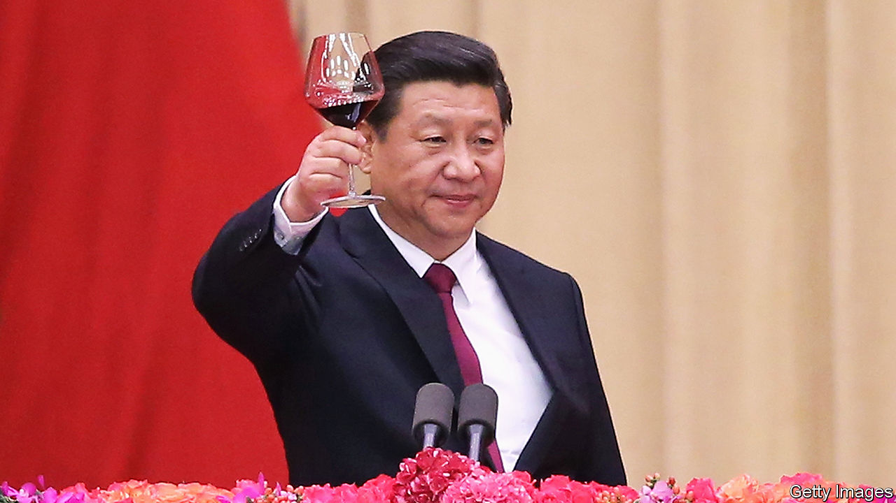

###### Vino vinci

# A toast to the possible end of Chinese tariffs on Australian wine 

##### Officials in Beijing appear to be done fermenting trouble 

 

> Mar 14th 2024 

SO MUCH WINE has gurgled up in Australia in recent years that analysts have been measuring the surplus in terms of Olympic-size swimming pools. The last reading suggests the plonk would fill hundreds. Some 4,000km away, in Hong Kong, something similar is now happening. Cases of Australian wine are sitting in the city’s warehouses, much more than Hong Kongers can imbibe (safely). Grudge-holding officials in Beijing are fermenting this trouble—but perhaps not for much longer. 

China’s case of sour grapes dates to 2020, when Australia’s government called for an international probe into the origins of covid-19. Tensions between the countries had already been rising. For China, this was a tipple point. It placed trade restrictions on Australian products such as barley and beef. Later Australian wine was hit with tariffs that now range from 116% to 218%. China did not link the measures to the diplomatic spat, but they were widely seen as retaliation.

Until then, China’s thirst for Australian wine had seemed unquenchable. Business took off after the two countries signed a free-trade agreement in 2015. In 2019 China drank up 40% of Australia’s wine exports. Used to , a strong liquor, Chinese boozers like the bold flavours and high alcohol content of Australian wine, say some observers. Others point to the quality. But price may be the biggest factor. In 2020 Chinese winemakers complained that low-price Australian wine was hurting them.

The new tariffs caused the trade to “vanish overnight”, says Eddie McDougall, an Australian wine producer. Sales of Australian wine to China were 99% lower last year compared with 2019. Many of the bottles originally destined for China are gathering dust.

At last China looks set to uncork the flow, as part of an effort to de-escalate its punitive trade war against Australia. The election of a new Australian government, led by Anthony Albanese, in 2022 gave China cover to back down. Tariffs on other goods were lifted last year. In a sign of improved relations, Mr Albanese met Xi Jinping, China’s leader (pictured), in Beijing in November.

China is expected to wrap up a review of the wine tariffs this month. Australian producers are optimistic, which explains the glut in Hong Kong. They are storing wine there so that it can swiftly enter the mainland if the tariffs go. Hopefully the saga won’t have a long finish.■


