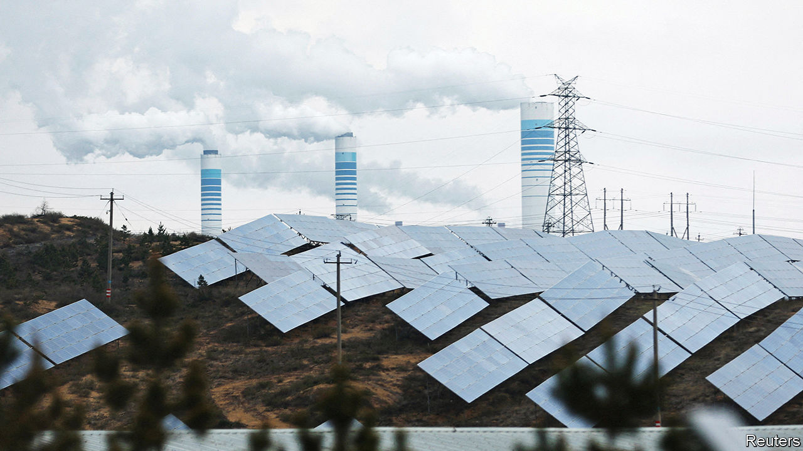
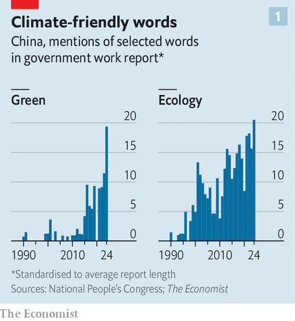
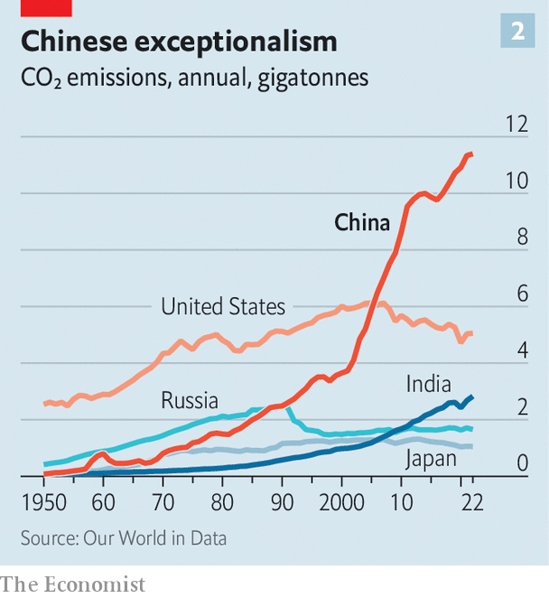
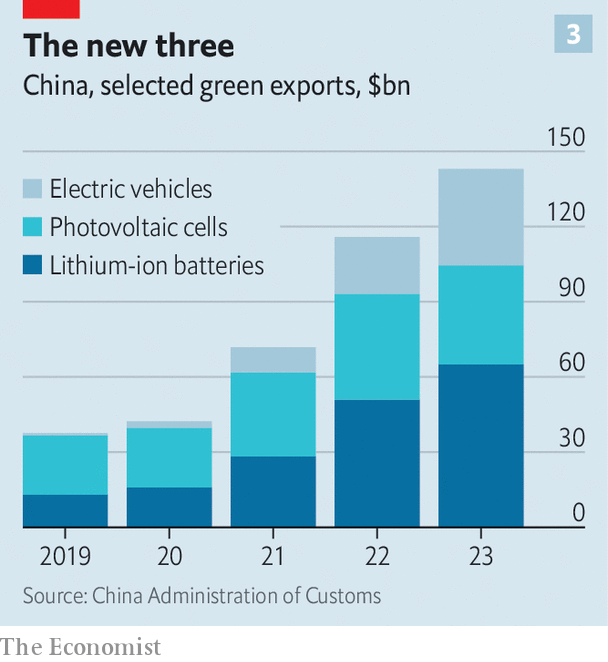

###### Blowing hot and cold

# Is China a climate saint or villain? 

##### It is supercharging the green transition—while burning mountains of coal 

 

> Mar 12th 2024 

AMONG THE words mentioned most often by Li Qiang in his “work report”—a sort of state-of-the-nation address—on March 5th was “green”. His predecessor as prime minister used it nine times in last year’s speech; Mr Li nearly doubled that (see chart 1). This is hardly surprising. China is a green-technology powerhouse: its batteries, solar panels and electric vehicles (EVs) lead the world. Chinese officials want such industries to spur future economic growth and China’s own pursuit of energy self-sufficiency.

 


Yet for all the talk of “harmony between humanity and nature”, as Mr Li put it, China emits more than a quarter of the world’s greenhouse gases each year (see chart 2). Over the past three decades it has released more carbon dioxide into the atmosphere, in total, than any other country. That all adds up to a big question: is China a villain or a saint when it comes to climate change?

The case for villainy is straightforward. Already the world’s leading polluter, China’s emissions rose by about 5% last year. About half come from the power sector, which is dominated by coal-fired plants. Another third or so belch out of factories, particularly steel foundries (last year China produced 1bn tonnes of the metal, over half the world’s total). Cars and lorries are the other big contributor, spewing nearly a tenth of China’s emissions. To keep its vehicles running, China consumes more oil than any country bar America.

 


Defensive Chinese officials note that Western countries, which started industrialising long before China did, are responsible for the bulk of emissions over the past century. Today these countries outsource much of their manufacturing—and, therefore, emissions—to China. Yet, the defence continues, China’s emissions per person are still only two-thirds of the level in America (which has less than a quarter of China’s population). This is all fair enough, but none of it changes the fact that for the world to meet its climate goals, China will have to drastically reduce its emissions.

It has ambitions to do so. China has installed more renewable power than any other country. Government subsidies encourage the manufacture and purchase of green products, such as EVs. These policies have coincided with other big changes. After decades of building roads and railways—and producing masses of carbon-intensive steel and cement—China is moving into a less dirty phase of development. As a result, China’s emissions are expected to peak in the next few years and certainly by 2030, which is the goal China has committed itself to in climate negotiations. 

But experts are worried about what happens next. There is a risk that China’s emissions plateau, rather than fall. Its goal of eliminating net emissions (or becoming “carbon neutral”) by 2060 seems in doubt. Climate Action Tracker, a watchdog, calls China’s policies “highly insufficient”. Most countries, including China, have pledged to keep global warming since the Industrial Revolution well below 2°C. Climate Action Tracker reckons that China’s level of ambition, if matched by all countries, would lead to as much as 4°C of warming compared with the pre-industrial average, a potentially catastrophic outcome. 

Drive across China and it is not unusual to see carbon-spewing factories or belching smokestacks in proximity to enormous wind turbines or rows of solar panels. (Your car is likely to be electric, too.) This paradox lies at the heart of China’s climate policy. The world’s largest emitter of carbon dioxide is also its top source of green technology. Chinese companies make 90% of the world’s solar cells (the building blocks of solar panels), 60% of its lithium-ion batteries and over half of its electric vehicles. These industries are known as the “new three” in China.

 


For nearly two decades the Communist Party has focused on the new three as drivers of economic growth. A stimulus package to cushion the impact of the global financial crisis in 2008 showered billions of dollars in subsidies on green-tech manufacturers. They have since received billions more, while benefiting from China’s control of many of the raw materials (such as lithium) that go into such products. Today the party calls climate tech a “new productive force”, a buzzword for the high-value-added industries that it favours.

China hopes the new three will keep its economy humming as it moves away from its old model of growth, which relied on investment in low-end manufacturing, infrastructure spending and the property market. Last year clean-energy industries accounted for 40% of China’s GDP growth, according to the Centre for Research on Energy and Clean Air (CREA), a think-tank in Finland. Rising green-tech exports (see chart 3) make up an increasing share of China’s trade with the world. Last year the new three accounted for 4.5% of China’s total exports, up from 1.5% in 2020.

Driving progress

In some cases, this has led to a backlash from foreign governments. Take EVs, an industry China has boosted with cheap loans, equity injections, purchase subsidies and state contracts. Chinese firms have also coercively transferred technology from joint ventures with foreign carmakers. Rich-world policymakers are thus considering how to protect their carmakers from this state-backed competition. 

But Chinese firms have also displayed hard work, foresight and innovation. Economies of scale have helped them to keep costs low. That has led to low prices, which have been driven down further by intense competition. There are around 150 carmakers in China, including foreign brands. EVs made in the country cost about a fifth less than those made in Europe. Similar dynamics are at work in other green-tech industries. For example, LONGi Green Energy Technology, a big solar manufacturer, says the average lifetime cost per unit of energy generated by its solar panels fell by 60% between 2015 and 2021. 

While much of this technology is shipped abroad, China’s case for sainthood depends in large part on its renewable-energy roll-out at home. In this area, things are moving quickly. China added 293 gigawatts (GW) of wind and solar capacity in 2023, more than doubling its previous record in 2022. (For comparison, Britain’s total power capacity is less than 100GW.) Over a quarter of the new cars sold in China last year were electric or hybrid, according to Xinhua, the state news service. The widespread adoption of EVs has led analysts to conclude that the demand for petrol in the country may have already peaked. 

China, then, might seem to be on its way to a green future. But there is a big problem: coal. Over half of China’s energy comes from burning the black rock. That has fallen from about 70% in 2011. In total, though, more coal is burned every year as China’s overall demand for electricity increases. Last year 47GW of new coal capacity went into operation, up from 28GW in 2022. Officials approved an average of two new coal-fired power plants a week.

Given the declining utilisation rates of existing coal plants, some of the planned ones may never be used. But for local governments, building a coal plant (needed or not) is a way to boost economic growth. The coal industry supports about 2.7m jobs. That makes it difficult to tame.

Coal suits Chinese leaders in another way, too. Their first priority is to ensure a reliable power supply. China has relatively little oil and gas, depending on imports of each. But it has vast reserves of coal. Last year China dug up a record 4.7bn tonnes of the stuff, a process that releases methane, another dangerous greenhouse gas. China is responsible for around 10% of all human-caused methane emissions.

Renewable power might seem like a solution to all this. But it doesn’t provide China’s leaders with the same sense of security as coal. For a start, green energy depends on nature’s co-operation, whereas coal-fired power plants can be ramped up and down at will. Officials were spooked in recent years when droughts disrupted hydropower supplies, leading to blackouts in some areas. When Russia invaded Ukraine in 2022, sending oil and gas prices soaring, China doubled down on coal.

According to some observers, though, China has reached an inflection point. Energy generation from renewable sources is growing faster than electricity demand in the country, according to the International Energy Agency (IEA), an intergovernmental organisation. A rebound in hydropower availability is expected after a two-year low. The growth in wind and solar capacity is accelerating. And China is building nuclear power stations faster than any other country. These changes are “laying the foundation for coal consumption to decline from 2024 onwards”, says the IEA.

Faster is better

The hope is that China moves even more quickly to roll out clean energy at home. There are two grounds for optimism, starting with technology. China has become the laboratory for the world on green tech. Last year $676bn was invested in the field in China, accounting for 38% of the world’s total and more than double the amount that was invested in America, according to BloombergNEF, a research firm. It is also ahead on nuclear technology. In December it began operating the world’s first “fourth generation” nuclear reactor, designed to use fuel more efficiently than previous models. Several other experimental reactors are also being developed in China, which aims to produce 10% of its electricity from nuclear power by 2035.

Another area to watch is hydrogen, a vast potential source of clean fuel. A giant machine called an electrolyser is often used to strip hydrogen from oxygen in water. Therein lies the rub: that process eats up energy and is expensive. But as electrolysers become more efficient and the cost of low-carbon energy declines, so-called “green” hydrogen might become economical. The IEA says the cost of producing hydrogen from renewable electricity could fall by 30% over the course of this decade. China is already playing a big role in the industry. It makes about 40% of the world’s electrolysers. Several provinces have launched pilot projects aimed at producing green hydrogen and state-owned firms have pledged to build a 6,000km pipeline network to transport it by 2050.

Unexpected breakthroughs (call them miracles) in other areas, such as nuclear fusion, might qualify China for sainthood. But more mundane developments could also have a big impact at home. For example, making the power grid more flexible would allow China to better utilise the renewable energy it already has in place. At the moment, a surplus in one spot often goes to waste. But officials are making progress. They have built a network of power lines to help move renewable power from western China, where there are lots of wind and solar resources, to industrial centres in the east. And although China has less total energy storage in its grid than America, it is adding storage faster. 

The other reason to hope that China’s shift to renewables happens faster than expected is its scope for better policies. Here, too, the grid provides an example. Provincial governments have much control over their portions of it. They don’t like relying on each other for energy. So some provinces prefer to use their own coal plants rather than cleaner sources located elsewhere. Reforms might allow renewable energy to be added to the grid faster.

Tighter rules on emissions would also help. At the moment China’s carbon market covers around 40% of the country’s emissions. Fines for breaking the rules are paltry. But that may all change this year, reports Bloomberg, citing an unpublished government plan. Seven industries are expected to be added to the market by 2030. These include big carbon-emitting sectors such as aluminium, cement and steel production. The government is also planning to increase penalties this year. Such efforts are increasingly necessary owing to pressure from abroad. From 2026 the EU will start taxing imports based on how much carbon was emitted while making them. 

Whether Chinese officials will face pressure at home is another question. Few people in China express much concern about climate change. Most think the government is doing a good job when it comes to renewable energy. (Since 2012 it has cracked down on environmental NGOs and activists.) But opinions can shift quickly. A decade ago public complaints about air pollution grew so loud that the state was forced to act. It quickly imposed anti-pollution measures, though not the type of broad reforms that would lead to greater progress on the climate. Those may come if the effects of climate change become more tangible. China’s coastline is vulnerable to flooding as sea levels rise. The arid north lacks drinking water. Last year droughts damaged crops across the country. 

So far, though, the government is struggling to change. Take the six targets China set for itself in 2021, to be met by 2025. One was “strictly controlling” growth in coal consumption. Another was cutting carbon intensity—a measure of emissions generated per unit of economic output—by 18%. China is “severely off track” for all of these goals, says Lauri Myllyvirta of the CREA.

Nevertheless, Chinese officials continue to talk a big game about creating a green economy and achieving carbon neutrality. “We will advance the energy revolution, tighten control over fossil-fuel consumption and work faster to develop a new energy system,” said Mr Li in his state-of-the-nation speech. But he added: “We will see that coal and coal-fired power play their crucial role in ensuring energy supply.” Until that changes, China’s case for climate sainthood will be weak. ■


