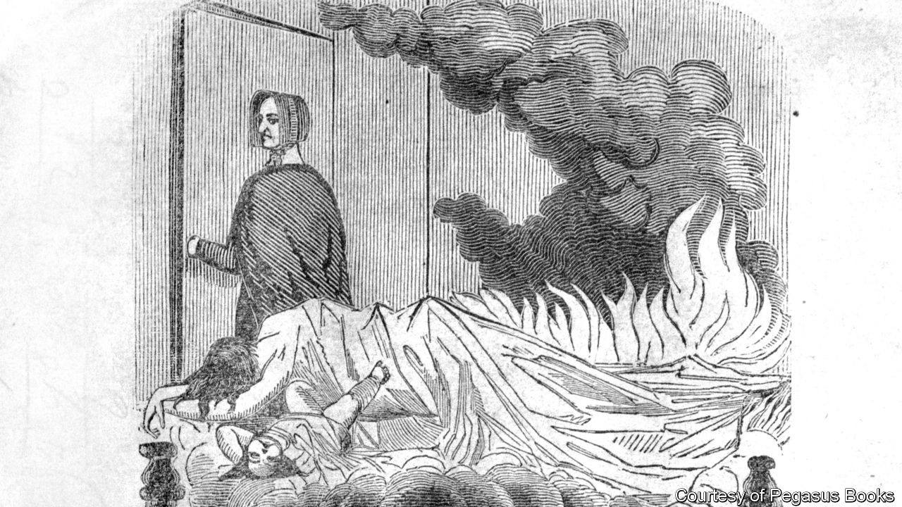

###### True crime’s first crime

# A double murder in 1843 ushered in a new era of tabloid journalism 

##### The trial of Polly Bodine proved perfect material for a nascent, sensationalist press 

 

> Mar 14th 2024 

By Alex Hortis. 

It was Christmas Day in 1843, and men were gathered in a tavern on Staten Island for a festive drink. They set down their pints when they heard shouting. After extinguishing the flames engulfing George Houseman’s home, they inspected the wreckage. In a corner of the kitchen, they found the charred remains of his wife and young daughter. A post-mortem revealed evidence of blunt trauma.

Houseman, an oysterman, was at sea. People soon started to direct blame at his sister, Polly Bodine (pictured). She had slept at the house on December 23rd, as she often did when her brother was away, and was thought to be the last person to see the victims alive. When word reached Bodine that villagers were starting to pin responsibility for the murders on her, she fled, but a couple of days later she turned herself in to the authorities. 

“The Witch of New York” reconstructs the events and subsequent trials in great detail. Alex Hortis, a crime historian, can do so because the press seized on the case and delighted in recounting its grisly details. Journalists for the emerging “penny press”—cheap newspapers that specialised in the lurid and schlocky—shuttled to and from  with dispatches from the crime scene. 

Bodine turned out to be the perfect subject, for not only was she a suspected murderess and arsonist—she had a colourful personal life, too. She had fled an abusive marriage and returned to live with her parents; her husband was in prison for bigamy. Yet Bodine was no lonely spinster. She had taken a lover in the city and was eight months pregnant when the murders were committed. She became a lightning rod for her contemporaries’ feelings about sex. 

The printing presses ran hot for years, publishing sensationalist stories and denigrating illustrations. If facts could not be had, wild invention sufficed. (The rumours covered everything from her supposed abortions to other murders she might have committed.) So fervid was the press coverage of Bodine that it made due process impossible. After an initial mistrial in Staten Island, a retrial there had to be abandoned, as three days of jury selection failed to proffer 12 unbiased men. 

A new trial took place in Manhattan, but after a guilty verdict was delivered, the Supreme Court ruled that Bodine had been denied a fair hearing. Afterwards potential jurors were quizzed extensively about their impressions of the case, and selection came close to impossible. After three weeks and several thousand prospective jurors, the third and final trial was moved to Newburgh, some 60 miles (97km) away. There Bodine was found not guilty. 

It is an engaging story, skilfully told. The case pulled stars into its orbit. Both  and Walt Whitman wrote about the trials; James Fenimore Cooper fictionalised the grim tale in a novel. P.T. Barnum exhibited a hideous witchy waxwork of Bodine in his American Museum. (He comes across as a rather less genial fellow than “The Greatest Showman”, a musical film, would have you believe.)

Mr Hortis says Bodine “probably” did commit the crimes; the reader will finish the book with reasonable doubts. Guilty or not, Bodine’s case set a dangerous precedent, ushering in an age of “tabloid justice” that “undermines legal justice and obscures truth”. It also established a pattern of public shaming and lewd speculation about female defendants. Interest in sordid, violent crimes has not abated in the years since: to read “The Witch of New York” is to understand the ancestry of the current  The reporters covering Bodine’s case showed that justice was less important than entertainment. ■

Picture credit: Back cover of “The Early Life and Complete Trial, of Mary, Alias Polly Bodine, for the Murder of Emeline Houseman and Her Child”. New York: 1847.


