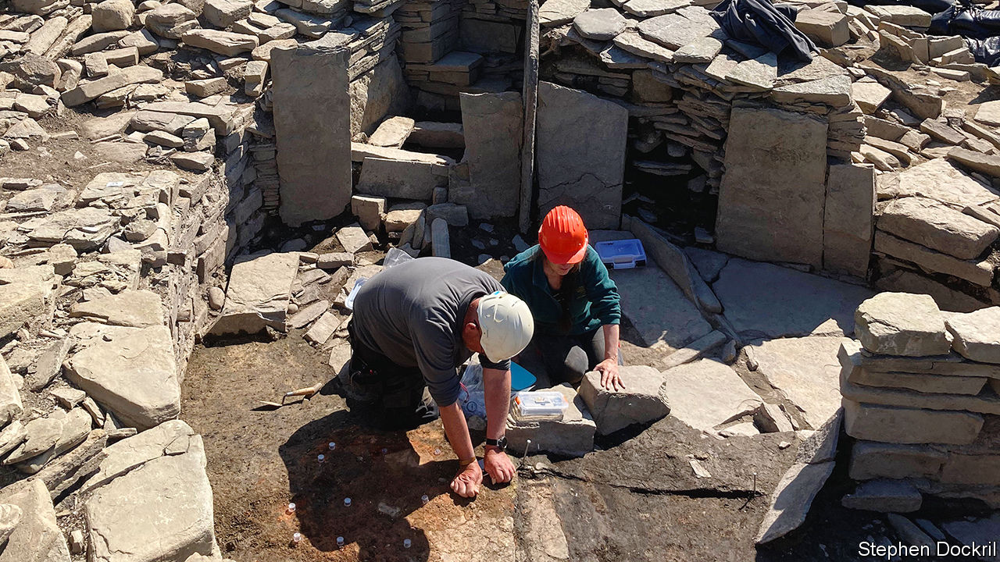

###### In ruins

# Climate change is unearthing and erasing history all at once 

##### Rising sea levels and extreme weather are harming archaeology 

 

> Mar 14th 2024 

IT LOOKS, at first glance, like a pile of rubble. But hidden beneath the sandbags and tarpaulin is the Knowe of Swandro, an archaeological site that contains the remains of Iron Age and Norse settlements (pictured). Every summer a team of archaeologists descends on Rousay, one of the , off the north coast of Scotland, to sift through the evidence. 

Time is not on their side. Rising sea levels and more frequent storms are washing away sediment where the site sits. Scotland now experiences more winter rainfall than had been predicted for 2050, according to a study by the James Hutton Institute, which conducts environmental research. Coastal erosion has destroyed most of the Knowe’s crown jewel, a dwelling from the Iron Age. “The final third” will break apart and disappear “within the next couple of years”, predicts Stephen Dockrill, who co-leads the excavation. 

Unesco, the cultural arm of the United Nations, estimates that one in six cultural heritage sites is threatened by climate change. Hundreds of sites on the Scottish coastline face threats similar to Swandro. At Vindolanda, in the north of England, the waterlogged soil that preserved Roman tablets for millennia is drying out. In Iraq, an ancient city is being buried under tonnes of sand. And in the Arctic, indigenous artefacts are being destroyed as the . 

On the climate change to-do list, archaeological preservation is, understandably, not a top priority. The International Council on Monuments and Sites declared a climate emergency only in 2020. Archaeologists complain of shallow co-ordination efforts among climate policymakers. 

Funding is the main problem. Archaeology tends to be bankrolled by land developers. But when it comes to climate change, there is “no one to pay for it”, says Jorgen Hollesen from the National Museum of Denmark. Moving sites and other mitigation efforts, such as building protective armour, is costly. Many just have to wait and see what happens.

Digging deeper, it is not all doom and gloom. Changing weather patterns and rising temperatures have brought some unexpected benefits. Several of the most exciting discoveries of recent years, from Nazi warships in the Danube to ancient rock carvings in the Amazon, were revealed after severe drought. Storms can also expose hidden gems. , a Neolithic site also in Orkney, was concealed by sand dunes until disturbed by a storm in 1850. A centuries-old shipwreck reappeared under similar circumstances this year. 

Archaeologists and heritage institutions must answer two pressing questions, says Dr Hollesen: “Which sites should be saved, and which sites should be allowed to decay?” In poor countries, paying for preservation can be hard to justify, though unesco provides funding to its designated World Heritage sites. (Sub-Saharan Africa has 103; Italy has 59.) Countries with fewer resources will get priority in funding, says Lazare Eloundou Assomo, the head of UNESCO’s World Heritage Centre.

Given the number of sites under threat and limited resources available, many will be lost. As sites are damaged or disappear, historical knowledge and tourism may also go away. According to Mairi Davies of Historic Environment Scotland, which works on preservation, communities must come to terms with changing landscapes—and adapt accordingly. Sites such as Swandro are turning to laser scanning and  to capture a digital record for future generations. “We have to have conversations about loss and what people value,” Dr Davies says. In the end, what survives will be determined by what people “can come to terms with losing”. There is not enough money to save them all. ■


