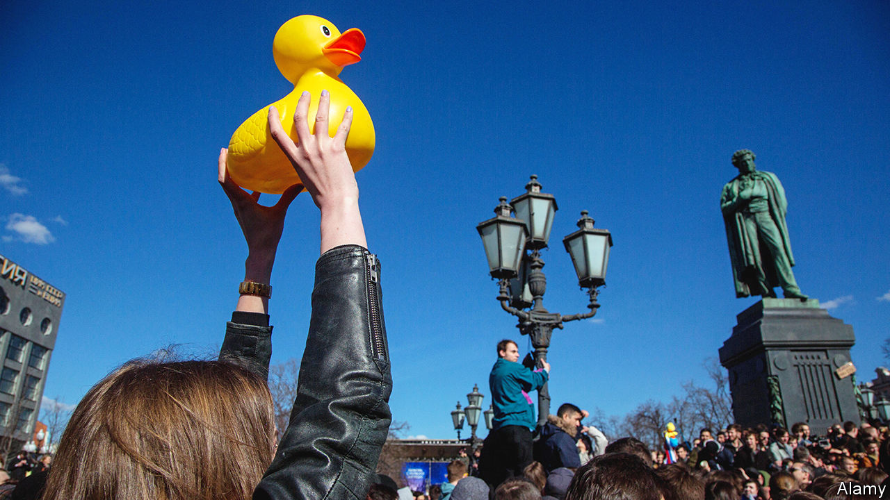

###### Lessons in decryption

# How Aesop’s fables fostered a secret language of protest in Russia 

##### Coded tributes to Alexei Navalny reveal the long afterlife of Aesop’s fables 

 

> Mar 14th 2024 

In late February 2024, rubber ducks started landing in unlikely places. One was spotted peering through roses in St Petersburg; another was illuminated by plastic torches next to a tributary of the Volga river. When Alexei Navalny, Russia’s most prominent opposition leader, was alive, rubber ducks symbolised his fight against corruption. Since , they have played a different role: to protest against the regime that murdered him, while evading censorship.

Aesop, a slave in Ancient Greece, is credited with invoking talking animals to tell tales about morality. In Russia, images of animals carry coded meaning. There is a herd of examples, such as stickers of a goose cawing. (The sound made by a goose is written as “ga-ga-ga”, similar to “Ha-aga”, the Russian pronunciation of The Hague, where , Russia’s president, should be tried for war crimes in Ukraine.) Graffiti of a crossed-out fish is another allusion to Ukraine:  (no to war) in Russian has a similar number of letters to  (no to salt-cured fish).

“You need to avoid your censor, and you know that censor is watching you all the time,” explains Alexandra Arkhipova, a social anthropologist in Paris. She refers to these anonymous Russian symbols as “Aesopian language”, a term that originated in the late 19th century. (Many credit Mikhail Saltykov-Shchedrin, a satirist, for popularising it, though he preferred the phrase “the language of slaves”.)

The Soviet Union’s founding Bolshevik, , resented that he had to use Aesopian language (before he seized power and censored other people). In 1917 Lenin lamented that he wrote “with an eye to the tsarist censorship…with extreme caution, by hints, in an allegorical language—in that accursed Aesopian language”. 

It would be preferable for coded language not to be needed in the first place. But cloaked expression is better than no expression. Ahead of Russia’s  on March 15th-17th, Dr Arkhipova is monitoring government voting posters. A recent one in Moscow had “Navalny” scrawled across it. Another appeared normal, with official red, blue and white. A closer look reveals the phrase “for Russia without Putin”. ■


