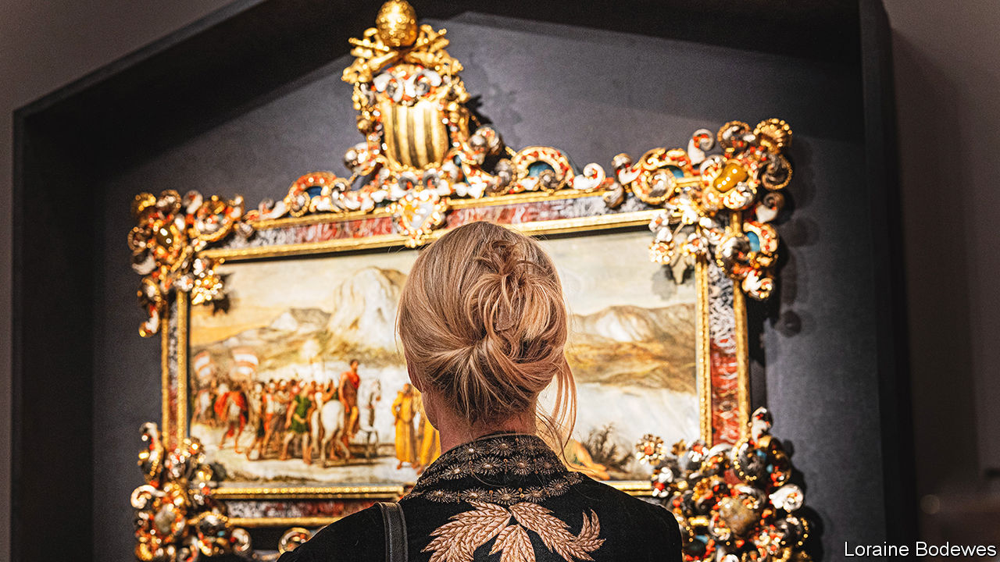

###### Art with history

# Maastricht is where museums go on shopping sprees 

##### A fair in a small Dutch city is a window on the art world and collecting trends 

 

> Mar 13th 2024 

THE PAINTINGS are spotlighted, so you can see every brushstroke and crack. Next to each work is a placard, outlining its history and to whom it once belonged. Here is an elaborately framed painting, probably offered by the King of Naples to Pope Benedict XIV in the 18th century (pictured). Nearby is a 470-year-old portrait of a sibyl wearing ermine, once owned by  and Joanne Woodward, two American actors. The artwork on display in Maastricht is reminiscent of a museum exhibition, except for one catch. Here, everything is for sale. 

Every March since 1988 the European Fine Art Foundation (TEFAF) has put on a fair in the small Dutch city, best known as the birthplace of the modern-day European Union (the treaty that created it was signed here in 1992). Now this is where museums and art aficionados come to shop. “Maastricht”, as art-world insiders call it, is “the most important fair by a mile for classical paintings and works of art”, says Jonathan Green, a gallerist based in London. The eight-day fair opened on March 7th.

Maastricht is not the only fair where expensive art is sold, but it probably boasts the largest concentration of museum curators on the hunt for their next acquisition. Among this year’s 50,000 visitors were some 300 museum directors—including Laurence des Cars, who runs the Louvre in Paris—and 650 curators. It is the premier destination for old art, as opposed to the contemporary paintings that fairs like Art Basel in Switzerland and Miami favour. Maastricht is the “Met of art fairs, and Art Basel is MoMA”, says Eric Lee, director of the Kimbell Museum in Fort Worth, Texas. 

What happens before the fair begins is also unusual. Dealers set up their stands, only to be forced to leave. For a day and a half 230 specialists come in to vet works’ , as well as their descriptions and stated provenance, bringing x-rays and other technical machines with them. 

The specialists have the right to ask for descriptions to be changed. Objects can be removed if the experts believe they are inauthentic; they are locked in a cupboard until after the fair. “You come back in and hope to God that nothing has been thrown out,” says one dealer, who calls Maastricht “the best-vetted fair in the world”. 

Each year “tens” of objects are removed, according to Will Korner of TEFAF. But the strict vetting process means dealers work especially hard to ensure their offerings can withstand scrutiny. This gives confidence to buyers, including museums, whose acquisition committees want to be confident they are buying the real deal.

As well as being a destination to ogle breathtaking art, Maastricht offers a window on the art world and current collecting trends. The fair is best known for Old Master paintings, but the number of contemporary dealers in attendance has been growing—because that is where most of the activity in the art market is. Last year European Old Masters (defined as work produced by artists born between 1250 and 1820) accounted for less than 4% of the value of sales at auction globally, according to a new report by Arts Economics, a research firm. In 2003 it was 16%. 

Masterpieces by historically significant artists still do well. In 2021 a painting by Sandro Botticelli, the Italian artist of Venus-on-the-half-shell fame, sold for $92m, for example. But the middle has fallen out of the market, owing to changes in aesthetics and interior design. Many of today’s art collectors favour large, colourful canvases by living or recently living artists, to complement their minimalist furniture and large, white walls. (“Park Avenue” taste is how one dealer describes an old Dutch landscape he has for sale, which is now out of favour.) 

Social media have changed what sells, says Christophe van de Weghe, a contemporary-art dealer. Old Masters do not photograph as well, and, given the paintings’ age, buyers need to check their condition in person. So dealers of Old Masters are trying to become more masterful at marketing. “We’re trying to sell more blood, sex and mythology,” says Patrick Williams of Adam Williams Fine Art, a gallerist based in New York. (However, images of bloody Christ on the cross are not in vogue: secular works are more popular among younger collectors and those from the Middle East and Asia.) People at Maastricht talk about “wall power”: images that can catch the eye and spark conversations. 

Who painted the canvas matters, too. The “biggest trend in the current market is women,” says Alexander Bell, co-chairman of the Old Masters painting department at , an auction house. Should anyone doubt it, one stand at Maastricht displayed three paintings by  adorned with a large sign: “Wall of Ladies”. Museums are avid buyers, as they seek to expand the works and backgrounds of the artists they exhibit. But there are not many to choose from. “It’s a bit of a frenzy” for female artists, says Mr Williams: “Any time we get them, we sell them immediately.”

The reality is that there is less and less for sale by both women and men from bygone centuries. Unlike contemporary art, more of which is created every day, the supply from dead artists is—for obvious reasons—limited. More is disappearing into museum collections or being given by donors to institutions. “The trade is becoming more challenging, because of a scarcity of high-quality paintings available to sell,” says Mr Green. To optimists this suggests that Old Masters as a category are undervalued. At least, that’s what buyers at Maastricht like to think. ■


