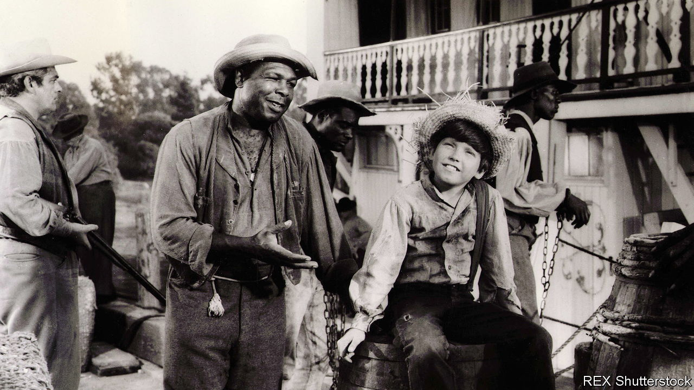

###### Once upon a time, again

# What’s behind the wave of literary retellings? 

##### Percival Everett’s “James” imagines Mark Twain’s classic tale with a twist 

 

> Mar 14th 2024 

 By Percival Everett. 

On a moonlit night in Hannibal, Missouri, a slave called Jim watches two white boys hiding in the grass. The “little bastards” think he cannot see them. “They were always playing some kind of pretending game where I was either a villain or prey, but certainly their toy,” Jim thinks. Huck and his friend, Tom Sawyer, rustle and giggle: “Those boys couldn’t sneak up on a blind and deaf man while a band was playing.” Jim decides to indulge them anyway—because “it always pays to give white folks what they want.” Stepping into the yard, he calls out into the night, “Who dat dere in da dark lak dat?”

So begins “James”, a novel by Percival Everett that reimagines ’s “Adventures of Huckleberry Finn” from Jim’s perspective. Mr Everett, a professor of English literature at the University of Southern California, is known for producing genre-defying works, ranging from a satire of the publishing industry that inspired the film “American Fiction” to a murder mystery about lynchings in the American South. (“The Trees” was shortlisted for the Booker prize in 2022.) 

In retelling Twain’s classic American tale with a twist, Mr Everett joins a long tradition of writers who have dragged marginalised characters into the centre of new (old) tales. The modern trend began with  (1966), when Jean Rhys gave a voice to Mr Rochester’s wife, the “madwoman in the attic”, from  by Charlotte Brontë.

Two types of retellings have been popular recently. One involves feminist revisions of books focused on men.  (2018) by Madeline Miller retold the “Odyssey” from the perspective of Circe, a minor goddess; Pat Barker’s  (also 2018) imagined the “Iliad” from the viewpoint of a Trojan queen taken as a slave by Achilles. Last year  by Sandra Newman retold George Orwell’s “1984”, offering meat and mind to a previously scrawny character. 

“James” is an example of another sort of retelling, which gives prominence to non-white characters from tales previously focused on white ones. This is not entirely new: in “The Wind Done Gone” (2001), Alice Randall rewrote Margaret Mitchell’s “Gone With the Wind” from a slave’s perspective. As readers demand fresh perspectives, more authors are trying their hand at adaptations. Successful ones do not just tweak familiar stories but create something entirely new, therefore reading as original and defiant. 

The shift from Huck’s perspective to Jim’s is such an act. Consider the opening scene. In Twain’s original novel, first published in America in 1885 (and banned in Massachusetts shortly afterwards because of its bad language), the boys sneak up on Jim to “play something on him”. They see him as dumb and superstitious. (The N-word appears around 200 times in the novel, which has made the book a frequent flashpoint in schools.) 

The brilliance of Mr Everett’s retelling is to imagine Jim’s interiority while maintaining the integrity of Twain’s scene. Jim sees the boys in the grass but pretends not to. His narration is intelligent and witty, but when he speaks aloud, he plays dumb. With a few lines, Mr Everett has turned Twain’s tale on its head. 

“James” unfolds in this fashion, making familiar scenes feel startling and new. You do not need to read the original to enjoy the revision, however; Mr Everett’s tale stands on its own. As in Twain’s novel, Jim runs away to avoid being sold to a new slave-owner and separated from his family. Huck fakes his death to get away from his abusive father. The unlikely pair escape by raft down the Mississippi river, encountering all kinds of dangers and obstacles on their journey. 

Jim, who has secretly taught himself to read and write, finds paper and ink. “I am called Jim,” he writes. “I have yet to choose a name.” He discusses morality with Huck, who wonders if he’s “doin’ wrong” by helping Jim escape. “If’n ya need sum kinda God to tells ya right from wrong, den you won’t never know,” Jim advises wisely. 

In Mr Everett’s telling, Jim’s slave dialect is a put-on. He drops it around other slaves, but reverts to “lawdy, lawdy” when a white person appears. “White folks expect us to sound a certain way and it can only help if we don’t disappoint them,” he explains. He advises slave children to mumble, sound stupid and use “correct incorrect grammar”. Making whites feel safe and superior is a matter of survival. 

When Jim and Huck are separated, Mr Everett invents new trials for Jim that are darker and bloodier than anything in Twain’s text. The central thread, however, remains the relationship between the runaway slave and the boy. Huck protects Jim in the wilderness, but Jim also feels responsible for Huck, who grows increasingly uncomfortable with slavery. Toward the end, Mr Everett introduces a twist, as well as action-packed scenes of revenge that read like they are destined for re-enactment on the big screen. “My name is James,” Jim declares at one point. “I’m going to get my family.” (You can almost hear the dramatic score that will accompany these lines and might wonder which actor will play Jim.) 

Whether or not “James” is a commercial success, the trend of retellings is only likely to continue. Writers have always looked to classic tales to comment on contemporary times. Shakespeare’s “Hamlet” adapted the Danish legend of Amleth. Milton’s “Paradise Lost” rewrote the Bible’s . Readers love the comfort of a familiar story remixed with surprising twists and provocative insights. For publishers, that makes retellings a good bet—easy to market and sure to sell. ■


